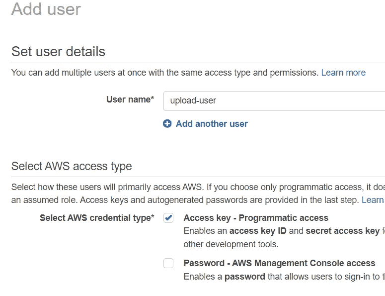
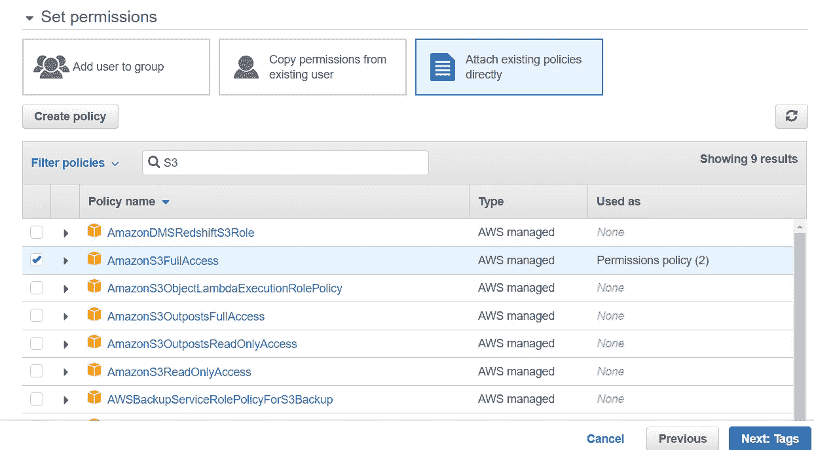

# 使用 Angular 和 NestJS 将文件上传到 S3

> 原文：<https://levelup.gitconnected.com/upload-files-to-s3-using-angular-and-nestjs-64721d815d18>

## 使用 Angular 和 NestJS 的端到端示例


照片由[阿格尼维什·贾亚迪普](https://unsplash.com/@agniveshaj?utm_source=unsplash&utm_medium=referral&utm_content=creditCopyText)在 [Unsplash](https://unsplash.com/s/photos/file?utm_source=unsplash&utm_medium=referral&utm_content=creditCopyText) 拍摄

最近，我为 Angular/NestJS 应用程序开发了一个 S3 文件上传功能。令我惊讶的是，我很难找到一个完整的和工作的例子教程。因此，我认为用 Angular 和 NestJS 完成将文件上传到 S3 (Amazon Simple Storage Service)存储桶的过程可能是有用的。

我假设你对 Angular 和 NestJS 有基本的了解。因此，我将跳过这些应用程序的初始设置，专注于文件上传部分。

# 先决条件

您将需要这些技术来跟进:

*   角度 14
*   NestJS 版本 9
*   NodeJS v14 或以上
*   AWS 帐户

## S3 桶和访问密钥/秘密访问密钥

要将文件上传到 S3，我们需要设置 NestJS API 访问它所需的 S3 桶和 IAM 用户。

如果你还没有一个 S3 桶，按照这个指令创建一个。

下一步是登录您的 AWS 帐户并导航到 IAM 以添加用户。输入用户名并勾选“访问键-编程访问”选项。



创建 IAM 用户

然后，单击“Next: Permission”按钮，将“AmazonS3FullAccess”策略附加到 IAM 用户。



附加现有策略

单击“下一步”按钮接受默认设置并创建用户。访问密钥 ID 和秘密访问密钥将显示在成功屏幕上。我们可以下载 CSV 文件来保存键值以备后用。

在这里，我们创建一个 IAM 用户，他可以完全访问您的 AWS 帐户下的所有 S3 时段。在生产环境中，我们应该创建一个自定义策略，限制 IAM 用户只能访问特定的 S3 存储桶进行文件上传。但是为了简单起见，我们在本文中跳过这一步。

现在，我们已经准备好了 S3 桶。让我们用 NestJS 构建文件上传 API。

## NestJS 文件上传

我们可以使用 Nest CLI 创建一个新的 NestJS 应用程序。

```
nest new ng-nest-upload
```

我们需要安装`aws-sdk`包。

```
npm install aws-sdk @types/aws-sdk
```

我们还需要安装 multer 的类型定义

```
npm i -D @types/multer
```

> NestJs 使用 [Multer](https://www.npmjs.com/package/multer) 来处理文件上传。Multer 是一个处理`multipart/form-data`的 node.js 中间件，主要用于上传文件。Multer 将表单文本字段的值提取到一个`body`对象中。它还在`request.file`或`request.files`对象中为文件或多个文件创建一个新对象。`body`对象包含表单文本字段的值，`file`或`files`对象包含通过表单上传的文件。

让我们创建文件上传端点，它从 FileInterceptor 捕获并保存文件。

文件上传控制器

我们在这里使用两个装饰者:

*   `FileInterceptor`:将字段名作为第一个参数，提取上传的文件。字段名是从客户端`multipart/form-data`发送的，因此您需要更新它以匹配您代码中的字段名。FileInterceptor 在幕后使用 Multer。
*   `UploadedFile`:用于从请求中引用文件载荷。

## 将文件保存到 S3 桶中

在上面的控制器中，我们也使用`FileService`将文件保存到 S3。在文件服务中，我们使用`aws-sdk` v3 将流对象上传到 S3 桶。如下所示，我们需要指定 3 个参数

*   时段:S3 时段的名称
*   Body:表示文件的缓冲区对象
*   Key:文件的唯一键

如何在 NestJS API 中设置对 S3 的访问配置？我们在`main.ts`的`bootstrap` 方法中初始化这些配置。

同样为了简单起见，在上面的例子中，访问密钥和秘密是硬编码的。在现实生活的应用程序中，它们应该来自环境变量。

## 棱角分明的客户

为了从 Angular 应用程序上传文件，我们使用`[*File*](https://medium.com/gitconnected/3-ways-to-access-local-files-from-web-browser-70f57fa57e50)` [接口](https://medium.com/gitconnected/3-ways-to-access-local-files-from-web-browser-70f57fa57e50)，该接口提供关于文件的信息并允许网页上的 JavaScript 访问它们的内容。

下面的`<input type="file">`代表一个文件选择域和一个“选择文件”按钮。这个简单的按钮允许用户从浏览器访问本地文件。我们可以使用`accept`属性来限制上传文件的类型。

```
<input type="file" [accept]="acceptedFileExtensions" (change)="attachFile($event)">
```

不幸的是，我们不能改变默认文件选择按钮的样式。解决方案是使用另一个自定义按钮来调用默认按钮。在下面的代码中，我们隐藏了默认按钮，并用 CSS 类`fileButton`设计了自定义按钮。

在`UploadComponent`中，我们使用@ViewChild decorator 来获取对模板中隐藏的文件选择按钮的引用。

```
@ViewChild(‘fileInput’, { static: false })
 fileInput: ElementRef | undefined;
```

我们可以调用组件类中的隐藏按钮 click，而不是调用 Html 模板中的 click 处理程序，如下所示。

```
this.fileInput.nativeElement.click();
```

为了将文件发送到 NestJS API，我们构造了 formData 并向 NestJS 端点发送了一个请求，如下所示。

请注意，post 请求标题不应包含内容类型。

## 进一步考虑

在这个虚构的例子中，没有实现身份验证。在实际应用中，您可以考虑使用 JWT 令牌来[加强 Angular 客户端和后端之间的安全性](https://medium.com/gitconnected/maximize-code-security-in-your-nestjs-applications-part-2-be707466b7ea)。

另一件要考虑的事情是上传文件的安全性。尽管我们已经在 Angular 客户机中实现了文件扩展名的验证，但这还不够。含有恶意内容的文件仍有可能溜进来。更好的方法是设置一个带有防病毒扫描服务的分段 S3 存储桶。在将任何上传的文件移动到最终存储桶进行消费之前，都需要对其进行扫描。但是这个主题超出了本文的范围，这里的[是一个很好的起点。](https://aws.amazon.com/blogs/apn/integrating-amazon-s3-malware-scanning-into-your-application-workflow-with-cloud-storage-security/)

通过对上传的文件执行这些检查，您可以确保它不是恶意的，并保护您的系统免受潜在的伤害。

## 摘要

在本文中，我们将通过 NestJS API 从 Angular 客户端向 S3 木桶上传一个文件。通过内置的装饰器，NestJS 使得处理文件上传过程变得非常容易。

完整的源代码可以在这个 [GitHub repo](https://github.com/sunnyy02/ng-nest-s3-upload) 中找到。

编程快乐！