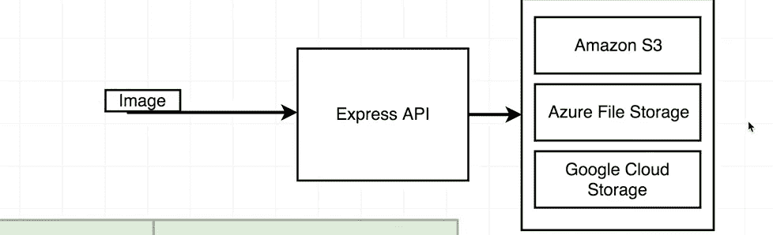
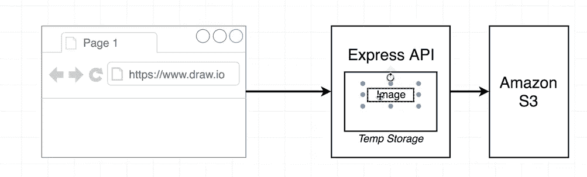
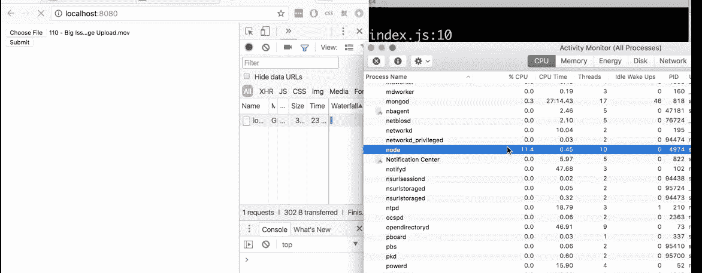
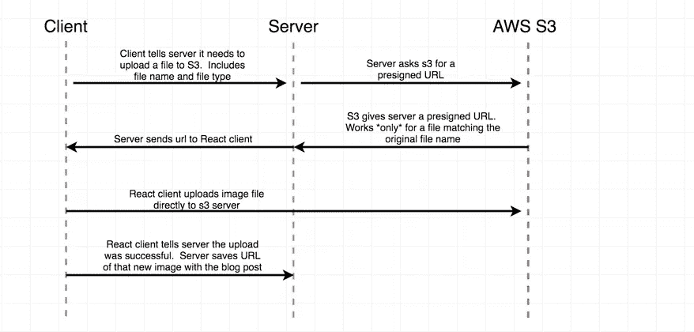

# 直接从 React 应用程序上传图片到亚马逊 S3

> 原文：<https://levelup.gitconnected.com/upload-image-directly-from-react-app-to-amazon-s3-856280c62e45>

本文将详细介绍如何从客户端亚马逊 S3 直接发送图像的方法。

## 上传图像的问题:

1.  图像物理存储在哪里？
2.  图像如何到达它们应该被存储的地方？
3.  我们如何联系图像？

## 解决方案 1:在 MongoDB 中

这是一个糟糕的方法，因为我们要为使用的每 GB mongo 存储付费。例如，mlab 每月每 GB 收费 15 美元。也就是大约 330 张 3mb 大小的图片。

## 解决方案 2:外部数据存储，如亚马逊 S3

这是一个很好的方法，因为它的存储非常便宜，易于备份，而且从来不用担心大小。

# 通过服务器向 S3 发送图像

这里，我们使用 Express API 将一个图像从 React 应用程序(或任何客户端应用程序)发送到服务器，然后服务器将这个图像发送到 S3 桶。

这个 Express API 已经参与了图像上传，这意味着我们的服务器将使用一些资源，如 **CPU 和 RAM** 来处理图像。这一点都不理想。

我自己记录了上传小文件需要多少 CPU 和 RAM:

当文件未上传时

当我上传单个文件时

看到区别了吗——这只是来自单个用户的一个小文件。

通过你的服务器传送图片会让处理图片更容易**但是**这也意味着我们要花更多的钱来处理图片上传。我不知道你怎么想，但是我绝对不想在我的服务器上花任何多余的钱。我需要确保我的节点服务器只负责处理 JSON 数据，不负责其他事情。

这种方法一次又一次地被社区所接受，但它不是最好的解决方案。

# **直接从客户端向 S3 发送图像**

1.  客户端告诉服务器它需要上传一个文件到 S3，包括文件名和文件类型
2.  服务器要求 S3 提供一个预签名的 URL
3.  S3 给服务器一个预先指定的 URL，它只适用于与原始文件名匹配的文件
4.  服务器将 URL 发送给 React 客户端
5.  React 客户端将图像文件直接上传到 S3 服务器
6.  React 客户机告诉服务器上传成功，服务器保存新图像的 URL。

所以，是的，我认为这是最好的方法，显然越来越多的社区接受它。

感谢阅读:)