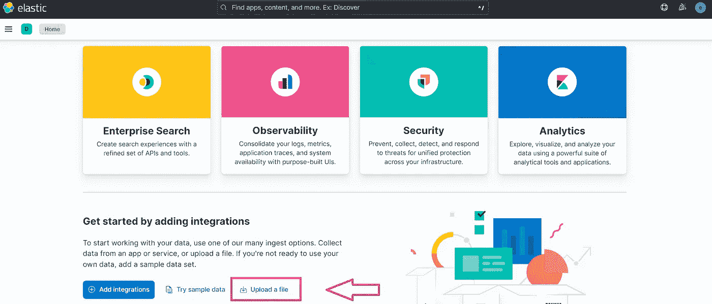
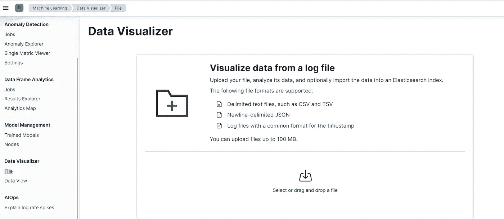
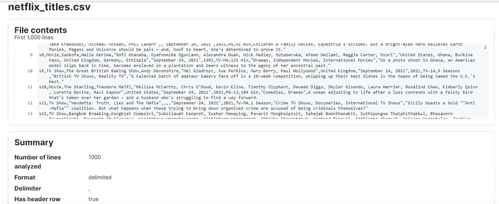
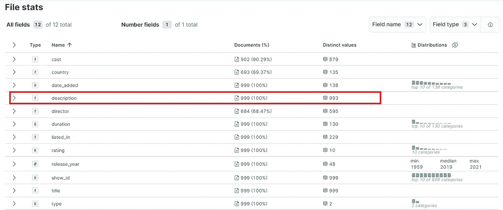

# 使用数据可视化工具将数据上传到 Elasticsearch

> 原文：<https://levelup.gitconnected.com/upload-you-data-into-elasticsearch-using-the-data-visualizer-5dffaa976efa>


让我们看看如何使用文件数据可视化工具将数据导入到 Elasticsearch 中。

**文件数据可视化工具**是 Kibana 上的一个工具，它允许你将 CSV、JSON 或文本文件中的数据直接上传到 Elasticsearch 中。这个特性使您只需点击几下鼠标，就可以接收、解析和定制您的索引设置和映射。

让我们从去 Kibana 主页开始。您将在`Machine learning > Data visualizer > File`部分找到文件数据可视化器。这个部分的链接也直接在 Kibana 主页上提供。



打开后，该页面如下所示:



您可以导入不同的格式，包括 *CSV* 、 *TSV* 、*分隔的文本文件*、*换行符分隔的 JSON* 以及带有通用时间戳格式的*日志文件*。这些文件不能超过 **100mb** 。你所要做的就是拖拽&文件到相应的区域，你就完成了。对于本教程，我们将使用*网飞电影和电视节目*数据集，可通过点击此[链接](https://drive.google.com/file/d/1WGD_cESbAS7PRwoi6NZEw2aafj4jVTg2/view?usp=sharing)下载。

下载后，导入文件。如果数据集包含更多的内容，Kibana 将分析数据集的前 *1000* 行，并为每一行返回一个文档。

*摘要部分*像格式( *CSV，此处用逗号分隔*)一样通知我们关于我们的导入，我们甚至可以看到第一行已经被识别。



*visualize 部分*将呈现数据集的不同统计数据，字段的数量、类型，以及文档中每个字段的现有值的百分比或不同值的数量。对于我们的数据集，我们可以看到我们的文档的 *100%* 具有*描述*字段，并且对于这个相同的字段，我们具有 *993* 不同的值。



现在点击导入。你可以在两个选项中选择，**简单的**如果你对 Kibana 生成的东西感到满意，你只需要键入索引的*名称*；和**高级**如果你想定制*索引设置*，*映射*或任何*变换*你想在数据上。对于本教程，我们使用**简单的**选项和*网飞 _ 电影*作为索引名称。


我们的索引已创建，我们可以通过打开控制台并运行以下查询来验证我们的数据集已添加到 Elasticsearch 中:

```
GET netflix_movies/_search
```

或者通过检查刚刚在`Analytics > Discover`部分下创建的数据视图。你可以使用这个数据集在 Elasticsearch 上了解更多关于[文档和索引](https://medium.com/@mhdabdel151/handling-documents-and-indexes-on-elasticsearch-dd2690775d4f)的信息，也可以通过我提供给你的教程来进行[搜索](https://medium.com/@mhdabdel151/the-essentials-of-data-search-in-elasticsearch-ca2efee5509e)和[聚合](https://medium.com/@mhdabdel151/aggregations-in-elasticsearch-495503d78b7d)。

今天到此为止。感谢您的阅读，如果您对本文有任何问题或评论，请在下面留下您的评论。

我们下次再见，看更多的帖子🚀。

阿卜杜尔-巴吉