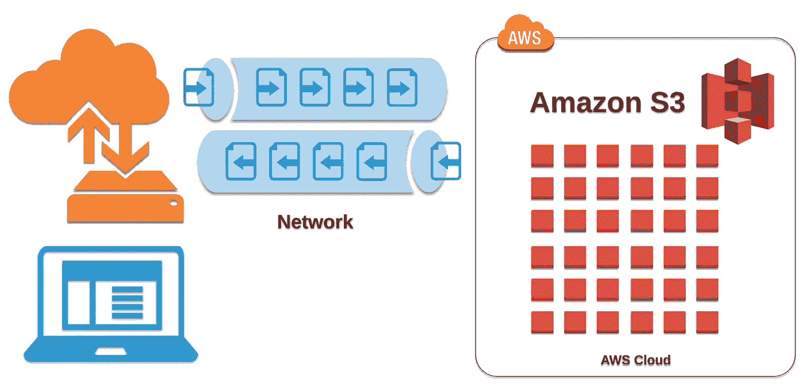
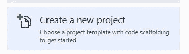
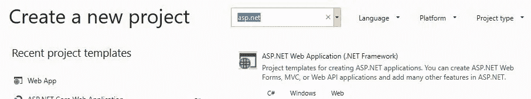
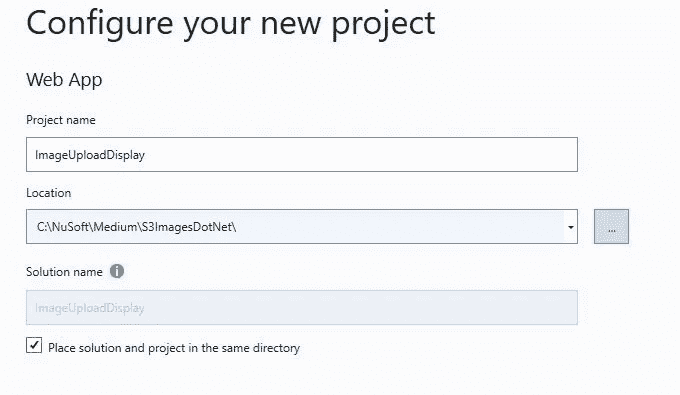
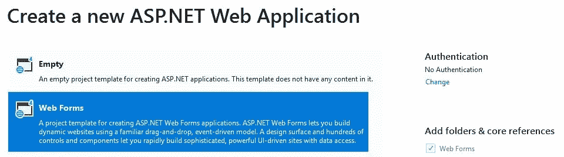
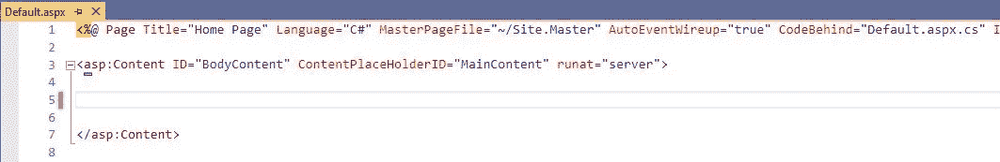
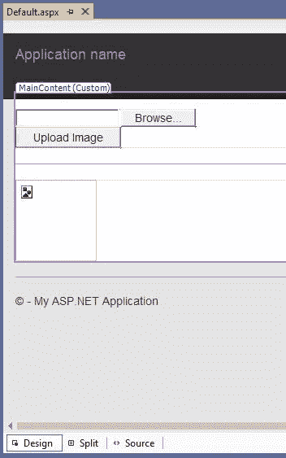
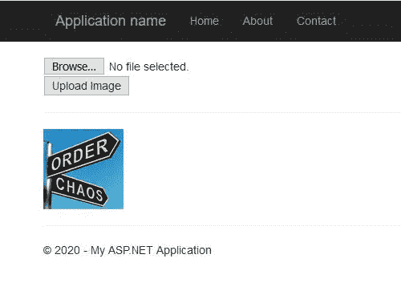
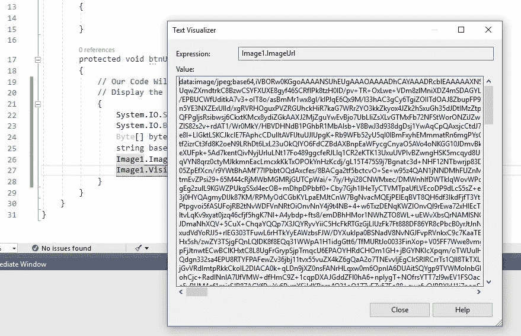
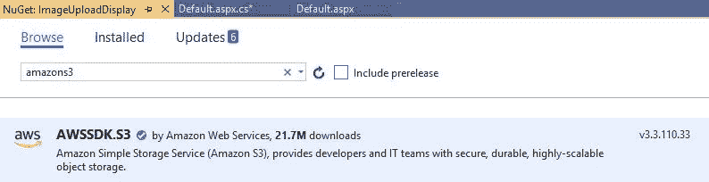

# 上传和显示图像在一个私人的自动气象站 S3 桶使用 ASP。网

> 原文：<https://levelup.gitconnected.com/uploading-and-displaying-images-in-a-private-aws-s3-bucket-using-asp-net-86266af51c8b>

## 亚马逊网络服务提示

## 绕过文件系统并使用流



图片[由 DZone](https://dzone.com/) 提供

# 如何使用本教程

**你可以通过三种方式使用本教程:**

1.  了解如何显示图像而不存储在文件系统中。
2.  了解如何将上传的图像存储到 AWS S3 存储桶。
3.  或者两者都有。**这是本教程的主要目标。**

## S3 亚马逊网络服务概述

亚马逊网络服务(AWS)允许我们使用他们基于云的对象存储服务，亚马逊简单存储服务( [*亚马逊 S3*](https://aws.amazon.com/s3/) )。

*要了解更多关于亚马逊 S3 的信息，请查看* [*这篇文章*](https://medium.com/@jovanshernandez/what-is-amazon-s3-8362ee26c7c3) *作者* [创建项目](https://medium.com/u/3cd0a0ff5636# ASP.NET Web 窗体解决方案。</p><h2 id=)

1.  [开始](https://medium.com/u/3cd0a0ff5636# ASP.NET Web 窗体解决方案。</p><h2 id=) [Visual Studio 2019 社区版](https://visualstudio.microsoft.com/free-developer-offers/)(免费)(非 Visual Studio 代码)
2.  选择**创建新项目**并点击下一步。



新建 Visual Studio 项目

3.在创建新项目中，选择左侧*的 **Web App** 并输入“ **ASP。NET"** 进行搜索，找到下面的模板。点击下一个。*



这允许 web 表单

4.选择一个**名称**和**位置**并点击创建。



项目名称和位置

5.最后选择 **Web 表单**并点击创建。



基本 Web 窗体应用程序

我们可以使用 **Default.aspx** 页面。

1.  打开 Default.aspx HTML 标记并删除内容，使其如下所示。



Default.aspx

2.在内容部分添加以下 HTML 标记。这包括服务器端 FileUpload 控件和单个服务器端 Image 控件。注意 btnUpload_Click 的代码还没有创建，所以它还不会运行。

```
<br />
<asp:FileUpload ID="FileUpload1" runat="server" accept=".png,.jpg,.jpeg,.gif" /><asp:Button ID="btnUpload" runat="server" Text="Upload Image"
    onclick="btnUpload_Click" /><hr /><asp:Image ID="Image1" Visible = "false" runat="server" Height = "100" Width = "100"/>
```

3.切换到**设计**模式，双击*上传图片按钮，在 Default.aspx.cs 页面中创建后面的代码。它应该如下所示(没有注释。)*



切换到设计并双击上传图像

```
using System;
using System.Collections.Generic;
using System.Linq;
using System.Web;
using System.Web.UI;
using System.Web.UI.WebControls;namespace ImageUploadDisplay
{
    public partial class _Default : Page
    {
        protected void Page_Load(object sender, EventArgs e)
        {}**protected void btnUpload_Click(object sender, EventArgs e)
        {
            // Our Code Will Go Here
        }
    }**
}
```

## 试运转

运行该解决方案，并单击**浏览…** 按钮，验证文件上传控件是否正常工作。

## 显示图像

在下一步中，我们将使用文件上传控件的 InputStream 显示图像，并进行一些操作，将图像转换成 ImageURL 可以接受的字符串格式。

添加以下代码，使 btnUpload_Click 看起来如下所示。

```
protected void btnUpload_Click(object sender, EventArgs e)
{
 // Our Code Will Go Here
 // Display the Image
 {
  System.IO.Stream stream = FileUpload1.PostedFile.InputStream;
  System.IO.BinaryReader br = new System.IO.BinaryReader(stream);
  Byte[] bytes = br.ReadBytes((Int32) stream.Length);
  string base64String = Convert.ToBase64String(bytes, 0,   bytes.Length);
  Image1.ImageUrl = **"data:image/jpeg;base64," + base64String;**
  Image1.Visible = true;
  }
}
```

**试运行**

运行解决方案。点击**浏览…** 找到图片。然后单击上传图像。



单击浏览..然后上传图像

**可选步骤**

如果您想查看 ImageURL 的内容，请设置一个断点，如下所示(在 Image1 上。Visible="true ")并运行解决方案，然后选择一个图像。在断点处，将鼠标悬停在 Image1 的 ImageURL 上。



转换为字符串的流形式的图像

## 将图像存储在 S3 桶中

将图像存储到您的 S3 存储桶中的过程仍将使用 InputStream，但不需要我们操作它。

然而，我们需要为 S3 NuGet 包安装 Amazon SDK。

**安装 AWSSDK。S3 和存储图像**

1.  选择**项目/管理 Nuget 包**，浏览如下。安装软件包。



必需的 SDK

2.在 Default.aspx.cs 的顶部使用语句添加以下

```
using Amazon.S3;
using Amazon.S3.Model;
```

**这将允许我们，**

*   **创建 AmazonS3Client 的一个实例。**
*   **使用我们的桶和图像信息发出 PutObjectRequest**
*   **调用 PutObject 并向其传递 PutObjectRequest**

**3.将以下代码**添加到图像**的显示下方或其自身程序中。**

```
// Store to S3
{
**// Do not actually store your IAM credentials in code**. EC2 Role is best
var awsKey = **"Your IAM Key"**;
var awsSecretKey = **"Your IAM Secret Key"**;
var bucketRegion = Amazon.RegionEndpoint.USEast1;   // Your bucket region
var s3 = new AmazonS3Client(**awsKey,awsSecretKey,bucketRegion**);
var putRequest = new PutObjectRequest();
putRequest.BucketName = "companyimages";        // Your bucket name
putRequest.ContentType = "image/jpeg";
putRequest.InputStream = FileUpload1.PostedFile.InputStream;**// key will be the name of the image in your bucket**
putRequest.Key = FileUpload1.FileName;
PutObjectResponse putResponse = s3.PutObject(putRequest);

}
```

# **结论**

**在本文中，我们探讨了两个主要话题。第一个问题是我们如何显示图像，而不需要将图像存储在文件系统中。其次，我们学习了如何将图像存储到亚马逊 S3 存储桶中。**

**我鼓励你更详细地探索它，玩弄它的概念并扩展它。**

****感谢您的阅读和快乐编码！****

**在 Medium 上阅读所有你想要的文章，并通过成为 Medium 会员(每月仅 5 美元)来帮助我继续写作。**

**[](https://bobtomlin-70659.medium.com/membership) [## 通过我的推荐链接加入灵媒——重力井(罗伯·汤姆林)

### 作为一个媒体会员，你的会员费的一部分会给你阅读的作家，你可以完全接触到每一个故事…

bobtomlin-70659.medium.com](https://bobtomlin-70659.medium.com/membership) 

你也可以享受，

[](/creating-an-asp-net-core-restful-web-api-62b3a5a90ba5) [## 创建 ASP.NET 核心(RESTful) Web API

### 探索 HTTP 动词并执行 CRUD 操作

levelup.gitconnected.com](/creating-an-asp-net-core-restful-web-api-62b3a5a90ba5) [](https://medium.com/@bobtomlin_70659/signing-out-of-an-alb-web-application-e464723ac6d8) [## 创建注销

### 当位于应用程序负载平衡器之后时

medium.com](https://medium.com/@bobtomlin_70659/signing-out-of-an-alb-web-application-e464723ac6d8) [](https://link.medium.com/u7OawVRSg0) [## 从 C#调用 Lambda 函数

### 节点中的 AWS Lambda

link.medium.com](https://link.medium.com/u7OawVRSg0)**