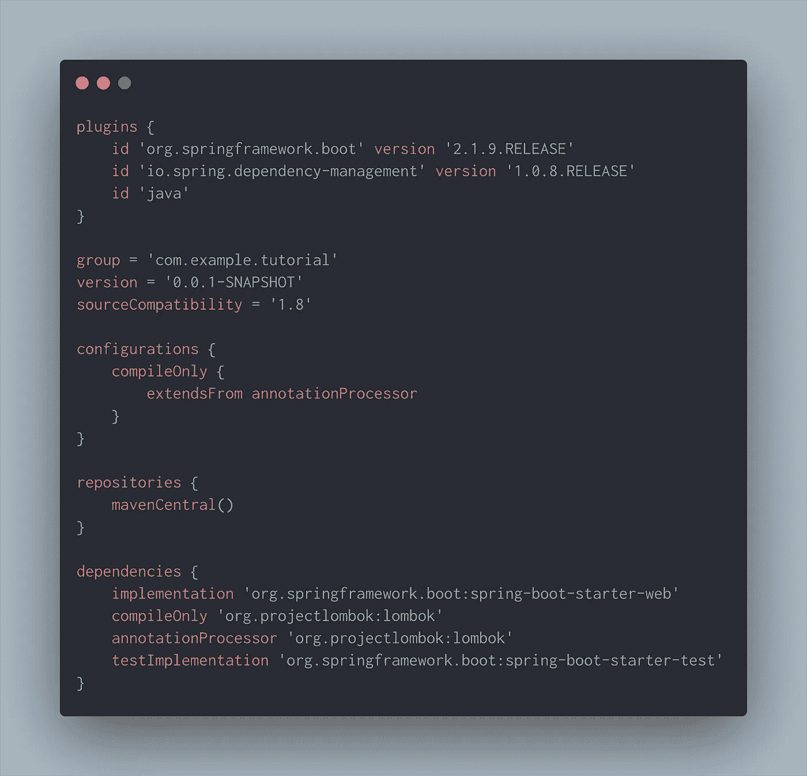
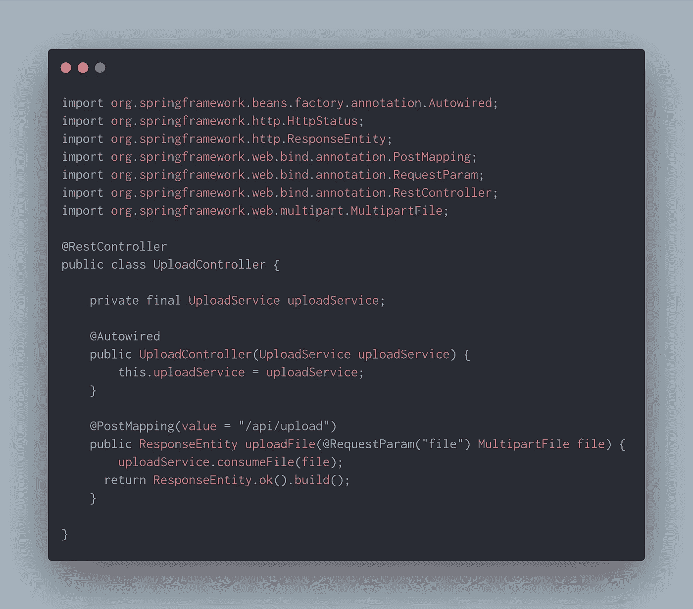
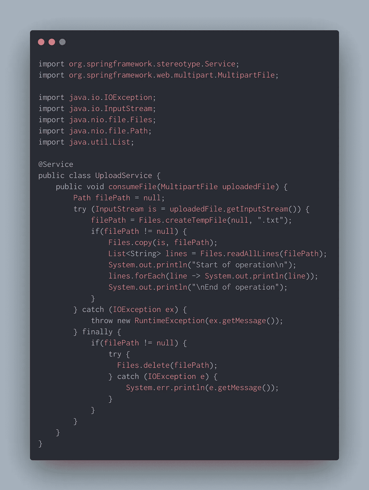
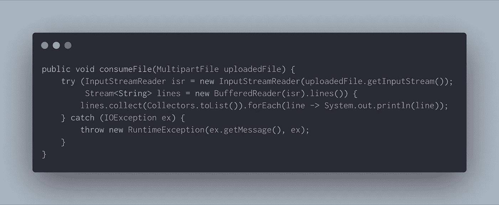
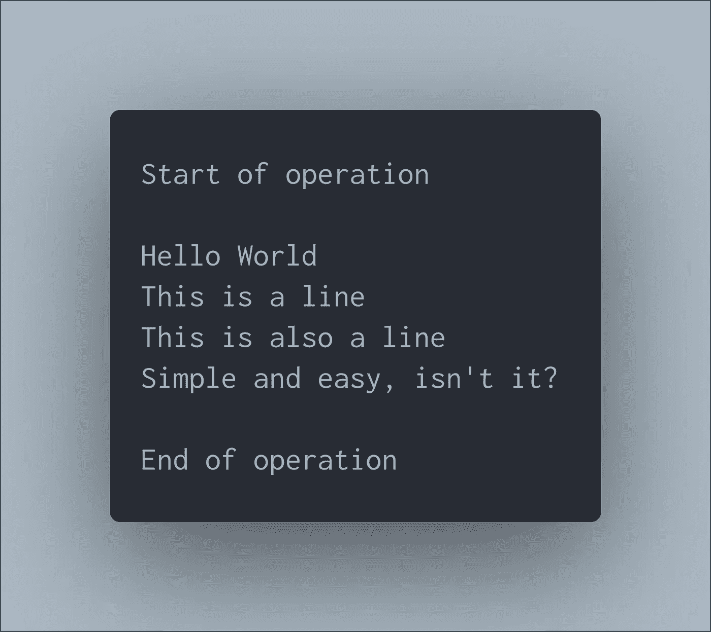

# 了解如何创建使用 Spring Boot 上传文件的应用程序

> 原文：<https://levelup.gitconnected.com/uploading-files-in-spring-boot-a2f6e3f653e1>

嘿，伙计们，在这个博客中，我们将使用 Spring Boot 构建一个应用程序，用于上传和处理它。这可以是任何文件，但我将用一个简单的文本文件来解释它。让我们开始吧。

但是在继续之前，我假设你已经知道以下几点。

1.Gradle
2。Spring Boot
3。Java 8
4。REST API

让我们从 [start.spring.io](https://start.spring.io) 创建一个新项目。我只添加了两个依赖项， *web* 和 *Lombok* 。

build.gradle

我们将从编写一个简单的 REST 控制器开始。在这个控制器中，我们有一个处理 POST 请求的方法，它将要求 Spring 在客户端中以 *MultipartFile* 对象的形式给出上传的文件。收到文件后，我们将阅读文件中的每一行并打印出来，这只是为了本教程的目的。

UploadController.java

我们[自动连接](https://docs.spring.io/spring-framework/docs/current/javadoc-api/org/springframework/beans/factory/annotation/Autowired.html)服务类，它将由 Spring 作为 bean 给出，并调用 *consumeFile()* 方法。就是这样。让我们编写处理这一部分的服务类。

UploadService.java

我们只有一个方法将上传的文件作为一个 *MultipartFile* 对象并处理它。

1.  创建一个多部分文件的*输入流*。我们使用 Java 7 的 *try-with-resource* 来自动关闭 *InputStream* 。
2.  接下来是将 *MultipartFile* 对象中的内容复制到 *temp* 目录中的一个文本文件中。
3.  接下来，我们读取上一步中刚刚创建的文本文件中的所有行，并打印出来。
4.  最后，我们将删除在 temp 目录下创建的文本文件，因为将其存储在磁盘上是没有意义的。

还有另一种方法来消费上传的文件并对其进行操作。是的，我们可以通过*缓冲*来直接使用 *inputStream* ，而不是创建一个临时文件。这个方法比前一个更有效。下面是这样做的截图。我们创建一个 *BufferedReader* 并使用 *lines()* 方法获取每一行作为 *Stream < String >* 然后处理它，在这种情况下只是将它们打印出来。

UploadService.java

瞧。我们完了。这是一个简短的例子。但是你可以用你的任何逻辑来扩展它。例如，如果您想上传一个电子表格文档中的主数据，您可以很容易地完成。或者，您可以创建一个“文件存储服务”，在内部将上传的文件存储到云存储中，我们可以返回文件的引用(可能是一个短 URL)作为响应。有了这个参考，我们可以随时随地获取文件。

让我们运行并测试应用程序。我使用 *Gradle wrapper* 来构建 jar，并将其作为独立的应用程序运行，因为 Spring 将默认提供嵌入式 Tomcat 服务器。运行下面的命令构建 jar 并运行应用程序。

> 。/gradlew 干净生成
> 
> 爪哇罐。/build/libs/upload-demo-0 . 0 . 1-snapshot . jar

为了测试 API，我们可以使用*邮递员*。下面是控制台中显示的输出。

简单吧？分享您的反馈。感谢您的阅读！