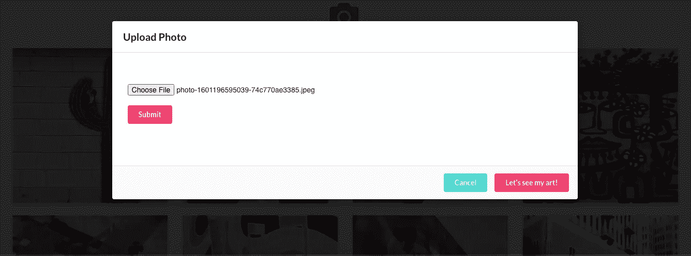

# 在 Rails 中上传图像——使用 Cloudinary API 对项目进行反应

> 原文：<https://levelup.gitconnected.com/uploading-images-in-your-rails-react-project-using-cloudinary-api-3bf546e0e430>

*想建立一个图像库？在你的 Rails/React 项目中，有很多处理图片上传的方法；例如使用载波、主动存储等等。在这篇文章中，我不打算谈论一个相对于另一个的优缺点。相反，我将指导您设置 Cloudinary API，因为这是一种处理上传图像的超级简单的方法。*


Cloudinary 是一个基于云的图像和视频管理平台。它使用户能够为网站上传、存储、管理、操作和传送图像和视频。要开始使用 Cloudinary，你需要在他们的网站(【cloudinary.com】T2)上注册，以获取你的云信息。您将需要一个**云名称**、 **API 密钥、**和 **API 秘密**来在您的项目中设置它。所有这些信息都可以在帐户控制台的仪表板页面中找到。

现在让我们开始使用 Rails API 设置我们的后端。

首先，你需要将*云宝石*添加到你的宝石文件中。这个 gem 简化了将 Cloudinary API 集成到您的项目中。

增加

```
gem 'cloudinary'
```

添加到您的 Gemfile 并运行

```
bundle install
```

然后在**config/initializer**文件夹中创建一个文件，并将其命名为 **cloudinary.rb**

接下来，将以下代码添加到该文件中:

```
Cloudinary.config do |config| config.cloud_name = ENV['cloud_name'] config.api_key = ENV['cloud_api_key'] config.api_secret = ENV['cloud_api_secret'] config.secure = true config.cdn_subdomain = trueend
```

在这个文件中，我们将设置全局配置参数。**云名**、 **api_ key** 和 **api_secret** 为强制设置。云名称用于为您的所有媒体资产构建公共 URL。Api_key 和 api_secret 用于与 Cloudinary API 通信并签署请求。 ***安全*** 是一个可选参数，它强制 HTTP 用于资产交付，即使它们嵌入在不安全的 HTTP 页面中。

在 **config** 文件夹中，您必须已经有了 **application.yml** 文件(如果您正在使用**gem‘figaro’**来保护您的 API 密钥，否则您可以手动创建 application.yml)。将您的 Cloudinary 密钥添加到该文件中。

```
cloud_name: 'xxxxxxxxx'cloud_api_key: 'xxxxxxxx'cloud_api_secret: 'xxxxxxxxx'
```

注意:确保您的密钥以字符串格式存储，并将***application . yml***添加到您的 ***。gitignore*** (如果你用的是**【费加罗】**它会把 *application.yml* 添加到*。gitignore* 自动)。

我们现在已经完成了为云设置密钥。现在让我们为我们的照片创建一个模型。你可以用你喜欢的任何方式做这件事。我更喜欢用发电机。

```
rails g model Photo image:string
```

然后创建一个控制器:

```
rails g controller photos
```

别忘了路线。在 **routes.rb** 文件中我们添加

```
resources :photos
```

如果您只是练习创建和删除照片，请分别更新您的路线。

为了上传从客户端发送到云端的图像，我们需要在我们的 **PhotosController 中使用 **create** 方法。**一旦用户在我们的网站上上传照片，Cloudinary 将发送一个响应，其中包含上传到我们云的照片的 URL 字符串。在 Rails 数据库中，我们不存储实际的照片，我们只存储由 Cloudinary 托管的照片的 URL 字符串。

*Cloudinary gem* 让我们可以使用所有 Cloudinary 方法。我们要用来上传照片的是

```
Cloudinary::Uploader.upload(file, options ={})
```

方法，它接受一个图像作为参数。(举个例子:cloud inary::uploader . upload(' my _ image . jpg '))。

上传完成后，即可对上传的图像进行操作。上传调用返回给我们一个对象；现在我们只需要用**键[‘URL’]**提取一个值。该网址让我们可以访问存储在云中的上传照片。

在 **PhotosController** 中添加以下代码:

```
def create result = Cloudinary::Uploader.upload(params[:image]) photo = Photo.create(user_id: current_user.id, image:   result['url']) if photo.save render json: photo else render json: photo.errors endend
```

*(在我的例子中，我有* ***属于*** *关系，这就是为什么我在创建时也传递了一个 user_id。)*

好了，现在我们可以继续我们的 React 应用程序，为我们的前端构建一个上传功能。首先，让我们创建一个组件，该组件将呈现一个上传照片的表单，并将处理向 Rails API 提交照片。

*(使用 XHR CORS 请求从浏览器直接上传。确保您在 Rails 后端使用了****gem‘rack-CORS’****，并取消注释掉****CORS . Rb****文件中的代码，将 origins 改为****' *****。)*

让我们用**类型的‘文件’**创建一个输入字段，这样用户可以从他们的本地机器上选择一个文件。此外，我们在**接受属性**中包含一个通配符 **(*)** 来表示任何格式的类型都是可接受的。

输入监听 **onChange** 事件，该事件将为我们的照片设置一个状态。我们通过***event . target . files .***访问我们的附加文件，而不是通过 *event.target.value* 访问值

此外，我们需要创建一个新的 **FormData 对象**，并向其添加一个新的键值对。在我们的例子中，键是'*照片*'，值是*照片的状态*。一旦创建了新对象，我们就可以向后端提交请求了。

```
import React from 'react' class NewPhoto extends React.Component { state = { photo: null } onChange = (e) => { e.persist() *this*.setState(() => { return { * //Upload only one file, multiple uploads are not allowed*
       [e.target.name]: e.target.files[0] } }) } onSubmit = (e) => { e.preventDefault() * //create a FormData object*
   const formData = new FormData() *// Add the file to the AJAX request* formData.append('photo', *this*.state.photo) *this*.props.handleUploadPhoto(formData)} render(){ return ( <form onSubmit={*this*.onSubmit} > <input type='file' name='photo' accept='image/*' onChange={*this*.onChange}/> <button type='submit' value='Submit>Submit</button> </form> ) } }export default NewPhoto
```

我将 **handleUploadPhoto** 放在了一个不同的组件中，但是你可以用相同的组件来写它。这是个人喜好的问题。

我们需要将存储照片状态的对象传递给 **handleUploadPhoto** ，并向服务器发出 ***POST*** 请求。请注意，在 body 中，我们*附加了我们的 formData 对象*。一旦用户上传照片并点击提交按钮，一个请求将被发送到服务器，在前端更新我们的状态，用户被直接带到他们刚刚上传的照片。

```
handleUploadPhoto = (formData) =>{ fetch('http://localhost:3000/photos', { method:'POST', body: formData }) .then(resp => resp.json()) .then(data => { *this*.setState((prevState) =>({ photos: [...prevState.photos, data] })) *//scroll down to the uploaded photo* window.scrollTo(0,document.body.scrollHeight)})}
```

就是这样！现在，用户可以上传将要存储在我们的云中的照片，在后端，数据库存储这些照片的所有 URL。

