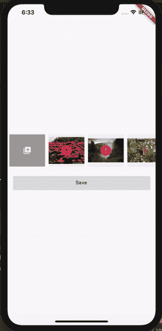

# 使用 Flutter 将图像上传到 S3 自动气象站—第 2 部分

> 原文：<https://levelup.gitconnected.com/uploading-images-to-s3-flutter-part-2-6a6fb000ba7b>

欢迎学习本教程，向 S3 自动气象站上传图像—第 2 部分

第 1 部分在这里[可用。](https://medium.com/@theboringdeveloper/uploading-images-to-s3-flutter-part-1-92c52ce62432)

你可以在 [Instagram](https://www.instagram.com/theboringdeveloper/) 上和我联系

## 让我们从看到我们的最终目标开始

## 让我们来回顾一下问题-

*   处理照片权限
*   打开图像拾取器，选择并加载图像
*   将图像上传到 AWS S3 存储桶
*   显示加载和错误
*   打开图像
*   保存图像
*   删除图像

我们已经解决了第 1 部分中的问题 1、2 和 3。

**确保你在** **这里勾选了第 1 部分** [**。**](https://medium.com/@theboringdeveloper/uploading-images-to-s3-flutter-part-1-92c52ce62432)

# 让我们现在解决问题 4

**问题 4:** 显示加载和错误上传图像

## 我们做了什么？

*   将库 **flutter_spinkit: 4.1.2** 添加到 *pubspec.yaml.*

 [## 颤振 _spinkit |颤振包

### 一个装载指示器的集合，以颤动的方式显示。深受@tobiasahlin 的 SpinKit 启发。依赖性…

公共开发](https://pub.dev/packages/flutter_spinkit#-installing-tab-) 

*   创建了一个可以**加载、出错和加载的 PhotoStatus 枚举**
*   创建了一个列表来保存每张照片的状态
*   在选择一张照片时，图像状态将是**正在加载，**然后我们在图像上看到一个正在加载的微调器
*   如果图像上传成功，我们将状态更改为**已加载**
*   如果上传时出现任何错误，我们将状态更改为**错误**

## 让我们检查输出-

**对于安卓-**

**对于 IOS-**

**问题 4 解决了。**

# 让我们现在解决问题 5

**问题 5:** 打开图像

主.镖

gallery_photo_wrapper .镖

## 我们做了什么？

*   将库**照片 _ 视图:^0.9.1** 添加到*公开说明书*

 [## 照片 _ 查看|颤振包

### 一个用于 Flutter 的简单的可缩放图像/内容小部件。PhotoView 使图像能够随用户缩放和平移…

公共开发](https://pub.dev/packages/photo_view#-installing-tab-) 

*   增加了照片点击时的点击监听器
*   如果照片没有上传，我们显示使用文件系统
*   如果照片上传，我们显示使用网络从 S3
*   如果上传照片时出现错误，我们将不会显示照片。
*   增加了一个后退按钮，允许用户退出照片视图

## 让我们检查输出-

**对于安卓-**

**对于 IOS-**

**问题 5 解决了。**

# 让我们现在解决问题 6

**问题 6:** 本地保存图像

## 我们做了什么？

*   将库 **photo_view: ^0.9.1** 添加到 *pubspec.yaml.*

 [## 共享首选项| Flutter 包

### 包装 NSUserDefaults(在 iOS 上)和 SharedPreferences(在 Android 上)，为简单数据提供持久存储。数据是…

公共开发](https://pub.dev/packages/shared_preferences#-installing-tab-) 

*   当应用程序打开时，我们从共享偏好设置或本地存储中加载所有图像
*   所有加载的图像将使用 AWS S3 下载链接显示，因为如果相同的图像可能在文件系统中不可用，我们只在本地存储 S3 网址
*   当单击保存按钮时，我们将列表保存在共享首选项或本地存储中
*   我们也可以储存在在线数据库中

## 让我们检查输出-

**对于安卓-**

**对于 IOS-**

**问题 6 解决了。**

# 让我们现在解决问题 7

**问题 7:** 删除图像

## 我们做了什么？

*   在所有图像上添加删除部件
*   在删除小部件上添加点击监听器

## 让我们检查输出-

**对于安卓-**

**对于 IOS-**

**问题 7 解决。**

我们做到了:)

点击查看完整项目[。](https://github.com/GursheeshSingh/flutter_image_picker)

> 谢谢你坚持到最后

# 更多 flutter spinner 博客

 [## 信用卡滑块—颤动

### 欢迎来到本教程，创建一个可怕的信用卡滑块。

levelup.gitconnected.com](/credit-card-slider-flutter-1edec451103a)  [## Twitter 旋转器——颤动

### 欢迎来到本教程，在 Flutter 中创建 Twitter Spinner

medium.com](https://medium.com/swlh/twitter-spinner-flutter-81ca13c0f00e)  [## 简单易用的通用底部导航栏——Flutter

### 欢迎来到本教程，在 Flutter 中创建一个普通的底部导航栏。

medium.com](https://medium.com/swlh/common-bottom-navigation-bar-made-easy-flutter-199c9f683b29)  [## 颤动:TabBar 的自定义标签指示器

### 欢迎学习本教程，为 Flutter 中的 TabBar 创建一个自定义的标签指示器。

medium.com](https://medium.com/swlh/flutter-custom-tab-indicator-for-tabbar-d72bbc6c9d0c) 

我将会发布更多关于 flutter 的消息，敬请关注:)

 [## Gursheesh Singh 印度昌迪加尔|职业简介| LinkedIn

### 查看 LinkedIn 上 Gursheesh Singh 的专业资料。LinkedIn 是世界上最大的商业网络，帮助…

www.linkedin.com](https://www.linkedin.com/in/gursheesh-singh-a66545154/)  [## boring 开发者

### 欢迎回到 Instagram。登录查看您的朋友、家人和兴趣爱好捕捉和分享了什么…

www.instagram.com](https://www.instagram.com/theboringdeveloper/)