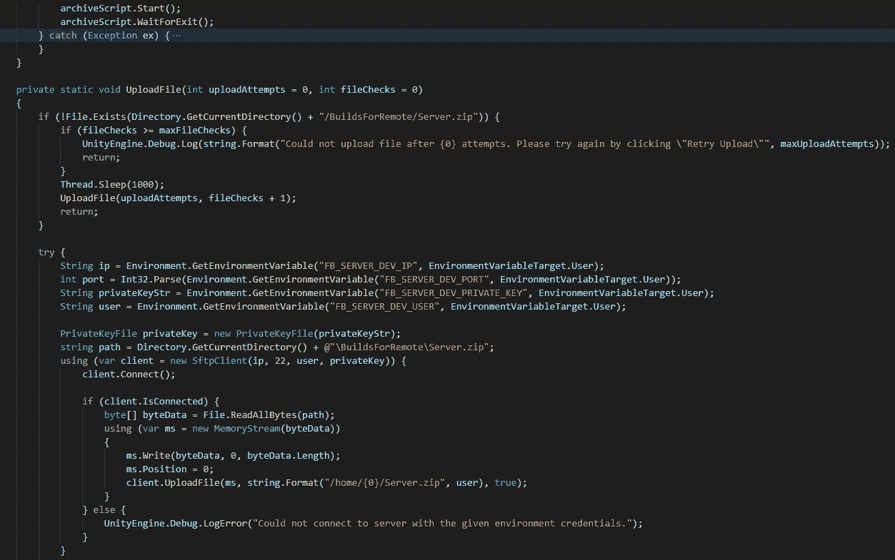
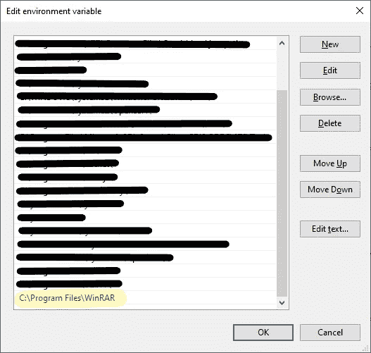
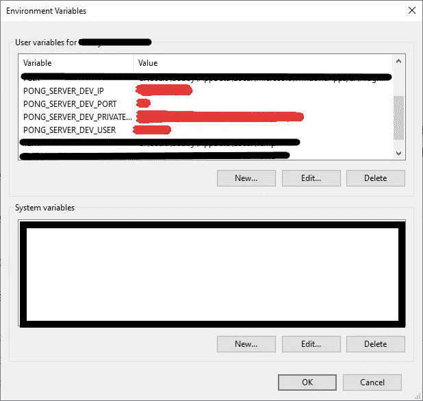
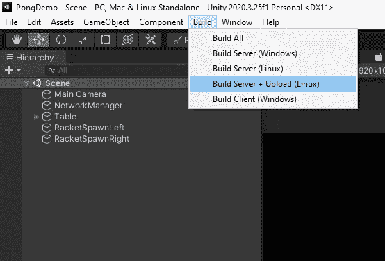

# 上传镜像服务器很容易在 Unity 中建立

> 原文：<https://levelup.gitconnected.com/uploading-mirror-server-builds-in-unity-easily-bd29b6fc4957>

自动化技巧，以帮助测试你的多人游戏服务器建立快

[GitHub](https://github.com/michaelkellam-cs/ArchiveUploadServerExample)



# 发展的斗争

当开发多人游戏时，调试网络问题和其他游戏功能已经够难的了。将服务器文件打包并上传到服务器上是另一件痛苦的事情，我已经花了几个小时寻找高效完成这项工作的方法。虽然它并不完美，但我认为我已经有了一个很好的工作流程来简化它，这样你就可以把更多的时间放在开发你的游戏上。

## 注意:这个过程不是任何种类的管道，所以我建议您只在想要在正确部署之前快速测试新特性时使用这个方法。

# 要求

*   Windows 10(我们将使用批处理脚本。如果你能写一个 *bash* 脚本或者其他类型的能够归档和移动文件的脚本，你也许能让它在另一个操作系统上工作)
*   [统一](https://unity.com/download)
*   [镜子](https://mirror-networking.com/)
*   [WinRAR](https://www.win-rar.com/start.html?&L=0)
*   [仁慈。SshNet C# DLL](https://www.nuget.org/packages/SSH.NET/) (使用 net35 版本。导入 dll 可能很棘手，所以[这里有一个关于如何做的教程](https://www.youtube.com/watch?v=GRn49ehm_pI)
*   AWS Lightsail(或其他 Linux 托管服务)的实例

# 概观

我们将按此顺序:

*   **构建**服务器，
*   **归档**使用 WinRAR 构建的服务器，以及
*   **使用 SFTP 将存档的服务器上传到远程托管服务**

在 Unity 编辑器中，所有这些都与**中的一个**按钮有关。

# 出发

作为起点，我们将使用 [ShrineGames 的教程 repo](https://github.com/ShrineGames/UnityMirrorTutorials) 作为构建脚本([看看 Shrine，他们有很棒的镜像视频！](https://www.youtube.com/c/ShrineApp))。我们将在此基础上构建，特别是 Linux 服务器脚本。

请确保查看该脚本中已经存在的代码，并查看是否需要对其值进行任何更改，以应用于您当前的游戏。例如，`buildPlayerOptions.scenes`只有一个场景，它可能与你的任何场景都不对应。之后，我们可以开始归档过程。

# 归档

为了上传服务器文件，必须将**存档**。我们将使用 **WinRAR** ，因为您可以通过命令行运行它，这对于通过批处理脚本运行它很有用。
您需要将 winrar.exe 的路径添加到 path 变量中。稍后，当我们运行归档程序脚本时，将会用到它。



我建议将这段代码封装在一个 **try/catch** 中，这样你就可以在 Unity 中记录任何错误。

接下来，这将是**归档**文件的方法。我们称之为`ArchiveFile()`。我们将使用一个新的`Process`作为我们的批处理脚本，这是一个运行 WinRAR 的简单的一行命令

```
Process archiveScript = new Process();
```

接下来，我们需要找到**到【winrar.exe】的**绝对路径。这是因为当创建一个新进程时，这个进程*不*知道任何路径值。所以我们需要在运行之前告诉脚本 winrar.exe 在哪里，因为我们不能在脚本中只使用路径值。只需几行代码就可以找到这一点，我们将路径字符串分成一个由分号分隔的字符串数组。然后，对于每个字符串，检查目录*与 exe 名称(winrar.exe)的组合*是否表示有效的文件路径。

```
string exe = "winrar.exe";string result = Environment.GetEnvironmentVariable("PATH", EnvironmentVariableTarget.Machine)
    .Split(';')
    .Where(s => File.Exists(Path.Combine(s, exe)))
    .FirstOrDefault();result = "\"" + result + "\"\\";
```

接下来，我们要设置**文件名**和**参数**。一旦设置了这些`Process`值，脚本就可以运行了。

```
string path = Directory.GetCurrentDirectory() + "/archiver.bat";
archiveScript.StartInfo.FileName = path;
archiveScript.StartInfo.Arguments = result;archiveScript.Start();
archiveScript.WaitForExit();
```

根据经验，我了解到试图在 C#中直接归档*是一件非常困难的事情，所以我让批处理脚本来做。在继续之前，您的`ArchiveFile()`方法应该是这样的:*

ArchiveFile()方法

在项目的根目录下，制作一个名为`archiver.bat`的**批处理**脚本，只有一行:

```
start cmd /k "cd Builds/Linux && %1winrar a -r Server.zip && move Server.zip ../../BuildsForRemote && exit"
```

这个批处理脚本做了几件事，每件事都用`&&`隔开:

1.  将目录设置为`Builds/Linux`
2.  运行 winrar.exe，**归档**服务器文件夹并将其命名为`Server.zip`。`%1`指的是第一个参数，我们将其设置为 winrar.exe 的目录。
3.  将 Server.zip 移动到文件夹`BuildsForRemote`。这是为了不让根目录变得混乱。
4.  退出脚本

这就是**归档**的全部内容。下一部分是**使用 SFTP 上传**文件。

# 上传

这个解释将假设你使用一个**私钥**来连接 SFTP。我已经在 AWS Lightsail 上用 Debian 和 Ubuntu 测试过了。

首先，我们要验证文件是否已经完成**归档**并被移动到文件夹 **BuildsForRemote。**参数`fileChecks`记录脚本检查存档文件是否存在的次数。这是必需的，因为在归档仍在进行时调用了`UploadFile()`,这意味着在归档完成之前文件将不存在。

在我们试图**上传**文件之前，我们会检查服务器文件是否存在于指定的目录中。为了确保 Unity 永远不会在尝试上传文件时陷入循环，您需要设置一个文件检查次数的限制。这将使用一个名为`maxFileChecks`的全局变量来完成。

```
private short maxFileChecks = 50;
```

在该方法中，添加了一个`fileChecks`的`int`参数，所以看起来是这样的:

```
private static void UploadFile(int fileChecks = 0)
```

如果文件*不存在*，我们将递增`fileChecks`，并在一秒钟后重试(`Thread.Sleep(1000)`)。如果`fileChecks`的值达到文件检查的最大次数，而文件还不存在，它将取消**上传**。根据您的计算机需要多长时间将**存档**，您可能想要更改`maxFileChecks`的值。对于每个文件检查，它将分配**一秒钟**让脚本完成归档。

```
if (!File.Exists(Directory.GetCurrentDirectory() + "/BuildsForRemote/Server.zip")) {
    if (fileChecks >= maxFileChecks) {
        UnityEngine.Debug.Log(string.Format("Could not upload file after {0} attempts. Please try again by clicking \"Retry Upload\"", maxUploadAttempts));
        return;
    }
    Thread.Sleep(1000);
    UploadFile(uploadAttempts, fileChecks + 1);
    return;
}
```

一旦发现文件存在于给定的目录中，我们就可以继续设置服务器文件的**上传**，从服务器的凭证开始。

有两种方式可以拥有 **IP** 、**用户名**、**端口**和**私钥**:

*   环境变量(推荐，更安全)
*   硬编码

如果按照**环境变量**的路线，一个好的命名约定是`GAME-ABBREVIATION_SERVER_DEV_VALUE`
，即:`PONG_SERVER_DEV_IP`，`PONG_SERVER_DEV_PRIVATE_KEY`

*   `IP`:服务器的 IP 地址
*   `PORT`:连接 SFTP 的港口，几乎都是 22
*   `USER`:服务器用于连接的用户名
*   `PRIVATE_KEY`:用于远程连接服务器的私钥的路径



设置用户变量将使你的代码更加安全，因为没有硬编码！

我们所有的**上传**功能都将发生在一个叫做`UploadFile()`的方法中。

第一步是动态地拉这些环境变量*(如果走**硬编码**路线，简单地用值替换`Environment.GetEnvironmentVariable(...)`*

```
*String ip = Environment.GetEnvironmentVariable("FB_SERVER_DEV_IP", EnvironmentVariableTarget.User);int port = Int32.Parse(Environment.GetEnvironmentVariable("FB_SERVER_DEV_PORT", EnvironmentVariableTarget.User));String user = Environment.GetEnvironmentVariable("FB_SERVER_DEV_USER", EnvironmentVariableTarget.User);String privateKeyStr = Environment.GetEnvironmentVariable("FB_SERVER_DEV_PRIVATE_KEY", EnvironmentVariableTarget.User);*
```

*然后，使用提取的路径获取**私钥**。*

```
*PrivateKeyFile privateKey = new PrivateKeyFile(privateKeyStr);*
```

*接下来，我们希望获得我们在`ArchiveFile()`中创建的`Server.zip`文件的绝对路径，这样我们就可以指向要上传的正确文件。*

```
*string path = Directory.GetCurrentDirectory() + @"\BuildsForRemote\Server.zip";*
```

*然后，我们使用**仁慈。SshNet** SFTP 库上传 Server.zip*

```
*using (var client = new SftpClient(ip, 22, user, privateKey)) {
    client.Connect();
 if (client.IsConnected) {
        byte[] byteData = File.ReadAllBytes(path);
        using (var ms = new MemoryStream(byteData)) {
            ms.Write(byteData, 0, byteData.Length);
            ms.Position = 0;
            client.UploadFile(ms, "/home/ubuntu/fbrev/Server.zip", true);
        }
    } else {    
        UnityEngine.Debug.LogError("Could not connect to server with the given environment credentials.");
    }
}*
```

*然后，作为常规管理，当文件上传完成时，如果您不再需要 Server.zip 文件，就可以删除它。*

*`File.Delete(path);`*

# *异常处理/优化*

*就功能而言，这足以让它工作。然而，软件是*永远不会*完美的，所以你会想要有一个安全网，以*尝试/捕捉*的形式，以确保任何**错误**得到相应的处理。首先，您将希望获得问题的正确记录。此外，如果您想要重试失败的**上传**，您将想要记录已经进行了多少次尝试，这样您可以完全停止上传尝试并记录每次失败尝试背后的原因。*

*首先，您将想要添加另一个*全局变量*:*

```
*private static short maxUploadAttempts = 5;*
```

*在方法参数中，您将希望再添加一个`int`变量，设置为 0，称为`uploadAttempts`*

```
*private static void UploadFile(int uploadAttempts = 0, int fileChecks = 0)*
```

*参数`uploadAttempts`记录 SFTP **上传**的尝试次数。发生错误后，您希望增加该值并重新运行该方法。*

*上传失败有多种原因。如果是一个`ArgumentException`，那就是*文件名*或者其他参数有问题。在这种情况下，重试**上传**是没有意义的，因为这是我们传递的参数的根本问题，所以我们可以让**上传**失败，并将其记录到 Unity 中。否则，我们将重试**上传**，递增`uploadAttempts`。最终，如果达到最大**上传**尝试限制，它将取消上传并记录错误。*

*在 *try/catch* 中，`ArgumentException`的特定异常将首先出现，然后是随后的一般异常`Exception`，其中它将增加`uploadAttempts`并再次尝试，除非达到最大尝试次数*

```
*try {
    // Previous Upload Logic...
} catch (ArgumentException argEx) {
    UnityEngine.Debug.LogError(argEx.StackTrace);
    return;
} catch (Exception ex) {
    if (uploadAttempts >= maxUploadAttempts) {
        UnityEngine.Debug.LogError(ex.ToString());
        return;
    }
    UnityEngine.Debug.LogWarning(string.Format("Upload attempt failed on attempt #{0}. Attempting to upload again. ({0} of {1} max attempts)", uploadAttempts, maxUploadAttempts));
    UploadFile(uploadAttempts + 1, fileChecks);
}*
```

*在这之后，`UploadFile()`应该是这样的:*

*一旦这两个方法都完成了，剩下的就是创建一个方法来完成普通的**构建**，然后调用`ArchiveFile()`，接着调用`UploadFile()`。*

*构建、归档和上传的方法*

*然后，一旦你的脚本重新编译，你应该在你的 Unity 编辑器顶部看到一个`Build`标签。展开它，然后您应该看到“构建/构建服务器+上传(Linux)”*

**

*仅此而已！使用一些脚本，上传和测试游戏的新版本应该会容易得多。您仍然必须在 Linux 中解压缩并正确运行服务器应用程序，但这是另一个主题，我可能改天再写。祝你在构建你的游戏时好运！*