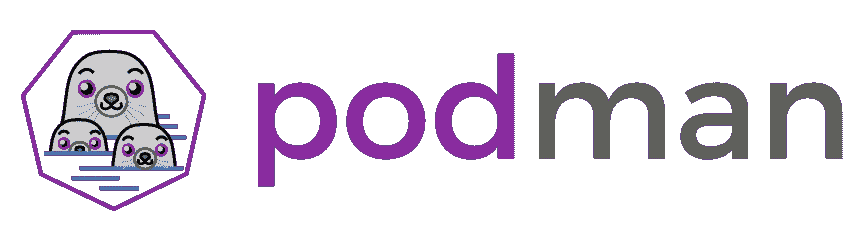
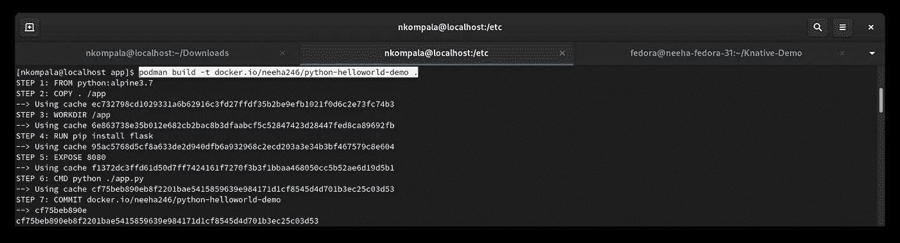
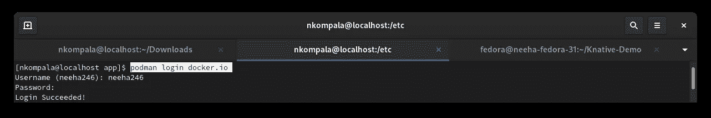
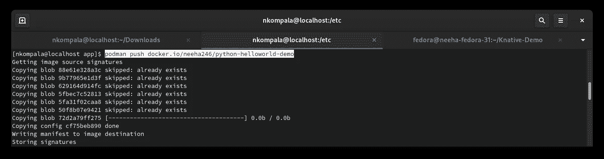
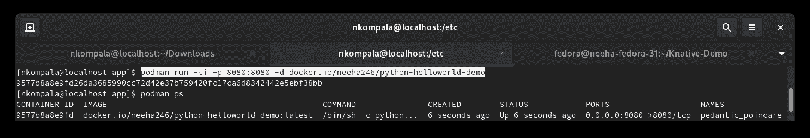
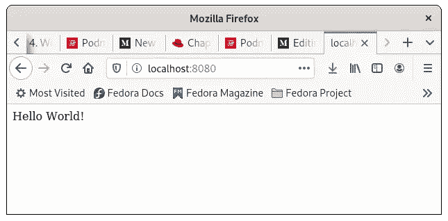
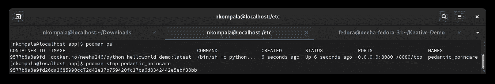

# 使用 Podman 上传您的第一张 Docker 图片

> 原文：<https://levelup.gitconnected.com/uploading-your-first-docker-image-using-podman-87713e2043a0>



Podman 是一个无后台容器引擎，用于在 Linux 系统上开发、管理和运行 OCI 容器。容器可以作为根运行，也可以在无根模式下运行。

Docker 是一组平台即服务产品，使用操作系统级虚拟化来交付称为容器的软件包中的软件。容器是相互隔离的，捆绑了它们自己的软件、库和配置文件；他们可以通过明确定义的渠道相互交流。

一个 **Docker 映像**是一个只读模板，包含一组创建容器的指令，该容器可以在 **Docker** 平台上运行。它提供了一种便捷的方式来打包应用程序和预先配置的服务器环境，您可以将其用于自己的私人用途，或者与其他 **Docker** 用户公开共享。

您将推进 docker.io 的图像基本上有:

*   Docker 文件
*   应用程序(这里我们将使用 python)
*   带包的文本文件(依赖)

让我们首先创建一个新目录(app)并在其中设置一个 **docker 文件**。

*Dockerfile :*

```
FROM python:alpine3.7
COPY . /app
WORKDIR /app
RUN pip install -r requirements.txt
EXPOSE 8080
CMD python ./index.py
```

**来自 python:apline3.7** 是 linux 系统中可用的最基本的 python 版本。

**复制**和**工作目录**只是设置**应用**作为将要工作的目录。

我们的应用程序文件可能需要在 python 的基本 linux 版本中通常找不到的包。所以我们写了一个 **requirements.txt** (我们将在下面看到一个例子)，它将保存我们需要的包，并在**上运行**命令，所有的包都将被安装。

**EXPOSE** 是打开我们将用来连接的端口，我们也会在应用程序代码中提到这一点。

我们已经讨论了上面的需求文件，这个应用程序很简单，不需要很多包。

*requirements.txt :*

```
flask
```

我们已经准备好了**文档**和**需求。txt** 接下来…

*app.py* :

我们可以使用 Docker 或 Podman 将文件上传到 docker.io 或 quaoy.io。

**注意**:当你必须在 Knative 上运行它时，确保端口是 8080，flask 默认为 5000，在上面的代码中我们明确地声明它是 8080。

## 您可能会面临错误的几个重要领域

*   确保您的应用程序和 Docker 文件中的端口号相同。
*   docker 文件中的文件名与应用程序的名称相同。

一旦你所有的文件都设置好了，进入 **app** 文件夹，那里存储着你的 docker 文件和剩余的文件，然后运行下面的命令。

```
podman build -t docker.io/neeha246/python-helloworld-demo .
```



```
podman login docker.io
```



```
podman push docker.io/neeha246/python-helloworld-demo
```



## 如何检查您的映像是否正在运行

要检查您的映像是否正常运行，您需要使用 podman 或 docker 在本地系统上运行映像，并查看应用程序是否正在部署。

```
podman run -ti -p 8080:8080 -d docker.io/neeha246/python-helloworld-demo
```

你不得不提到端口为 8080 和图像链接。您还可以选择在您的系统上给图像一个本地名称，否则 podman 会给它一个随机的名称。然后运行下面的命令，我们可以看到你的容器被部署。

```
podman ps
```



如果在运行您的命令后，您没有找到正在部署的容器，请尝试:

```
podman ps -a
```

上面的命令让您看到您试图部署的容器 ID/名称，您可以使用它来检查 podman 中的日志。

现在只要去任何一个浏览器，给链接 **localhost:8080** (这里)，基本上就是 localhost: <端口号>。你可以看到你的申请，在这里，你好世界！正在显示。



一旦您可以看到正在部署的应用程序，您就可以确认您的映像工作正常。

## 删除容器

您可以对多个映像使用同一个端口，因此您需要删除不再使用的映像/容器，以便再次使用该端口。如果您运行 podman ps 命令，您可以看到分配给容器的随机名称 podman，使用该名称删除。

```
podman stop <Container name>
```



我的下一篇文章将是关于如何使用 Knative 部署这个映像，然后也许我们可以使用 GO Lang 进一步编写 docker。