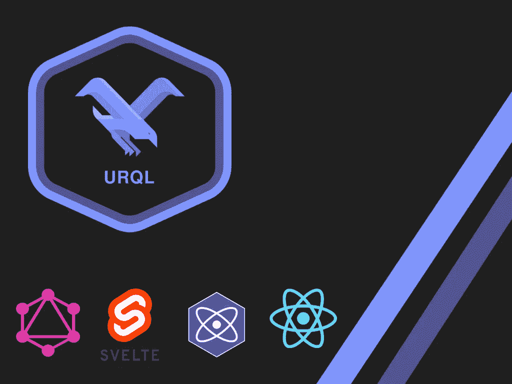
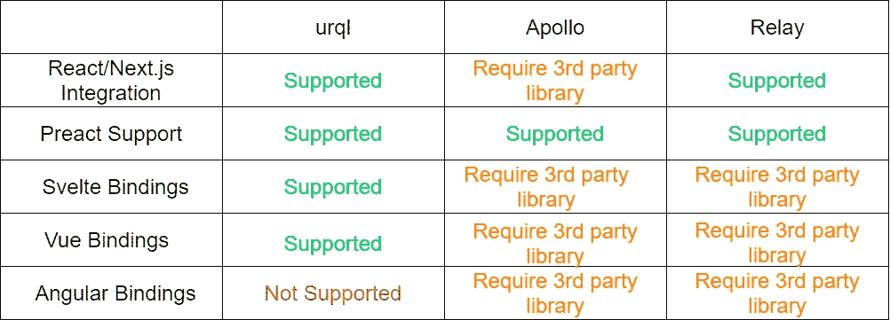
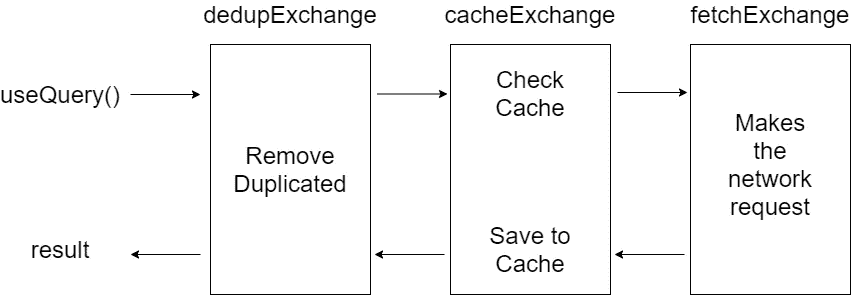

# 高度可定制和多功能的 GraphQL 客户端

> 原文：<https://levelup.gitconnected.com/urql-the-highly-customizable-and-versatile-graphql-client-69e4e3406904>



在过去的十年中，REST 架构已经成为 web 应用程序的行业标准，因为 REST 提供了一种无状态的服务器和结构化的方式来访问后端资源。但是随着时间的推移，为了适应不断变化的需求，REST 变得越来越麻烦。脸书引入了 Graphql 来避免 REST 架构的问题。

*   提取过量/不足
*   适应快速变化的前端
*   一个应用程序的多个端点

Graphql 遵循一个规范，所以客户机和服务器都将支持[模式格式](https://graphql.org/learn/schema/)和[查询格式](https://graphql.org/learn/queries/)，支持一些高级特性，如兑现和乐观变异。所以 Graphql 在开发人员中流行的原因显而易见。尽管脸书引入了 graphql，但是是开源社区给它带来了生机。目前，在构建 Grpahql 应用程序服务器和客户机时，有许多选择。一些著名的客户端有 [URQL](https://formidable.com/open-source/urql/) 、[阿波罗客户端](https://www.apollographql.com/)和[中继](https://relay.dev/)。这些客户端提供了与其他客户端不同的功能，如 Axios 或 fetch。 [Apollo 客户端](https://www.apollographql.com/)和 [Relay](https://relay.dev/) 是最常用的客户端库，但是人们转向了其他的替代库，比如 [URQL](https://formidable.com/open-source/urql/) 、 [react-query](https://react-query.tanstack.com/) ，甚至 [AWS Amplify](https://docs.amplify.aws/) 。

在本文中，让我们来看看 graphql 客户端库，它值得 graphql 社区中称为 [URQL](https://formidable.com/open-source/urql/) 的关注。

# 什么是 URQL

URQL 是 React 的一个轻量级、可扩展的 GraphQL 客户端。[威猛](https://formidable.com/)2019 年推出 [URQL](https://formidable.com/open-source/urql/) 作为[阿波罗客户端](https://www.apollographql.com/)的替代。 [URQL](https://formidable.com/open-source/urql/) 看起来有点类似[阿波罗客户端](https://www.apollographql.com/)。尽管如此，它还提供了额外的功能，并有更好的文档，易于配置，并支持离线模式，文件上传和认证等功能。

# URQL 与阿波罗和其他人有何不同

Apollo 是 react 社区中最著名的 graphql 客户端库，您将能够看到 [URQL](https://formidable.com/open-source/urql/) 中的一些特性与 [Apollo 客户端](https://www.apollographql.com/)非常相似。与 [Apollo 客户端](https://www.apollographql.com/)不同的是， [URQL](https://formidable.com/open-source/urql/) 带有一个单独的包，而 Apollo 需要几个包来实现额外的功能。这些库的文件大小可以被认为是一个显著的差异，因为 Apollo 的文件大小超过 100kb(其他库如 apollo-boost + react-apollo)，而 urql 的文件大小为 21.5kB。URQL 是轻量级的、可扩展的，并且有开源社区的支持，这使得 URQL 能够解决[持久化查询](https://github.com/FormidableLabs/urql/issues/196)。



urql vs 阿波罗 vs 接力

# 为什么您应该搬到 URQL

URQL 是由于 Apollo 日益复杂而引入的

*   易于使用
*   性能和功能
*   逻辑默认行为和缓存
*   易于扩展

# URQL 体系结构

Uqrl 采用包含电池的方法，其架构依赖于非个人化交换机(插件)，允许即插即用的功能。默认情况下，URQL 将提供创建 graphql 应用程序所需的足够数量的特性，您可以根据需要通过交换添加更多特性。这种即插即用的架构是 URQL 成为高度可定制和灵活的 GraphQL 客户端的原因。

# Graphcache

URQL 中的缓存完全可以通过交换(插件)来定制。URQL 提供了两种不同的兑现机制

*   **文档缓存**
    文档缓存的行为类似于浏览器缓存，它通过缓存每个查询的结果来帮助最大限度地减少向 GraphQL API 重复发送相同的请求。默认情况下，URQL 将提供文档缓存。
*   **规范化缓存** 随着时间的推移，应用程序将会增长，增加 URQL 管理的数据和状态的复杂性。规范化缓存通过将 JSON 数据反规范化回关系数据结构来帮助避免这种复杂性，关系数据结构通过可以直接查找的键来存储所有实体。要启用规范化缓存，您必须安装[@ urql/exchange-graph cache](https://www.npmjs.com/package/@urql/exchange-graphcache)，并将它们包含在您的 URQL 配置中。

# URQL 入门

在这一节中，让我们看看如何用 Graphql 创建一个 React 应用程序

## 步骤 01:安装

让我们通过下面的命令在 React 应用程序上安装 URQL。这些命令将安装所有必需的

```
npx create-react-app urql-pokemons
cd urql-pokemons
yarn add **urql** **graphql** antd
```

## 步骤 02:配置 URQL

配置 URQL 很简单，配置可以在 React 应用程序的 index.js 文件中完成。在这个配置中，您需要通过参数 **url** 指定您订阅的 graphql 服务的端点。可以通过 fetchOptions 部分配置任何其他选项，如附加头。配置完客户端后，您需要通过 **value** prop 将它传递给提供者的高级组件，该组件包装了整个应用程序，使您能够在整个应用程序中访问 graphql 客户端。

```
import { **createClient**, **Provider** } from 'urql';const **client** = **createClient**({
 **url**: process.env.REACT_APP_HASURA_URL,
 **fetchOptions**: () => {
  return {
   headers: {
     'content-type': 'application/json',
     'x-hasura-admin-secret': process.env.REACT_APP_HASURA_SECRET
   },
 };
},
});ReactDOM.render(
 <Provider **value**={**client**}>
  <App />
</Provider>,
document.getElementById('root')
);
```

## 步骤 03:使用 URQL 查询

通过 URQL 客户端查询或调用查询和变异非常简单。URQL API 提供了两个钩子来执行一个查询和一个变异。两个钩子都提供了一个状态来标识查询的状态(获取、错误)。

```
import { useQuery, useMutation } from 'urql';const **PokemonsQuery** = `
  query {
   Pokemons_Pokemon {
      id
      name
      power
      description
   }
  }
`;const createPokemon = `
 mutation CreatePokemon($name:  String!,$power:String!,$description:String!) {
insert_Pokemons_Pokemon(objects: { name: $name, power: $power, description: $description }) {
  returning {
   description
   id
   name
   power
  }
 }
}`const [{ data, fetching, error }] = useQuery({
  query: **PokemonsQuery**,
});const [{ fetching, error }, **executeMutation**] = **useMutation**(createPokemon)
```

## 步骤 URQL 的插件(交换)

可扩展性是 URQL 的主要焦点。是通过交流实现的。像所有 Grahql 客户端一样，URQL 是基于流的，它接受请求、查询或变异，并给出适当的响应(缓存值、来自 API 的响应或错误)。交换只是一个插件，允许您检查和修改传入和传出的流。URQL 中最常用的交换是

*   重复数据交换
*   cacheExchange
*   fetchExchange



默认交易所

上图显示了 urql 请求如何通过交换进行优化。您可以在您的应用程序中包含任意数量的交换，只要它们是未订阅的。

```
import { createClient, Provider } from 'urql';const client = createClient({
 url: process.env.REACT_APP_HASURA_URL,
 exchanges:{
  **dedupExchage**,
  **cacheExchange**,
  **fetchExchange**
 },
 fetchOptions: () => {
  return {
   headers: {
     'content-type': 'application/json',
     'x-hasura-admin-secret': process.env.REACT_APP_HASURA_SECRET
   },
 };
},
});
```

# 结论

总之，URQL 是目前最轻的 Graphql 客户机之一。它还提供了通过插件扩展其功能的灵活性，以增强开发体验。该库的简单性也使它成为使用 React 的 Graphql 初学者的一个很好的选择。要了解更多信息，您可以浏览 URQL 的[文档。最后，感谢您花时间阅读本文。我想看看你下面的问题和评论。](https://formidable.com/open-source/urql/docs/)

干杯！

# 了解更多信息

[](/jotai-atom-based-state-management-for-react-1ce8fd380296) [## jotai:React 的基于原子的状态管理

### 在过去的几年里，国家管理有了很大的发展。有很多库和方法可以让你…

levelup.gitconnected.com](/jotai-atom-based-state-management-for-react-1ce8fd380296) [](/build-your-own-self-hosted-ci-cd-workflow-with-github-actions-ec9ee1dcd800) [## 使用 GitHub 操作构建您自己的自托管 CI/CD 工作流

### GitHub 引入了 GitHub Actions，使开发人员能够直接从他们的 GitHub 库自动化工作流…

levelup.gitconnected.com](/build-your-own-self-hosted-ci-cd-workflow-with-github-actions-ec9ee1dcd800) [](/hookstate-the-simplest-state-management-tool-b02f7d3b01a4) [## 最简单的状态管理工具

### 小型、最小、简洁、可扩展、基于钩子的状态管理库

levelup.gitconnected.com](/hookstate-the-simplest-state-management-tool-b02f7d3b01a4) [](https://medium.com/swlh/intro-to-recoil-d689a77c5f04) [## 反冲介绍

### 反冲是一个反应的状态管理库，是由脸书的实验和开放源码…

medium.com](https://medium.com/swlh/intro-to-recoil-d689a77c5f04)