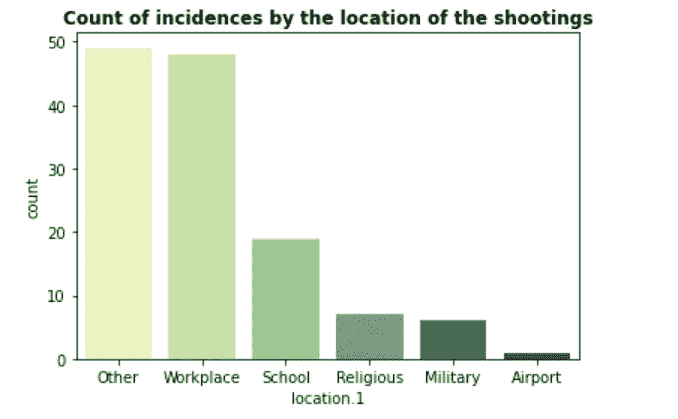

# 美国大规模枪击事件:数据告诉我们什么？— Python 教程

> 原文：<https://levelup.gitconnected.com/us-mass-shootings-what-does-the-data-tell-us-python-tutorial-452c89d135ae>

## 使用 Python 中的 Seaborn 和 Geopandas 调查并理解美国枪支暴力背后的统计数据

> 2020 年，美国死于枪支的儿童比死于汽车的儿童还多
> 
> 【1968 年至 2011 年间，美国约有 140 万人死于枪支[2]。
> 
> *在美国，每天有 12 名儿童死于枪支暴力。另有 32 人中弹受伤。[3]*

上述事实凸显了美国枪支暴力问题的严重性。在美国，枪支是儿童和青少年的头号杀手。19 岁或 19 岁以下的人占了枪支死亡人数的十分之一。在德克萨斯州乌瓦尔迪最近发生涉及儿童的学校屠杀事件以及最近在芝加哥独立日游行期间发生的事件之后，美国人重新开始了关于枪支准入的讨论。许多人认为，美国政府对基本人权的重视程度低于持枪权。与此同时，支持枪支的游说团体声称，枪支不会杀人，而是人会杀人。然而，这个话题是高度政治化的，让枪支管制倡导者和枪支支持者针锋相对。


图片来自 [635 制止枪支暴力照片——免费&免版税的 Dreamstime 库存照片](https://www.dreamstime.com/photos-images/stop-gun-violence.html)

但是我们能从美国的大规模枪击数据中推断出什么呢？我决定分析和调查枪支暴力数据，试图理解数字背后的故事。

## 数据

本文的数据取自[这里的](https://www.motherjones.com/politics/2012/12/mass-shootings-mother-jones-full-data/)。该数据集记录了美国过去 30 年(1991 年至 2022 年)发生的 130 起大规模枪击事件。请不要忘记，这个数据集只在死亡人数超过 3 人的情况下才考虑枪击事件——大规模枪击。此外，该数据集是在芝加哥独立日枪击事件之前拍摄的，因此不包含该事件的数据。该数据有 24 列，描述了枪击事件的时间和地点，枪手的个人特征，如年龄、性别、种族等，以及枪击事件中受伤/死亡的人数。

## 准备环境

由于我们将在这个项目中使用 geopandas 进行空间分析，所以第一步是安装 Geopandas。因为在我们的基础环境中安装它可能会导致它与一些已经安装的库冲突并导致安装失败，所以我们需要为它构建一个虚拟环境。

在任何情况下，为每个项目建立一个新的环境总是最佳实践。这意味着每个项目都可以有自己的依赖项，而不管其他项目的依赖项。虚拟环境有助于需求文件的隔离和组织。

这里的是一篇简单而优秀的文章的链接，这篇文章用 Python 创建了一个虚拟环境。按照指南中的步骤创建一个虚拟环境，将其包含在您的 jupyter 笔记本中，并安装 geopandas(如果您还没有)。

## 数据准备

如果你想继续，从[这里](https://www.motherjones.com/politics/2012/12/mass-shootings-mother-jones-full-data/)下载数据到你的本地文件夹，并读入数据框。

我们现在需要为分析准备好数据。

受伤、死亡和受害者总数显示在受伤、死亡和受害者总数栏中。这些列应该是整数类型。但是，如果我们检查受伤列中的信息，我们可以看到在该列中有一个字符串值是“tk *—“少于 10”*。该值会将整列视为一个字符串。

有几种方法可以处理这个值。1.)我们可以删除整行。但是因为我们的数据集已经很有限了，所以每一行都很重要。2.)用数值代替字符串值。我选择用中间值 5 来代替这个字符串。同样的代码:

列位置表示城市的名称，后跟州的名称。我决定将城市和州分开，以便按州进行进一步分析。我还用“Washington”替换了值“D.C ”,以匹配我们稍后将使用的位置数据。

在不同列的数据中，我们可以看到许多异常和不一致之处。例如，数据集中的列性别有 5 个不同的值——男性、M、男性和女性、女性和 f。显然，男性和 M 的值需要组合，女性和 f 的值也需要组合。我们将在此分析中使用的所有列的数据都由下面的代码清理。

## 数据分析

1.  **死亡人数最多的案例**

根据总死亡人数计算过去 30 年中的最严重事故，首先按照死亡人数降序排列数据框，然后取数据框的前 10 行。

```
df.sort_values(by = 'fatalities', ascending = False, inplace = True)
ax = sns.barplot(data = df.head(10), y = df['case'].head(10), x = df['fatalities'].head(10), palette = "YlGn" )
ax.bar_label(ax.containers[0]);
ax.set_title('10 Worst gun violence by number of fatalities', fontweight = 'bold')
```


总死亡人数最多的一次

2017 年拉斯维加斯大道大屠杀是美国历史上最严重的枪支暴力事件。一个周日的深夜，一名 64 岁的男子开始在拉斯维加斯大道向一大群音乐会观众开枪。他发射了 1000 发子弹，造成 546 人受伤，58 人死亡。

21 人死亡，最近的罗伯小学枪击案排在第九位。十起最严重的枪击事件中有四起发生在教育机构，包括大学和小学。

**2。这些武器是合法获得的吗？**


在 130 起案件中，有 80 起(62%)枪支是合法获得的。只有 13%的时间是非法获得枪支。考虑到枪支在美国随处可见，获得枪支的容易程度不足为奇。

据报道，2022 年，美国每 100 名居民拥有 120.5 件枪支，高于 2011 年的 88 件。美国拥有枪支的人数显著增加。

**3。射手的种族**


枪手的种族——作者提供的图片

大多数枪手——近 42%——是白人，其次是比例不明的 27%——和 13%的黑人。因为美国白人比其他任何种族都多，所以这种趋势并不能准确代表这个国家。为了进一步研究这一点，我们可以使用一个叫做**相对比率指数(RRI)，**的比率来比较一个种族相对于另一个种族参与的可能性。更多关于 RRI 的信息可以在[这里](https://mjja.org/images/resources/dmc/how-to-calculate-relative-rate-index.pdf)找到。

**4。拍摄者的性别**


拍摄者的性别——作者提供的图片

令人吃惊的是，96%的案件中，开枪者是男性。只有 2%的病例是女性，其余的 2%是男性和女性。

**5。之前有精神疾病的迹象？**


精神疾病的前期症状-作者图片

令人震惊的是，62%的案件中，开枪者之前就有精神疾病的迹象。统计数据显示，10 个案例中有 9 个案例中，枪手事先与某人分享了他的计划。必须制定适当的程序来识别这些迹象，并更加认真地对待它们。警告信号可能会突然出现在任何地方，在社交媒体平台，你管视频或在线论坛。

根据一项研究，超过 40%的有孩子的美国家庭拥有枪支，但这些家庭中只有不到三分之一的父母锁好并卸下他们的武器。这一惊人的统计数据得到了数据的证实。

**6。拍摄者的年龄**


射手的年龄-作者图片

射手游骑兵的年龄从 11 岁到 66 岁，虽然高峰在 20 岁和 40 岁左右。大约 25%的枪手不到 25 岁。

**7。受害者总数最多的州**


受害者总数最多的 10 个州

就受害者总数而言，内华达州是受灾最严重的州，其次是得克萨斯州、加利福尼亚州和佛罗里达州。

**8。按年份分列的受害者总数**


按年份分列的受害者总数:按作者分列的图像

为了按年分析数据，我将数据按年分组，并按受伤、死亡和受害者总数合计受害者总数(上面的第 2 行)。2017 年的死亡人数和受伤人数都是最高的，这使得今年成为一个异常值。今年的高数字是因为 2017 年在拉斯维加斯大道发生的大屠杀，当时一名 64 岁的男子向数千名音乐会观众开枪，造成 58 人死亡，546 人受伤。上图清楚地显示了过去两年死亡人数多于受伤人数的模式。2020 年是 Covid 年，事故和受害者数量最少。

**9。拍摄地点**



按位置统计案例数-按作者统计图片

大多数大规模枪击事件发生在被归类为“其他”的地方，依次是工作场所、学校和宗教场所。一个按地点和年份划分的快速线图显示了最近工作场所枪击事件的增加。工作场所枪击案最常见的动机是被同事拒绝的感觉、受欺负或失去晋升机会。

**10。美国地图上的枪击地点**

我们用图书馆的地图在美国地图上标出了枪击地点。为了在地图上标出各州，我们需要一个 shapefile，这是我从[这里](https://www.census.gov/geographies/mapping-files/time-series/geo/carto-boundary-file.html)下载的。形状文件包括美国所有的州，包括夏威夷群岛和阿拉斯加。在第 6 行，我们去掉了不在美国大陆的州。接下来，在第 8 行，我们将各州的受害者总数与形状文件数据合并，这样每个州都有自己的边界多边形。

对于拍摄的每个位置，我们创建点几何(第 15 行)。最后，我们在地图上分层绘制数据。地图的基层是 choropleth 地图(第 26 行)，其中一个州的颜色强度表示该州的受害者总数，红点表示枪击地点(第 33 行)。标记的大小与受害者的数量成正比。


按州和拍摄地点分列的受害者总数——按作者分列的图片

虽然上面的地图似乎显示内华达州的伤亡人数最多，但这只是因为 2017 年拉斯维加斯的枪击事件。当谈到枪击事件的数量时，像加利福尼亚和得克萨斯这样的州比美国其他州的总和还要多。蒙大拿、怀俄明、北达科他和南达科他等州似乎很平静，没有记录在案的大规模枪击事件。但需要注意的是，这一数据仅包含大规模枪击事件(3 名以上受害者死亡)。如果我们分析所有枪击事件的数据，这一趋势可能会有所不同。

12。美国地图上的校园枪击案


我认为分析发生在学校/教育环境中的枪击事件是有益的。为此，我仅将发生在学校/教育机构的枪击事件数据作为子集(第 2 行)。并按照与上一节类似的步骤创建了一个 choropleth 地图，该地图按州显示了学校中的受害者总数，并在地图上按枪击地点显示了散点图，受害者人数显示了点的大小。

迄今为止最严重的校园枪击事件发生在弗吉尼亚州的布莱克斯堡，一名学生在自杀前在校园里开枪。加州再次成为校园枪击事件最多的地方。

**结论**

为了理解数据背后的趋势和统计数据，我们研究了美国大规模枪击事件的数据。根据这一数据，我们可以得出结论，在大规模枪击事件中，96%的枪手是男性，42%的枪手是白人。在这个数据集中，20 到 40 岁是最常见的年龄范围。大约 62%的持枪者有精神病史。

然后，我们进行了空间分析，以了解不同地点/州的拍摄趋势。就大规模枪击事件和死亡人数而言，加利福尼亚州、德克萨斯州和佛罗里达州是受影响最严重的州。大多数枪击事件发生在指定为“其他”的地方，其次是工作场所和学校。近年来，工作场所枪击事件有所增加。

对只发生在教育机构的枪击案的调查也得出了类似的结论。加利福尼亚、德克萨斯、弗吉尼亚和俄勒冈是受灾最严重的州。

计算美国枪支立法和大规模枪击事件频率之间的关系可能是这项研究的进一步应用。这种分析可以扩展到包括所有的枪击事件(甚至是死亡人数少于 3 人的事件)。这会给我们提供一个不同于现在的图景。

感谢您抽出时间阅读本文。我的一些其他受欢迎的文章可以在[这里](/stacked-lines-by-percentiles-a-new-way-to-compare-quantitative-data-across-different-categories-9686794e1048)和[这里](https://medium.com/codex/bring-your-boring-plots-to-life-by-animating-them-acbb8b4b5388)找到。如果这篇文章值得你花时间，请随意鼓掌，然后[跟随](https://hgarg01.medium.com/)。如果没有，请告诉我如何才能做得更好。继续读，继续学！！

**参考**

[1][2020 年枪支杀死的儿童首次超过汽车|独立报](https://www.independent.co.uk/news/world/americas/gun-deaths-car-accidents-firearms-us-b2088061.html)

[2] [美国的枪支暴力—维基百科](https://en.wikipedia.org/wiki/Gun_violence_in_the_United_States)

[3] [跨越界限——美国儿童主要死亡原因的变化](https://www.nejm.org/doi/full/10.1056/NEJMp2200169)

[4]【forbes.com】大多数父母的枪都是上了膛或者没有上锁的——即使孩子们可能会伤害自己