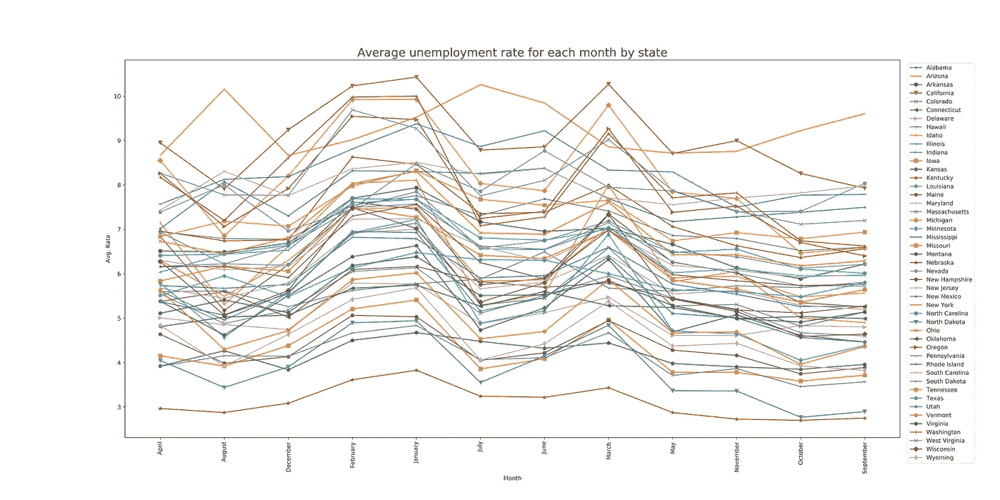

# 美国失业率分析

> 原文：<https://levelup.gitconnected.com/us-unemployment-rate-analyzed-294744559f50>

该项目是作为 She Code 非洲数据科学导师计划第三批成员的一项任务而开展的。


在这里，我探索了美国 27 年来每个月的失业率；1990 年至 2016 年，美国 47 个州的 1752 个县。该分析分两部分进行，即:时间分析(月和年)和地点/位置分析(州和县)。

用于此分析的[数据](http://www.kaggle.com/jayrav13/unemployment-by-county-us)来自美国劳工部劳工统计局。它有 885，548 行和 5 列。

```
 Year   Month       State          County        Rate
0  2015  February  Mississippi  Newton County      6.1
1  2015  February  Mississippi  Panola County      9.4
2  2015  February  Mississippi  Monroe County      7.9
3  2015  February  Mississippi  Hinds County       6.1
4  2015  February  Mississippi  Kemper County      10.6
...  ...  ...  ...  ...  ...
885543  2009  November  Maine  Somerset County     10.5
885544  2009  November  Maine  Oxford County       10.5
885545  2009  November  Maine  Knox County         7.5
885546  2009  November  Maine  Piscataquis County  11.3
885547  2009  November  Maine  Aroostook County    9.0885548 rows × 5 columns
```

以下是按失业率排序的美国就业数据。根据这一数据，美国自 1990 年至 2016 年的最高失业率为 58.4%。这是 1990 年 1 月在科罗拉多州圣胡安县。

```
 Year  Month       State      County         Rate
351231  1992  January    Colorado  San Juan County  58.4
337760  1992  February   Colorado  San Juan County  56.5
342958  1992  March      Colorado  San Juan County  54.9
240742  1991  February   Texas     Starr County     54.0
359186  1992  April      Colorado  San Juan County  53.3 
```

# 时间分析(月和年)


上面的线形图显示了 27 年来平均失业率的趋势。平均而言，1992 年至 2000 年间，美国有更多的就业机会，导致失业率大幅下降。然而，失业率从 2008 年开始急剧上升，并持续到 2010 年。这种急剧增长可以追溯到[大衰退](https://en.wikipedia.org/wiki/Great_Recession_in_the_United_States)；2007 年 12 月至 2009 年 6 月美国发生的经济崩溃。这场衰退的影响预计将持续到 2010 年。然而，如线图所示，美国正稳步复苏。

下面的柱状图给出了历年平均失业率的分类汇总。美国的失业率在 2010 年最高，在 2000 年最低。


显示每年平均失业率的条形图


显示每月平均失业率的条形图

上面的条形图显示，今年前 3 个月的平均失业率明显较高；一月，二月和三月。这可能是因为大多数公司在年底盘点和审查财务报表、业务费用和员工名单。

我们来看一下逐年各月的平均失业率。


上图显示了 1990 年至 2016 年 1 月至 12 月的平均失业率。几乎所有年份都有类似的趋势，最高平均失业率出现在 1 月、2 月和 3 月。即使在失业率最高和最低的 2010 年和 2000 年，这一趋势依然存在。然而，有些年份遵循不同的模式，例如在 2008 年和 2009 年(大衰退年)，最高失业率出现在 12 月。

## 地点分析(州和县)

现在我们将探讨位置如何影响失业率。

下面的条形图显示了 47 个州中每个州从 1990 年到 2016 年的平均失业率。


内布拉斯加州的平均失业率最低，而亚利桑那州的平均失业率最高。


同样，每个州每年的趋势都很相似。内布拉斯加州、北达科他州和南达科他州的失业率相对较低，但密西西比州和加利福尼亚州的失业率却年年居高不下。这可能是由许多因素造成的，比如这些州的人口数量。因此，一个人在美国居住的州可以决定他/她被雇用的机会。

下图显示了各州如何应对 2008-2010 年美国经济崩溃时期。


2008-2010 年各州平均失业率

就失业率而言，内布拉斯加州、北达科他州和南达科他州受经济衰退的影响最小。另一方面，加利福尼亚、密歇根和南卡罗来纳受到严重影响。



每个州失业率每月都不同。在大多数州，平均来说，一月、二月或三月是大多数人失业的月份，但是在亚利桑那州和南卡罗来纳州，七月的平均失业率最高。

> *结论*

> 2008 年美国失业率急剧上升，这被认为是大衰退的结果；2008 年至 2009 年美国发生的经济崩溃。这一上升趋势持续到 2010 年，此后失业率稳步下降。
> 
> 在 1996-2010 年间，美国的平均失业率在 2010 年最高，在 2000 年最低。
> 
> 平均而言，在该数据包含的美国大多数州，失业率在一年的前三个月上升；一月，二月和三月。一些国家
> 
> 失业率因地区而异。因此，一个人在美国居住的州可以决定他/她被雇用的机会。