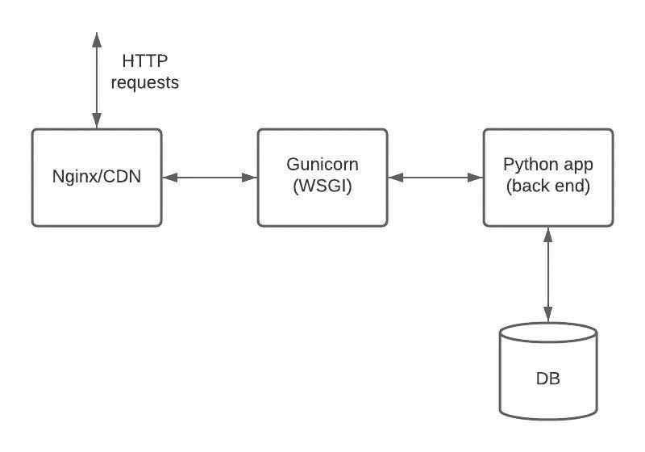

# 使用 Gunicorn 部署 python web 应用程序

> 原文：<https://levelup.gitconnected.com/usage-of-gunicorn-for-deploying-python-web-applications-1e296618e1ab>

## 关于如何使用和配置 Gunicorn 的教程

# **简介**


由 [Unsplash](https://unsplash.com?utm_source=medium&utm_medium=referral) 上的 [Clément Hélardot](https://unsplash.com/@clemhlrdt?utm_source=medium&utm_medium=referral) 拍摄

首先，什么是 Gunicorn，我们需要它做什么？根据来自官方网站的定义:

> Gunicorn 'Green Unicorn '是一个用于 UNIX 的 Python WSGI HTTP 服务器。

那么什么是 WSGI 服务器，它与 web 服务器有什么不同呢？WSGI 代表 *Web 服务器网关接口*，Python web 应用程序需要它，因为像 Apache 这样的传统 Web 服务器没有能力运行它们。

换句话说，WSGI 服务器是一个应用服务器。web 服务器和应用服务器之间的主要区别在于，web 服务器旨在提供 HTML 和 CSS 等静态页面，而应用服务器则通过执行服务器端代码来负责处理数据。通常我们使用 Nginx 这样的服务器来提供静态内容，但它也可以是任何其他的 web 服务器或 CDN。在这种情况下，Nginx 被用作**反向代理服务器**，它还负责:

*   **负载平衡** —它负责确定将在哪个应用服务器上发送传入的 HTTP 请求(确保现有应用服务器上的负载平衡)
*   **加速** —它也用静态内容兑现一些常见的响应

下图是 python web 应用程序的典型设置。



典型的 python web 应用程序设置

Gunicorn 和其他 WSGI 服务器可以与 flask 或 django 等所有流行的 web 框架一起工作。但是与其他服务器如服务员相反，它使用 fork worker 模型。[这意味着](https://docs.gunicorn.org/en/latest/design.html#design)有一个中央主进程管理一组工作进程。大师从来不了解个人客户。所有请求和响应都完全由工作进程处理。

Workers 依次可以是 Sync 或 Async(也有一些其他类型的可用 workers，但它们不是很受欢迎，所以我们将只关注这两种)。

同步工人是一次处理一个请求的工人。它们不支持持久连接——每个连接都在响应发送后关闭。

**异步**可用的 worker 是基于 green let 的(green let 是 Python 的协作多线程的一种实现)一般来说，应用程序应该能够不加修改地使用这些 worker 类。

关于工作人员的数量，Gunicorn 应该只需要[4–12 个工作人员](https://docs.gunicorn.org/en/latest/design.html#how-many-workers)进程来处理每秒数百或数千个请求。

Gunicorn 依靠操作系统在处理请求时提供所有的负载平衡。一般来说，建议使用:

> 2 *内核数量+ 1

工人。它基于这样的假设:对于一个给定的内核，一个工作者将从套接字读取或写入，而另一个工作者正在处理请求。尽管这可以针对特定的应用进一步调整。

# **设置一个简单的应用程序并与 Gunicorn 一起提供服务**

让我们建立一个小烧瓶应用程序，并用 Gunicorn 为它服务。为此，我们需要一个带有 1 个端点的“Hello world”Flask 应用程序:

现在，让我们为我们的应用程序创建一个入口点:

运行这个命令将启动 Gunicorn，它有 4 个工作线程，每个工作线程有 2 个线程，在端口 5000 上为我们的应用程序提供服务。

创建 Dockerfile 文件:

现在构建并运行我们的映像:

```
docker build -t hello .
docker run -p 5000:5000 hello
```

并通过 http 请求访问:

```
$ curl localhost:5000
Hello world!
```

# 摘要

在本教程中，我们已经浏览了 Gunicorn 及其工作原理。我们已经看到添加 Gunicorn 既快又简单。

# 参考

1.  [*古尼康建筑*](http://docs.gunicorn.org/en/latest/design.html)
2.  [*堆栈溢出答案*](https://stackoverflow.com/questions/38425620/gunicorn-workers-and-threads)
3.  [生产中的 Python](https://towardsdatascience.com/my-favorite-python-servers-to-deploy-into-production-d92289764fbe)