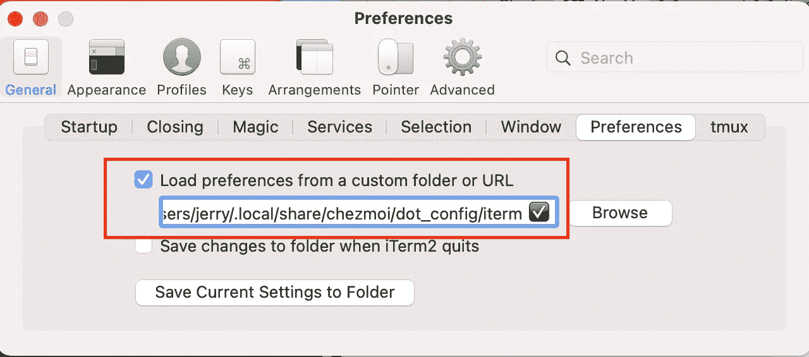

# 使用托管存储库跨多台计算机管理您的点文件

> 原文：<https://levelup.gitconnected.com/use-a-hosted-repo-to-manage-your-dotfiles-across-multiple-machines-e65f3eecb66d>

每当你换一台新电脑时，你是否厌倦了设置一套终端别名和命令？终端独特的背景色呢？打开流行的跨平台应用如`cURL`、`git`、`tmux`、`vscode`的快捷方式呢？

每当我们更换另一台计算机时，我们需要从头开始手动配置吗？

答案是绝对没有！

这篇文章将展示如何在多台机器上方便地管理点文件(即隐藏文件)。

[](https://github.com/jerryan9999/dotfiles) [## GitHub - jerryan9999/dotfiles: ~/。跨平台、跨外壳的配置文件。⚙️💻

### Bash、Zsh 和 Powershell 的通用命令集和丰富多彩的 shell 配置，与 macOS、Windows……

github.com](https://github.com/jerryan9999/dotfiles) 

## 第一步:安装`chezmoi`工具

```
$ brew install chezmoi
```

该工具的主要目标是管理多台机器上的配置文件。它是一个模板引擎，根据系统变量、模板和自定义帐户变量生成您的点文件。

## 步骤 2:从 GitHub 存储库中提取点文件

```
$ chezmoi init [https://github.com/jerryan9999/dotfiles](https://github.com/jerryan9999/dotfiles)
```

它会将 GitHub 存储库克隆到 chezmoi 的工作文件夹`*~/.local/share/chezmoi/*`

## 步骤 3:更新主文件夹以匹配工作文件夹

```
$ chezmoi apply -v
```

它会在主文件夹中生成一些隐藏的文件或文件夹。

## 步骤 4:安装或更新外壳依赖项

```
$  cd ~
$ ./dotfiles.sh
```

您可能需要事先创建一些文件夹。

```
$ cd *~/.local/share/chezmoi/
$ mkdir dot_*bash-it
$ mkdir dot_bash_it/dot_ackrc
$ mkdir dot_oh-my-zsh
$ mkdir dot_oh-my-zsh/custom/plugins/zsh-autosuggestions
$ mkdir dot_oh-my-zsh/custom/plugins/zsh-syntax-highlighting
$ mkdir dot_oh-my-zsh/custom/themes/powerlevel9k
$ mkdir dot_oh-my-zsh/custom/themes/powerlevel10k
$ mkdir dot_tmux/
$ mkdir dot_nano
$ mkdir dot_vim_runtime
```

## 第五步:再次更新

```
$ chezmoi apply -v
```

## 👏👏👏完了！👏👏👏

你现在可以开始使用你的计算机，假装你没有改变它。

# 附加配置

*   **Iterm2:** 从自定义文件夹或 URL 加载首选项

