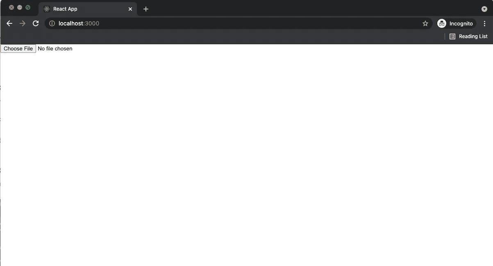
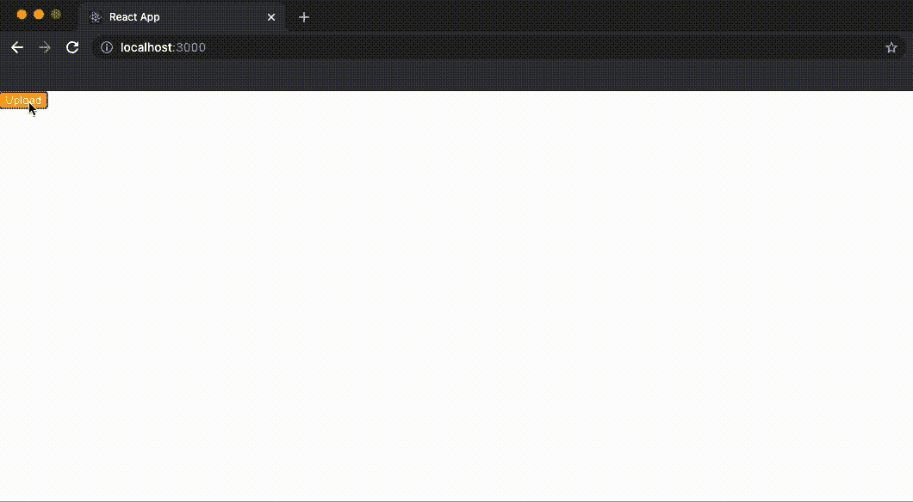

# 在 React 中使用 Refs 创建上传组件

> 原文：<https://levelup.gitconnected.com/use-a-refs-in-react-create-upload-component-7e33258e99ea>

本章将教你如何在 React 中使用引用。到本章结束时，你将能够在现有的应用程序中以一种有效且易于使用的方式使用 Refs。

在 React 中，我们使用 Refs 来直接访问、操作 DOM 并与之交互。对 HTML 元素的直接引用允许我们执行在创建客户端应用程序时经常遇到的任务。这些任务包括但不限于数据处理和布局分析。

我们将使用一个 Ref 来创建一个样式化的输入按钮，它不能使用普通的 CSS 样式化。我们将首先创建文件输入，然后添加一个自定义按钮组件。单击该按钮将触发输入的文件上传功能。

1.  使用`create-react-app` CLI 创建一个新项目:

```
$ npx create-react-app button-refs
```

2.转到该文件夹并启动`create-react-app`开发服务器:

```
cd button-refs && npm start
```

3.在项目编辑`src/App.js`文件中，将`App`组件修改为返回`input`组件:

```
const App = () => {
  return (
    <input />
  );
}export default App;
```

4.将文件类型添加到`input`组件:

```
const App = () => {
  return (
    <input type="file" />
  );
}export default App;
```

在`http://localhost:3000`运行应用程序，我们应该看到以下输出:



如果您单击这个输入按钮，您应该会看到一个弹出窗口，用于选择要上传的文件。

5.添加一个带有橙色背景和白色字体样式的`button`组件。添加隐藏属性以隐藏本机输入文件。

```
const App = () => {
  return (
    <>
      <input type="file" hidden={true} />
      <button style={{ backgroundColor: "orange", color: "white" }}>
        Upload
      </button>
    </>
  );
}export default App;
```

6.首先创建一个名为 inputRef 的类字段来存储 Ref:

```
const App = () => {
  inputRef;
  return (
    <>
      <input type="file" hidden={true} />
      <button style={{ backgroundColor: "orange", color: "white" }}>
        Upload
      </button>
    </>
  );
}export default App;
```

7.创建一个接受名为 refParam 的参数的内联函数，并将该参数分配给 App 组件的 inputRef 字段。

```
const App = () => {
  let inputRef;
  return (
    <>
      <input
        type="file"
        hidden={true}
        ref={refParam => inputRef = refParam}
      />
      <button style={{ backgroundColor: "orange", color: "white" }}>
        Upload
      </button>
    </>
  );
}export default App;
```

8.最后一步，向按钮添加一个 onClick 处理程序。如果单击该按钮，将调用输入上的 click 函数，如果该字段引用输入组件:

```
const App = () => {
  let inputRef;
  return (
    <>
      <input
        type="file"
        hidden={true}
        ref={refParam => inputRef = refParam}
      />
      <button
        style={{ backgroundColor: "orange", color: "white" }}
        onClick={() => inputRef.click()}
      >
        Upload
      </button>
    </>
  );
}export default App;
```

让我们试试上传:



现在，单击按钮，系统将提示您上传文件，因为自定义按钮现在会触发文件输入的本地功能。

您已经使用 React Ref 将几乎不可定制的本机输入功能绑定到一个按钮组件，您可以根据自己的意愿设置该按钮组件的样式。特别是，我们将检查作为 ref 对象传递给输入组件的函数。

回购网址:[https://github.com/easywebsify/button-refs](https://github.com/easywebsify/button-refs)