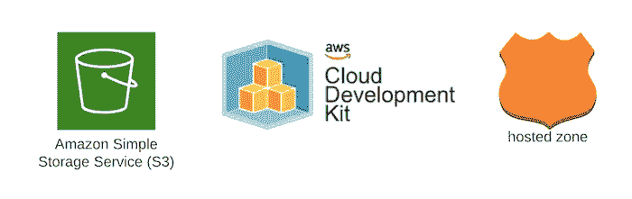
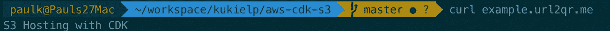
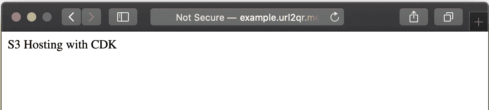

# 使用 AWS CDK 部署 S3 存储桶、静态内容并创建 Route53 条目

> 原文：<https://levelup.gitconnected.com/use-aws-cdk-to-deploy-a-s3-bucket-static-content-and-create-route53-entries-219038d43eb>



静态网站很常见。通常我会构建一些东西作为概念验证，并与我的朋友分享，我会创建一个公共 s3 bucket 并发送链接，快速而简单。如果我需要/想要更长的时间，我通常会创建一个子域，并将其指向桶。

在本例中，我们将:

*   在 s3 中用 CDK 创建一个桶
*   设置存储桶以允许托管
*   设置默认文档
*   将一个样本 html 文件部署到 bucket
*   查找根托管区域
*   在指向 s3 存储桶的现有区域中创建新的 DNS 记录

# 要求:

*   AWS CDK `npm install -g aws-cdk`
*   Node.js — [下载链接](https://nodejs.org/en/download/)
*   AWS 帐户
*   本地凭证(除非使用云 9)
*   您的帐户 ID(53 号路线变更时需要)
*   53 号公路中的一个区域

让我们统计一下本地设置:

我们现在准备编码。让我们开始创建文件和文件夹。

我们的示例程序(index.html)已经可以部署了。

现在打开“lib/{stack-name}。让我们开始编写一些基础设施的代码。

这非常简单，请记住在创建存储桶时，存储桶名称应该与您打算指向存储桶的域名相匹配。

请注意，尽管删除策略设置为销毁，但删除此堆栈时将会失败，除非您删除桶中的文件。如果删除堆栈时存储桶为空，则存储桶也将被删除。

将静态代码部署到存储桶。

我有一个现有的区域，我想添加一个子域。第一步是查找这个。您可以通过 hostZoneId 或 zoneName 来查找。为了可读性，这里我使用了域名。[Docs](https://docs.aws.amazon.com/cdk/api/latest/docs/@aws-cdk_aws-route53.HostedZoneProviderProps.html)<——此处

接下来，我们在 Route53 中创建新条目，并将该条目指向我们创建的 s3 存储桶的“bucketWebsiteDomainName”。在本例中，它是“example.url2qr.me”。

完整的代码应该如下所示:

我们还必须传入 accountID 和 default 区域。打开“bin/{stackname}。ts”并设置值。我将它们设置为 env 变量，出于示例目的，您也可以硬编码它们。

我们已准备好部署:

```
cdk bootstrap
cdk deploy
```

完成运行后:

```
curl example.{your-domain}
```

我们应该看看 index.html 档案的内容:



在浏览器中打开:



全额回购:[https://github.com/kukielp/aws-cdk-s3](https://github.com/kukielp/aws-cdk-s3)