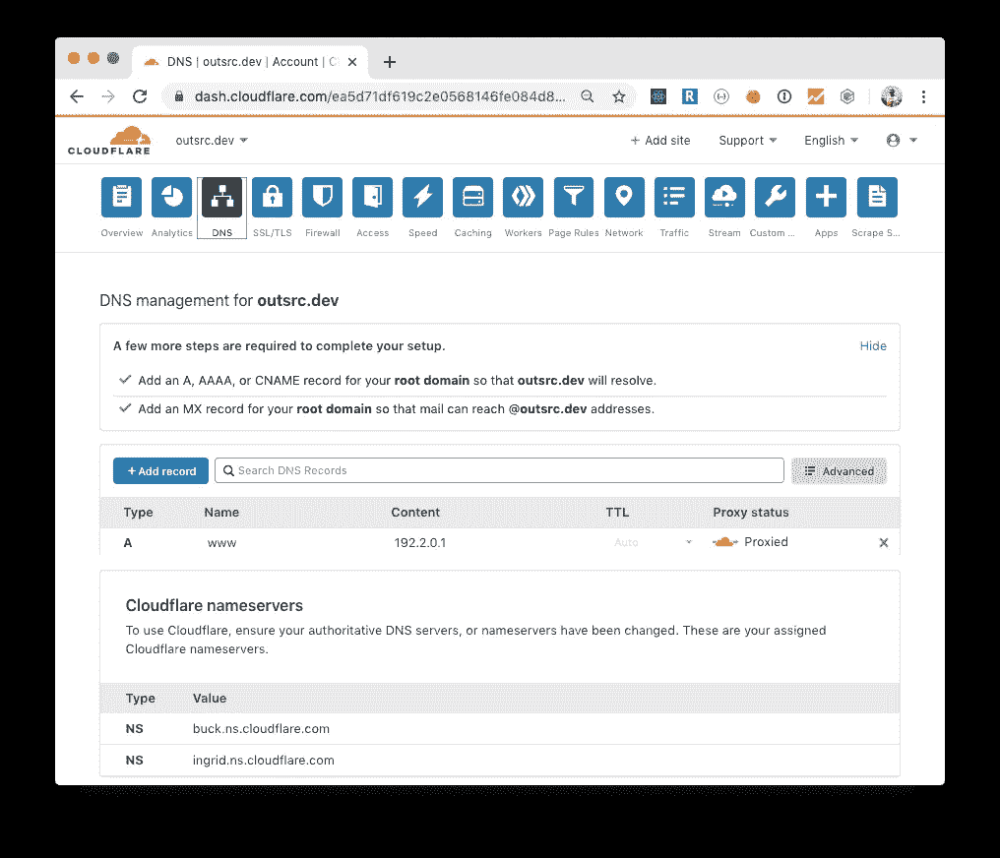
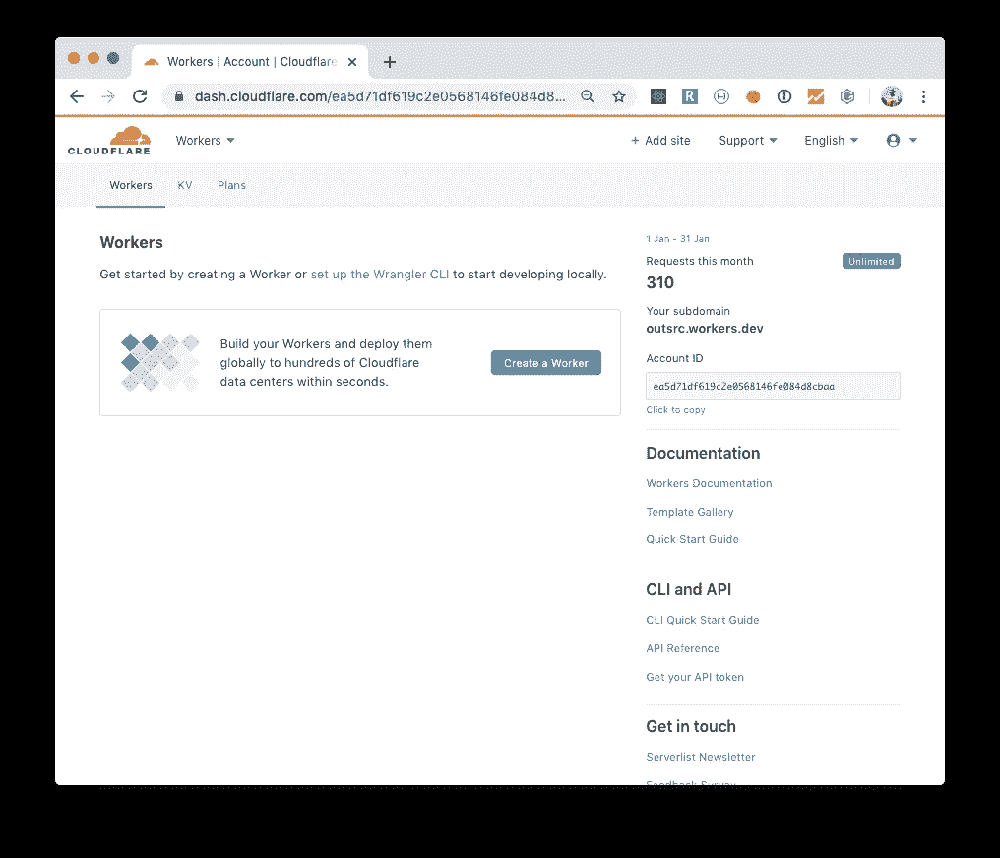
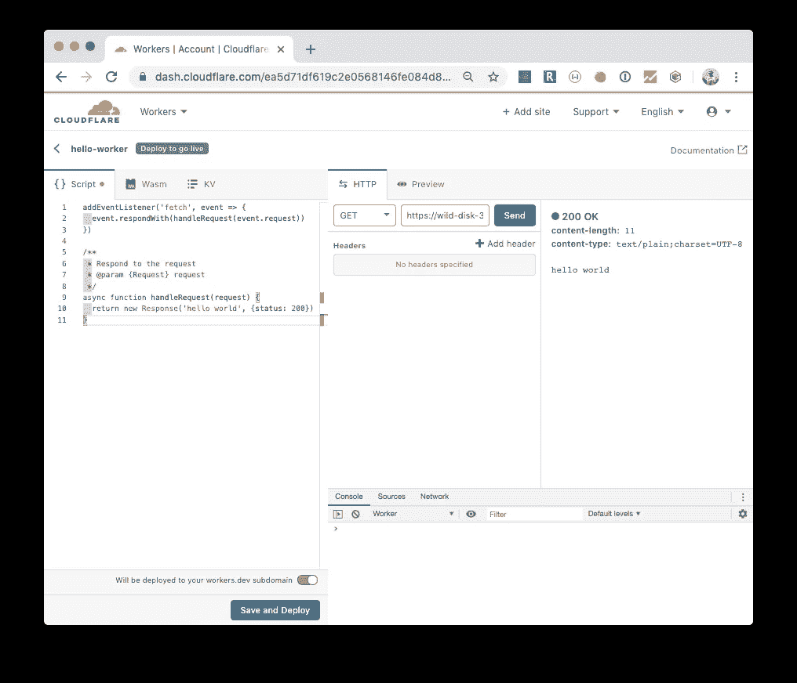
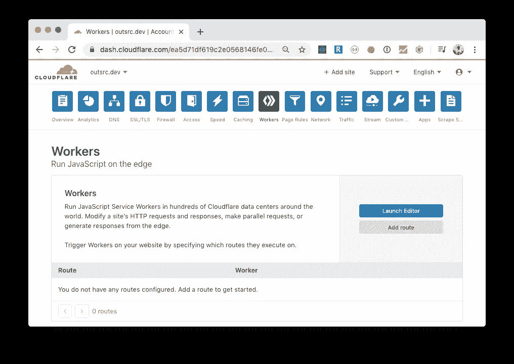
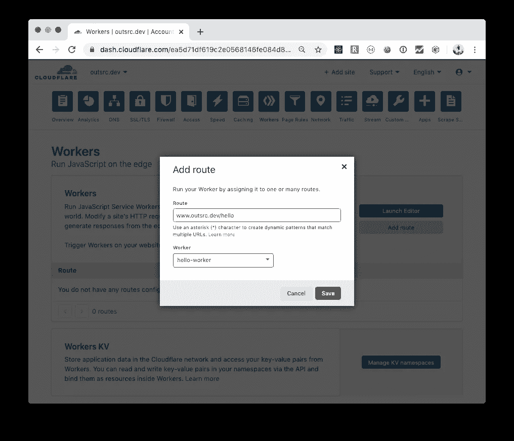
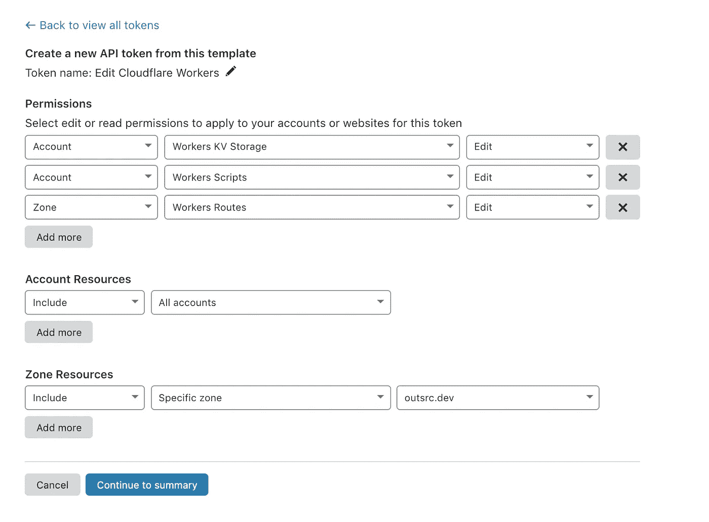
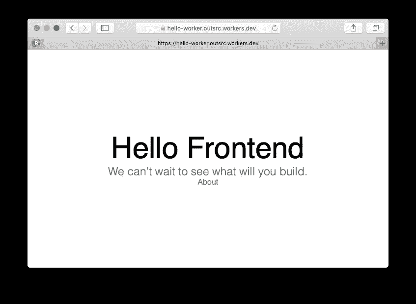
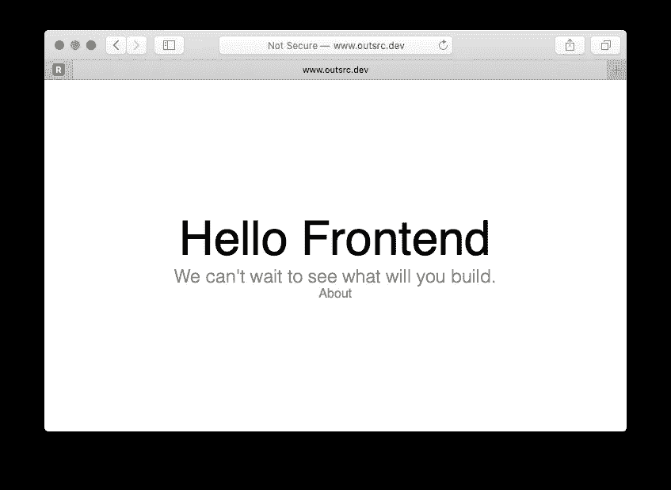
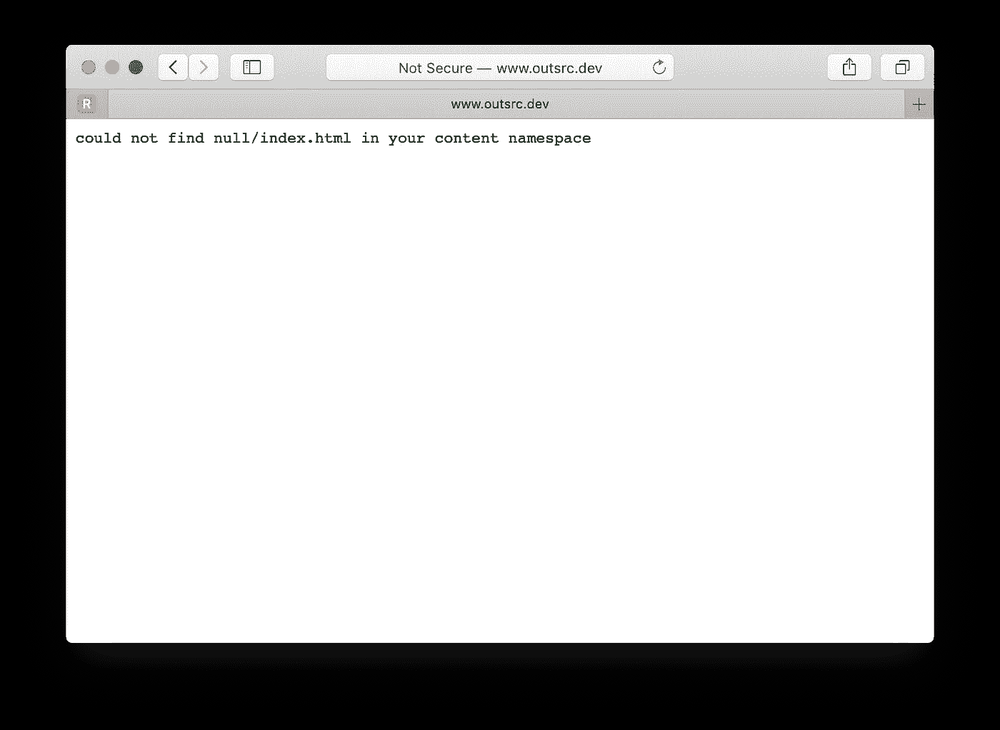
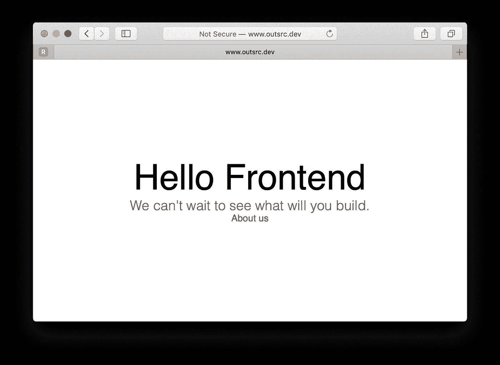

# 使用 Cloudflare JavaScript Workers 部署静态生成的站点(SSG)

> 原文：<https://levelup.gitconnected.com/use-cloudflare-javascript-workers-to-deploy-you-static-generated-site-ssg-1c518e078646>


来自 [Pexels](https://www.pexels.com/photo/man-sitting-on-edge-facing-sunset-915972/?utm_content=attributionCopyText&utm_medium=referral&utm_source=pexels) 的 [Abhiram Prakash](https://www.pexels.com/@abhiram2244?utm_content=attributionCopyText&utm_medium=referral&utm_source=pexels) 摄影

静态站点生成器正在成为构建和部署不需要服务器端呈现的 web 应用程序的实际方式。这些应用程序的页面不需要实际的 web 服务器来动态呈现内容。需要服务器的页面类型通常受到身份验证墙的保护。可能会有其他站点在服务器上为 SEO 生成动态内容。

[Hugo](https://gohugo.io/) 、 [Gatsby](https://www.gatsbyjs.org/) 和 [NextJS](https://nextjs.org/) 是这个领域最受欢迎的解决方案。它们都在一个文件夹中构建由一组文件(HTML、CSS、JavaScript、图像)组成的输出，然后我们可以用常规服务器(NGINX、Apache 等)将它们提供给用户。)或者最好通过 CDN(内容交付网络),因为我们不需要服务器业务逻辑。只有 CDN 将用作源的文件存储。

除了这些工件，一些静态 spa，尤其是用`react-router`开发的应用，可能需要额外的配置。我们可以通过将所有路径重定向到一个文件来实现这一点。这可以在负载平衡器上实现，甚至可以通过 Cloudflare Workers 本身实现。

到目前为止，在所有这些情况下，我们仍然需要将文件存储在某个地方。使用 S3 桶和 Cloudfront 发行版的 AWS 一直是一个很好的选择。这篇文章的目的是展示另一种解决方案。使用最新的 Workers KV 数据存储直接部署到 Cloudflare Workers。

*我必须指出，Cloudflare Worker 的最初目的是将计算带到边缘。无服务器平台。由于 Workers KV store 的可用性，部署静态站点是另一个受支持的用例。*

## 什么是工人

Cloudflare Worker 是一段 JavaScript 代码，每当您访问 Cloudflare 代理的网站上的特定路线时，它都会运行。在请求到达 Cloudflare 的缓存之前，代码会在每个请求*上执行。这意味着工作器响应不会被缓存(尽管工作器向其他 web 服务发出的请求可能会使用适当的缓存头进行缓存)。*

工人是在一个安全的上下文中执行的，所以我们可以安全地在其中包含秘密。工作者不能访问另一个工作者的上下文。

以下是基础工:

你好工人

## 配置域/路由/工作者

让我们部署第一个工人。首先，您需要在 Cloudflare 上配置一个域。我的仪表盘上已经有`outsrc.dev`了。

在 DNS 部分，为指向`192.2.0.1`的子域`www`添加一个注册表类型 A。这个 IP 号码被认为是一个没有人能够解决的问题。我们的工作人员会拦截所有请求。



我们将 www.outsrc.dev 映射到 192.2.0.1

然后我们可以在 worker 选项卡上创建一个 worker。



工人小组

在 Workers 面板中创建新的 Worker，更改名称(我使用了`hello-worker`)并点击 Save and Deploy。所有工人都可以被自动部署到一个演示工作区，在我的情况下，最终成为了[https://hello-worker.outsrc.workers.dev/](https://hello-worker.outsrc.workers.dev/)



工人编辑器

一旦部署完成，我们就可以在我们的主`outsrc.dev`域上运行这个 worker，甚至可以在一个单一的路由路径上运行。为此，我们需要转到主帐户仪表板并选择 Workers 选项卡。



工人标签

用`www.outsrc.dev/hello`添加路线并选择您最近部署的`hello-worker`工人。



你好工人被发送到 www.outsrc.dev/hello

现在我们可以直接访问这个网址:[https://www.outsrc.dev/hello](https://www.outsrc.dev/hello)

```
$ http [https://www.outsrc.dev/hello](https://www.outsrc.dev/hello)
HTTP/1.1 200 OK
CF-RAY: 55d4285c0f45d4ed-MIA
Connection: keep-alive
Content-Length: 11
Content-Type: text/plain;charset=UTF-8
Date: Thu, 30 Jan 2020 14:32:51 GMT
Expect-CT: max-age=604800, report-uri="[https://report-uri.cloudflare.com/cdn-cgi/beacon/expect-ct](https://report-uri.cloudflare.com/cdn-cgi/beacon/expect-ct)"
Server: cloudflare
Set-Cookie: __cfduid=dbd7b5387c4e90a370fdc89ed5e908f701580394771; expires=Sat, 29-Feb-20 14:32:51 GMT; path=/; domain=.outsrc.dev; HttpOnly; SameSite=Lax
Vary: Accept-Encodinghello world
```

## 工具作业

手动创建/修改工作者的代码可能会变得复杂，特别是因为我们可能想要自动化部署 Web 应用程序的所有步骤。

进入 Cloudflare 工作人员的 CLI 工具 Wrangler。[https://developers.cloudflare.com/workers/tooling/wrangler/](https://developers.cloudflare.com/workers/tooling/wrangler/)

```
$ npm i @cloudflare/wrangler -g
```

安装完成后，我们需要在使用几个命令引导/部署相同的基本 Hello Worker 之前配置身份验证。转到[https://dash.cloudflare.com/profile/api-tokens](https://dash.cloudflare.com/profile/api-tokens)为牧马人工具创建 API 令牌。(使用 Cloudflare 工作人员的模板获取权限)



为 Wrangler CLI 工具创建 API 令牌

```
$ wrangler config
wrangler config💁  To find your API token, go to [https://dash.cloudflare.com/profile/api-tokens](https://dash.cloudflare.com/profile/api-tokens)
 and create it using the "Edit Cloudflare Workers" template💁  If you are trying to use your Global API Key instead of an API Token
 (Not Recommended), run "wrangler config --api-key".Enter API token: 
```

配置完成后，我们可以通过 wrangler CLI 工具创建新员工。

```
$ wrangler generate hello-worker [https://github.com/cloudflare/worker-template](https://github.com/cloudflare/worker-template)
```

这个 worker 模板是一个简单的 JavaScript Hello Worker。除了模板的内容，我们还将有一个`wrangler.toml`文件，其中包含我们需要更新的设置，例如:

*   **account_id** :您的账户 id，您可以在主仪表盘上找到
*   **zone _ id**:cloud flare 上的每个 DNS 区域都有自己的 ID，也在控制面板上
*   **路线**:从哪里接近工人(例如:[www.outsrc.dev/hello](http://www.outsrc.dev/hello))
*   **workers _ dev**:true | false 它会将您的 Worker 部署到一个临时环境，通常采用以下形式:`https://<worker_name>.<account_name>.worker.dev`

设置就绪后:

```
$ wrangler publish
💁  JavaScript project found. Skipping unnecessary build!
✨  Successfully published your script to [www.outsrc.dev/hello](http://www.outsrc.dev/hello)
```

## 工人 KV 商店

> Workers KV 是一个全球性的低延迟、键值数据存储。它支持异常高的读取量和低延迟，使构建高度动态的 API 和网站成为可能，这些 API 和网站的响应速度与缓存的静态文件一样快。

有了这项功能，我们可以:

*   在边缘存储我们的静态资产 HTML、CSS、图像和 JavaScript 文件
*   修改我们的 Worker 代码，根据路径返回正确的文件。(Workers KV JavaScript APIs 已经支持这一点)
*   使用`wrangler`来自动化所有的过程。

我们开始吧。

## 创建静态生成的网站

任何静态站点生成器都可以。我们只需要能够拥有一个静态构建输出文件夹，我们将把它部署到 Worker KV 和一个 Worker 脚本，后者将从存储中提取并服务于它。

将以 https://github.com/outsrc/template-frontend[的](https://github.com/outsrc/template-frontend)回购为起点。这个 repo 基于 NextJS，并且已经包含了一个静态导出 web 应用程序的命令(生成了一个文件夹`out`)

```
$ git clone git@github.com:outsrc/template-frontend.git static-app
$ cd static-app
$ yarn install
$ yarn export
```

让我们添加`wrangler`作为开发依赖项，并通过`wrangler.toml`配置部署

```
$ yarn add --dev @cloudflare/wrangler
$ wrangler init --site hello-worker
⬇️ Installing cargo-generate...
🔧   Creating project called `workers-site`...
✨   Done! New project created /Users/ernestofreyre/Documents/nodeprojects/static-app/workers-site
✨  Succesfully scaffolded workers site
✨  Succesfully created a `wrangler.toml`
```

这将增加:

*   文件夹:包含所有必要的依赖项和一个包含我们的静态前端应用工人的文件。
*   `wrangler.toml`文件:部署工人的设置

worker-site/index.js

我们不需要修改`worker-site`文件夹(目前)，但是`wrangler.toml`需要一些更新(粗体字母)。

```
name = "hello-worker"
type = "webpack"
account_id = "**<YOUR ACCOUNT ID>**"
workers_dev = **true**[site]
bucket = "**./out**"
entry-point = "workers-site"
```

更新后，我们可以部署到一个暂存环境:

```
$ wrangler publish
🌀  Created namespace for Workers Site "__hello-worker-workers_sites_assets"
💁  Uploading...
✨  Success
added 2 packages from 2 contributors and audited 2 packages in 0.395s
found 0 vulnerabilities⬇️ Installing wranglerjs...
⬇️ Installing wasm-pack...
✨  Built successfully, built project size is 11 KiB.
✨  Successfully published your script to [https://hello-worker.outsrc.workers.dev](https://hello-worker.outsrc.workers.dev)
```

就是这样。访问底部显示的网址，你会看到我们的静态应用程序运行良好(我不得不说非常快)



瞧啊。

## 部署到生产环境

这是我们自己的领域。我们需要修改`wrangler.toml`文件来包含一个环境部分。

```
name = "hello-worker"
type = "webpack"
account_id = "**<YOUR ACCOUNT ID>**"
workers_dev = **true**[site]
bucket = "**./out**"
entry-point = "workers-site"[env.production]
zone_id = "**<YOUR ZONE ID>**"
route = "[**www.outsrc.dev/***](http://www.outsrc.dev/*)"
```

有了这些，我们现在可以:

```
$ wrangler publish --env production
🌀  Created namespace for Workers Site "__hello-worker-production-workers_sites_assets"
💁  Uploading...
✨  Success
⬇️ Installing wranglerjs...
⬇️ Installing wasm-pack...
✨  Built successfully, built project size is 11 KiB.
✨  Successfully published your script to [www.outsrc.dev/*](http://www.outsrc.dev/*)
```



成功！！

## 部署更进一步

假设我们使用提交散列作为路径前缀，将所有提交构建并部署到 Worker KV 存储。(例如:/8982c33e/index.html)然后，我们可以将所有请求实时地重新路由到我们想要的任何提交文件夹。这意味着部署到生产和回滚可以通过更改 KV 存储上的单个值来即时完成。Canary 也部署(一组用户将获得应用程序的一个版本)

首先创建一个名为 CONTROL 的新工作 KV 名称空间:

```
$ wrangler kv:namespace create "CONTROL"
🌀  Creating namespace with title "hello-worker-CONTROL"
✨  Success: WorkersKvNamespace {
    id: "22e976....",
    title: "hello-worker-CONTROL",
}
✨  Add the following to your wrangler.toml:
**kv-namespaces = [ 
  { binding = "CONTROL", id = "22e976...." } 
]**
```

我们需要将粗体部分放在`wrangler.toml`文件的顶部:

```
name = "hello-worker"
type = "webpack"
account_id = "<YOUR ACCOUNT ID>"
workers_dev = true**kv-namespaces = [ 
  { binding = "CONTROL", id = "22e976...." } 
]**[site]
bucket = "./out"
entry-point = "workers-site"[env.production]
zone_id = "<YOUR ZONE ID>"
route = "www.outsrc.dev/*"**kv-namespaces = [ 
  { binding = "CONTROL", id = "22e976...." } 
]**
```

因为我们的 NextJS 应用程序每次执行`yarn export`都会重新生成静态输出文件夹，所以我们需要相应地移动文件。此外，wrangler CLI 工具不会保留以前部署的旧文件。我们需要把它们都放在同一个文件夹下。(如果 wrangler 允许我们在存储上保留旧文件，那就太好了)。创建一个 builds 文件夹，我们将在其中复制所有的静态构建。

```
$ mkdir builds
```

并将部署脚本修改为首先，将`out`文件夹重命名为当前提交哈希的名称，并将其移动到`builds`文件夹:

```
{
  "name": "template-frontend",
  "version": "1.0.0",
  "description": "",
  "main": "index.js",
  "scripts": {
    "clean": "rimraf .next && rimraf out",
    "dev": "next",
    "build": "next build",
    "start": "next start",
    "export": "yarn clean && yarn build && next export",
    "test": "echo \"Error: no test specified\" && exit 1",
    "lint": "standard",
    "format": "prettier-standard --format",
    **"pre-deploy": "mv out `git rev-parse HEAD | cut -c 1-8` && mv `git rev-parse HEAD | cut -c 1-8` builds",
    "deploy:production": "yarn export && yarn pre-deploy && wrangler publish --env production"**
  },
  "keywords": [],
  "author": "",
  "license": "ISC",
  "dependencies": {
    "next": "~9.2.0",
    "react": "^16.12.0",
    "react-dom": "^16.12.0"
  },
  "devDependencies": {
    "[@cloudflare/wrangler](http://twitter.com/cloudflare/wrangler)": "^1.6.0",
    "[@types/node](http://twitter.com/types/node)": "^12.12.7",
    "[@types/react](http://twitter.com/types/react)": "^16.9.11",
    "prettier-standard": "^15.0.1",
    "rimraf": "^3.0.0",
    "standard": "^14.3.1",
    "typescript": "^3.7.2"
  }
}
```

我们需要的最后更改在`worker-site/index.js`文件中。对于每个请求，首先获取我们想要提供的提交散列，并将请求重新映射到包含我们的资产的文件夹。使用我们之前设置的控件命名空间中的值。

workers-site/index.js

如果我们部署并尝试访问我们的应用程序，我们将获得:

```
$ yarn deploy:production
yarn run v1.21.1
$ yarn export && yarn pre-deploy && wrangler publish --env production
$ yarn clean && yarn build && next export
$ rimraf .next && rimraf out
$ next build
Creating an optimized production buildCompiled successfully.Automatically optimizing pagesPage                            Size     First Load
┌ ○ /                           595 B       75.5 kB
└ ○ /about                      583 B       75.5 kB
+ shared by all                 68.8 kB
  ├ static/_buildManifest.js    188 B
  ├ static/pages/_app.js        944 B
  ├ chunks/commons.9ed1b2.js    21.7 kB
  ├ chunks/framework.94bc9f.js  40.5 kB
  ├ runtime/main.99b7a8.js      4.69 kB
  └ runtime/webpack.b65cab.js   746 Bλ  (Server)  server-side renders at runtime (uses getInitialProps or getServerProps)
○  (Static)  automatically rendered as static HTML (uses no initial props)
●  (SSG)     automatically generated as static HTML + JSON (uses getStaticProps)> using build directory: /Users/ernestofreyre/Documents/nodeprojects/static-app/.next
  copying "static build" directory
  launching 15 workers
Exporting (3/3)Export successful
$ mv out `git rev-parse HEAD | cut -c 1-8` && mv `git rev-parse HEAD | cut -c 1-8` builds
🌀  Using namespace for Workers Site "__hello-worker-production-workers_sites_assets"
💁  Uploading...
✨  Success
⬇️ Installing wranglerjs...
⬇️ Installing wasm-pack...
✨  Built successfully, built project size is 11 KiB.
✨  Successfully published your script to [www.outsrc.dev/*](http://www.outsrc.dev/*)
✨  Done in 16.53s.
```



错误！！

我们刚刚错过了在控件名称空间上设置`show_commit`值。

```
$ wrangler kv:key put --binding=CONTROL "show_commit" "0b0b0ef4"
✨  Success
```



成功！！

现在，每次我们提交并部署到生产环境时，应用程序都会被构建并部署到 KV 商店。更新提交所用内容的命令是:

```
$ wrangler kv:key put --binding=CONTROL "show_commit" "<COMMITHASH>"
```

回滚只需要与我们想要回滚的提交散列相同的命令。瞬间。

## 结论

*   您的 Web 应用需要一个 CDN，Cloudflare CDN 是一个成熟的解决方案。
*   cloud flare Workers+cloud flare Workers KV 允许您将静态站点生成的 Web 应用程序直接部署到边缘。
*   还可以支持更复杂的用例:不同的基路径、增强的安全模式。
*   您可以将您的 CI/CD 管道设置为持续部署到 Worker KV store，并在以后决定何时将您的用户转移到最新版本或在发现 bug 时回滚。

黑客快乐…