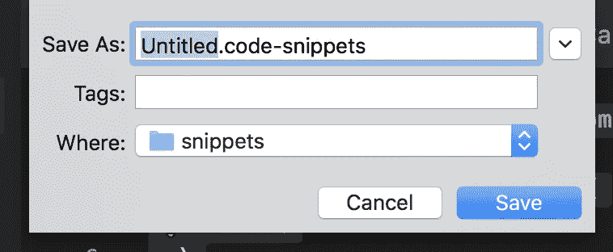

# 使用 VSCode 中的代码片段更快地创建 React 组件！

> 原文：<https://levelup.gitconnected.com/use-code-snippets-in-vs-code-to-create-react-components-faster-56fe5327896c>


照片由[克莱门特 H](https://unsplash.com/@clemhlrdt?utm_source=medium&utm_medium=referral) 在 [Unsplash](https://unsplash.com?utm_source=medium&utm_medium=referral) 上拍摄

最近，我一直在编写大量代码，试图快速生成不同的 React 组件，在 Storybook 中为它们创建故事，并为它们编写测试。一般来说，每个组件有 3 个文件，包含基本的可预测的代码，我通常会将这些代码复制并粘贴到每个新组件中。我最近创建了一些代码片段来帮助我生成这些文件中的代码，并发现它为我节省了大量时间。请继续阅读，了解我是如何做到的！

# 什么是代码片段？

> “代码段是可重用代码的小块，可以使用右击菜单(上下文菜单)命令或热键组合将其插入到代码文件中。”—微软

哇哦。代码片段可以为您提供一种快捷方式，将几个字符转换成预定义的代码行。又名我可以把`tcomp`变成:

```
import React from 'react'
import styled, { withTheme } from 'styled-components'const ComponentName = props => {
    return (

    )
}export default withTheme(ComponentName)ComponentName.displayName = "ComponentName"
```

这省去了我大量的打字和时间！现在我要做的就是用我想要的名字替换 ComponentName。让我们深入了解这一切是如何工作的…

# 如何创建代码片段

第一步:去菜单中的用户代码片段，就像这样…


步骤 2:如果您想在多个项目中使用这个代码片段，请选择您想要创建一个新的全局代码片段文件…


第三步:给它起一个比无标题更有创意的名字…



第四步:编写你的代码片段！

文件中已经有一些注释来帮助您开始并提醒您格式，但是您可以保留或删除它。在我的例子中，我删除了它，并编写了如下代码片段:

```
{
  "Themed Component": {
    "scope": "javascriptreact",
    "prefix": "tcomp",
    "body": [
      "import React from 'react'",
      "import styled, { withTheme } from 'styled-components'",
      " ",
      "const ${1:ComponentName} = props => {",
      "  return (",
      "    $0",
      "  )",
      "}",
      " ",
      "export default withTheme(${1:ComponentName})",
      " ",
      "${1:ComponentName}.displayName = \"${1:ComponentName}\"",
    ],
    "description": "Create Themed Component"
  }
}
```

现在让我们一步一步来…这个对象的第一个键是代码片段本身的**名**，在这个例子中是“主题组件”。**范围**表示它是为哪种语言编写的，在浏览您的代码片段时可用于过滤目的。**前缀**是您将在编辑器中键入的内容，以便使用快捷方式返回您的代码。在我的例子中，我选择了`tcomp`作为我的前缀，因为对我来说，它代表我想要创建一个主题化的组件，这也在我的**描述**中有所陈述。这完全是主观的，由你来选择你能记住并觉得方便的内容。

**主体**显然是最重要的部分，正如你可能猜到的，这是你想放入代码片段返回的地方。正文的格式是一个字符串数组，其中每个字符串都是新的一行代码。你可能也注意到了一些奇怪的符号:`${1:ComponentName}`和`$0`。这些分别是占位符和制表位的例子。一旦在文件中有了 tabstop，您就可以在代码段中移动它，并且只需在代码段中复制 tabstop，就可以同时在不同的位置进行编辑。占位符只是带有值的制表符。当你编辑你的代码并按 tab 键时，你将从`$1`开始按数字顺序跳过你的制表符。`$0` tabstop 是为您希望最后一个 tab 离开光标的地方保留的。

下面是这段代码片段的一个片段:


我的主题组件的代码片段

# 进一步的例子

这就是我的主题组件代码片段，使用了一个 tabstop 作为最终的光标位置，一个占位符作为组件名。我还为我的测试文件和故事书文件创建了代码片段:

```
{
  "React Component Test": {
    "scope":"javascript,javascriptreact",
    "prefix": "tst",
    "body": [
      "import React from 'react'",
      "import { render } from 'react-testing-library'",
      "import { ThemedComponent } from '../../../utils/test-utils'",
      "import $1 from './$2'",
      " ",
      "describe('$1', () => {",
      "  it('$3', () => {",
      "    $4",
      "  }) ",
      "})",
      " ",
    ],
    "description": "Create Test"
  }
}
```


我的测试文件的代码片段

```
{  
  "Create Storybook Story": {
    "scope": "javascript,javascriptreact",
    "prefix": "story",
    "body": [
      "import React from 'react'",
      "import { storiesOf } from '@storybook/react'",
      "import $1 from './$2'",
      " ",
      "storiesOf('$3|$1', module)",
      ".addWithJSX('$1', () => <$1 />)",
      " ",
    ],
    "description": "Create Story"
  }
}
```


为 Storybook 生成组件故事的代码片段

点击此链接了解更多信息:

[](https://code.visualstudio.com/docs/editor/userdefinedsnippets) [## 在 Visual Studio 代码中创建自己的代码段

### 向 Visual Studio 代码中添加代码片段很容易，既可以供您自己使用，也可以与公众分享…

code.visualstudio.com](https://code.visualstudio.com/docs/editor/userdefinedsnippets) [](https://levelup.gitconnected.com)[](https://gitconnected.com/learn/react) [## 学习 React -最佳 React 教程(2019) | gitconnected

### 排名前 49 的 React 教程-免费学习 React。课程由开发人员提交并投票，使您能够…

gitconnected.com](https://gitconnected.com/learn/react)