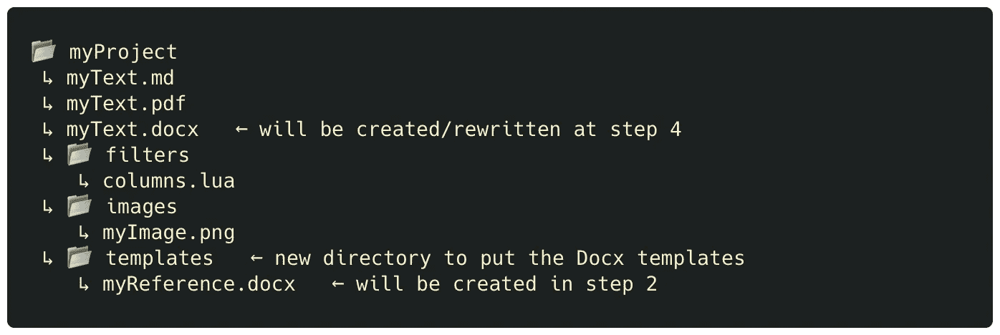

# 简单的 Pandoc 布局指南:列，页边空白，以及更多带有单行代码的 Markdown

> 原文：<https://levelup.gitconnected.com/use-columns-adjust-margins-and-do-more-in-markdown-with-these-simple-pandoc-commands-adb4c19f9f35>

## 文档编程

*您可以使用这些简约的技术来配置 PDF、HTML 和 Docx 输出的布局，而无需摆弄 LaTeX 模板。*


布鲁诺·马丁斯在 [Unsplash](https://unsplash.com/collections/1uHpKFLQuvQ/layout/58e21bfb5d22579f2e86fde2abba45c0?utm_source=unsplash&utm_medium=referral&utm_content=creditCopyText) 上的照片

# 要点/目标语；速度三角形定位法(dead reckoning)

如果你在 **Markdown** 中这样写:


您可以借助 [**Pandoc**](https://pandoc.org/installing.html) LUA 过滤器、[列](https://github.com/jdutant/columns)对其进行解析，如下所示:


得到这个 PDF 结果:


如果您还想调整页边距(以及列宽和高度)，可以通过在 Markdown 文件的开头添加如下语句来实现:


减价文件开头的 YAML 环境。

以下是使用这些布局参数可以做的一些事情的预览:


这些技术适用于 PDF 和 HTML 文件。对于 Docx 文件，您可以使用:


Docx 布局的设置不同于 PDF 和 HTML。

详情请继续阅读！

# 设置

您需要一个 LUA 过滤器(即，用 LUA 语言编写的脚本)Julien Dutant 的' [Columns](https://github.com/jdutant/columns) '来启用 Pandoc 中的多列支持。以下是获取和设置它的方法:

1.  如果还没有的话，[安装 Pandoc](https://pandoc.org/installing.html) 。
2.  下载或克隆“[栏目](https://github.com/jdutant/columns)资源库。如果你下载了一个 zip 文件，解压它。
3.  您只需要存储库中的一个文件:将文件`**columns.lua**`复制到项目的一个目录中。对于本指南，我使用下面的目录结构，并将`**columns.lua**`放在我的`**filters**`目录中:


添加 columns.lua 后的项目结构。

# Pandoc 中的用法

一旦您的项目文件夹中有了`**columns.lua**`过滤器，您就可以将它包含在 Pandoc 命令中，该命令将您的 Markdown 文件解析为一个 **PDF** 或 **HTML** 。(为了简洁，我在本指南中使用 PDF)。以下是如何在解析操作中包含 LUA 滤波器:

1.  打开终端并导航到您的项目目录(例如`**cd /Users/myName/MyProject**`)。
2.  用`**--lua-filter=./filters/columns.lua**`参数调用 pandoc:


**注意**:您是否需要在 **Docx** 文件中使用分栏或进行布局更改？那么您需要一种不同的方法，这将在后面的章节中讨论。

# 降价中的用法

这里有一些例子。

## 布局基础

***将一些文本显示为列***

通过将相关部分放在`**:::columns**`和`**:::**`语句之间，您可以显示文本的全部或部分内容。

`**:::columns**`告诉解析器接下来的是一个包含‘Columns’包的语句(这里冒号的数量与你的文本将有多少列无关)。


***栏间显示一条黑线***

如果您想进一步指定列属性，可以通过编写另一个类似于`**:::columns**`的一行程序来实现，但是由于花括号的原因，有点不太漂亮:


***显示为三列，中间有一条橙色粗线***

同样的技巧，但是这次用`**.threecolumns**` 代替`**.columns**`:


## 以分栏版式显示整个文档

上面的方法在两列中显示一个简短的文本。但是，对于应该在列中显示多少文本没有限制。因此，您可以将整个文档(或大部分文档)放在`**:::column**`和`**:::**`关键字之间:

```
**# Abstract** 
This part is displayed as a single block of text.
​
Lorem ipsum dolor sit amet, consectetur adipiscing elit, sed do eiusmod tempor incididunt ut labore et dolore magna aliqua. Cras pulvinar mattis nunc sed blandit. Nunc vel risus commodo viverra maecenas. Eget magna fermentum iaculis eu. Vehicula ipsum a arcu cursus vitae congue mauris rhoncus. Nunc eget lorem dolor sed viverra ipsum.
​
​
**# Introduction** 
::: columns
​
This part is displayed as two columns.
​
Lorem ipsum dolor sit amet, consectetur adipiscing elit, sed do eiusmod tempor incididunt ut labore et dolore magna aliqua. Cras pulvinar mattis nunc sed blandit. Nunc vel risus commodo viverra maecenas. Eget magna fermentum iaculis eu. Vehicula ipsum a arcu cursus vitae congue mauris rhoncus. Nunc eget lorem dolor sed viverra ipsum.
​
Lorem ipsum dolor sit amet, consectetur adipiscing elit, sed do eiusmod tempor incididunt ut labore et dolore magna aliqua. Cras pulvinar mattis nunc sed blandit. Nunc vel risus commodo viverra maecenas. Eget magna fermentum iaculis eu. Vehicula ipsum a arcu cursus vitae congue mauris rhoncus. Nunc eget lorem dolor sed viverra ipsum.
​
​
Lorem ipsum dolor sit amet, consectetur adipiscing elit, sed do eiusmod tempor incididunt ut labore et dolore magna aliqua. Cras pulvinar mattis nunc sed blandit. Nunc vel risus commodo viverra maecenas. Eget magna fermentum iaculis eu. Vehicula ipsum a arcu cursus vitae congue mauris rhoncus. Nunc eget lorem dolor sed viverra ipsum.
​
:::
```


混合布局:摘要部分显示为一个单独的块，而简介部分分为两列。

## 添加全角内容

有时，您会希望列环境中的特定元素(例如，图片或标题)占据文档的整个宽度，然后将所有内容返回到列布局。

首先，让我们向项目添加一个`**images**`子目录，并在其中放入一个图像文件:


添加图像文件夹和图像后的项目结构。

要使文本的一部分(或图像等元素)跨越文档的整个宽度，可以将该部分放在`**::::: column-span**`和`**:::::**`标签之间。这里的许多冒号(:)表示缩进的级别，因为这个表达式发生在另一个已经启动的环境中，即`**::: column**`环境。


横跨整个文档宽度的图像被放置在列环境中。最后的`**{ width=100% }**`部分是一个额外的措施，确保你的图像占据页面的整个宽度，而不管图像的实际大小。


显示全角元素。(照片由 [Ariel Pilotto](https://unsplash.com/@ariel_pilotto?utm_source=unsplash&utm_medium=referral&utm_content=creditCopyText) 在 [Unsplash](https://unsplash.com/s/photos/columns?utm_source=unsplash&utm_medium=referral&utm_content=creditCopyText) 上拍摄)。)

**注意**:使用`**column-span**`关键字的替代方法是关闭`**::: columns**`环境，放置全幅图像，然后打开另一个`**`::: columns**`环境，使列环境之间的图像全幅。不过，这是一个不太简约的解决方案。

## 指定列宽和页边距

您不需要“列 LUA”滤镜来设置文档边距，但是边距会影响列宽。例如，如果您想要使您的栏更宽，您可以减少为左右文档页边空白保留的空间，以便为文本内容创造更多空间，从而为您的栏创造更多空间。

您可以通过在 Markdown 文件的开头添加如下语句来指定页边距(无论您是否使用`**columns.lua**`):


YAML 规格。这里的三个连字符开始和结束 YAML 环境—您可以将该部分添加到 Markdown 文档的开头。这些参数在解析期间被传递给 Pandoc 以定制其行为。

# Docx 文件的布局

在撰写本文时，上述方法适用于 PDF 和 HTML 输出。如果您希望更改 Pandoc 的 Docx 输出的布局，您可以使用参考文档进行更改。方法如下:

1.在 shell 中导航到您的项目目录，然后(可选地)导航到您的 Docx templates 子目录(如果您想要的话)。在这个例子中，我确实为模板使用了一个单独的子目录，所以如果我有多个 Docx 模板，它们会整齐地放在一个地方。在我的项目中创建了`**templates**`子目录后，我的项目目录看起来是这样的:



添加模板文件夹后的(预期)项目结构。

2.检索 Pandoc 使用的默认参考文档(即“reference.docx”)，并将其作为文件(即本例中的“myReference.docx”)保存在 templates 目录中。您也可以使用任何包含样式信息的 Word 文件，但是使用 Pandoc 的参考文档可以确保在回读时与 Pandoc 兼容。


将 Pandoc 的默认参考文档复制到项目目录中。

3.在您的文字处理器中打开“myReference.docx ”(仅针对 word 进行了测试),编辑此文件中的文本样式、边距和布局(例如，将文本显示为两列),然后保存它。

4.导航回项目目录的根目录，然后告诉 Pandoc 在解析 Markdown 文件时使用新的引用文件。这样，它将从 myReference.docx 中提取样式和布局信息，并在创建新的 docx 文件时使用这些信息:


# 最后

在将降价文本解析为各种格式时，您可能希望有一个多栏布局并指定基本参数，如页边距。如果你不想把 LaTeX 模板输入 Pandoc，你可以使用 LUA 过滤器(用于列)和 YAML 语句(用于页边空白)来代替。这种方法适用于将 Markdown 文件解析成 PDF 或 HTML(在较新的浏览器中)。为了解析成 Docx，您需要一个参考文档。

我希望你觉得这是有帮助的，并喜欢阅读。

编码快乐！