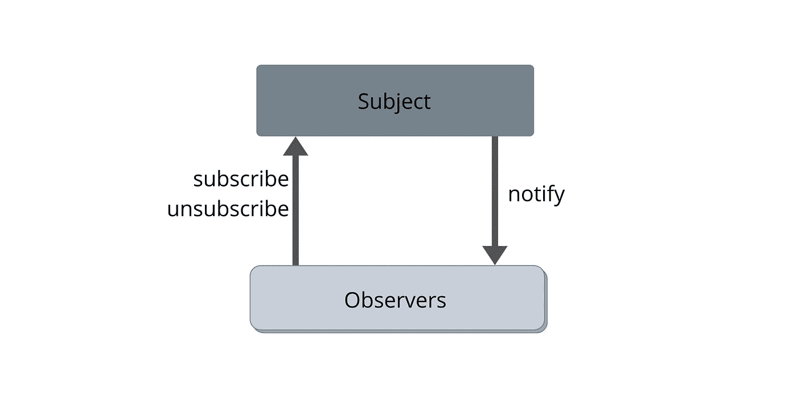
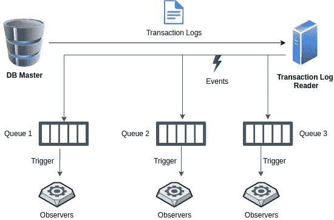

# 使用数据库事务日志实现观察者模式

> 原文：<https://levelup.gitconnected.com/use-database-transaction-logs-to-implement-observer-pattern-1e6fc0b03128>

## 在应用程序中有一个观察者并不好

穆斯塔法·梅拉吉在 [Unsplash](https://unsplash.com?utm_source=medium&utm_medium=referral) 上的照片

> “理解就是感知模式”——以赛亚·伯林

设计模式帮助您解决常见问题，并保持代码的可维护性和可扩展性。 [**观察者模式**](https://en.wikipedia.org/wiki/Observer_pattern) 就是这样一种模式。

一组观察者持续观察一个物体的变化。当对象发生任何变化时，观察者都会得到通知。当一个对象的变化应该触发观察对象的变化时，使用这种模式。

对于 web 应用程序，所有状态都保存在数据库条目和表中。在很多情况下，您需要对条目进行后处理，或者在表中的数据发生变化时触发作业。观察者模式就是用于这个目的的。

# 观察者模式是如何工作的？

观察者模式

本质上发生的是观察者认同主体的变化。当主题发生变化时，它会通知观察者。观察者订阅这些事件，以便根据主题的特定变化采取行动。

一旦观察者收到这个通知，他们就采取他们应该采取的行动。

# 在 Web 应用程序中实现观察者模式的方法

有许多方法可以实现这种模式。以下是我亲眼目睹的最常见的方式——

## 利用 Web 框架的观察器

许多 web 框架都内置了这种模式，或者有引入其功能的库。您可以简单地在模型代码中添加在记录创建、更新或删除时触发的观察者。

web 框架中一个典型的观察者是这样的。这个例子展示了 Ruby on Rails 如何提供实现观察者的特性。

**缺点—** 随着项目的发展，维护观察者变得越来越困难。您倾向于创建多个服务和应用程序。如果一个服务需要触发另一个服务中的作业，内置的观察者模式会使代码变得复杂。跟踪所有项目中的观察者可能是一场噩梦。

## 定期作业

这是我见过的程序员最常用的方法，主要是因为时间限制。运行一个简单的后台作业来扫描数据库表，并根据更改同步或异步运行观察器代码。

**缺点—** 这种方法成本很高。数据库扫描需要时间，并且由于作业定期运行，这些作业所做的更改会延迟。此外，这些作业会成为单点故障。

# 使用事务日志实现观察者模式

使用数据库事务日志的观察者模式

事务日志由数据库主服务器生成。这些日志帮助从属服务器跟上变化。在这种设计中，读取 DB 事务日志以发现各种表中的变化，并根据事件类型触发观察器。队列可以用来解决[生产者-消费者问题](https://en.wikipedia.org/wiki/Producer%E2%80%93consumer_problem)。

## 为什么要用这种设计？

这种设计有很多优点，下面是其中几个——

*   在一个地方维护观察者很容易。
*   这种设计有助于您维护观察器，而不管您的应用程序使用什么框架。
*   避免应用程序和服务中的意大利面条。
*   观察点可以独立缩放。
*   几乎瞬间触发观察者。

# 最后的话

我们有一堆代码在不同的网络服务中触发观察者。实施这个计划花了我们一些时间，但这是值得的。我们使用这个管道来反规范化对象、维护审计日志、将数据推送到分析等。

***我希望你喜欢读这篇文章。如果你愿意支持我当作家，可以考虑报名*** [***成为中等会员***](https://singhamrit.medium.com/membership) ***。每月只需 5 美元，你就可以无限制地使用 Medium。***

 [## 通过我的推荐链接加入 Medium-Amrit Pal Singh

### 作为一个媒体会员，你的会员费的一部分会给你阅读的作家，你可以完全接触到每一个故事…

singhamrit.medium.com](https://singhamrit.medium.com/membership)