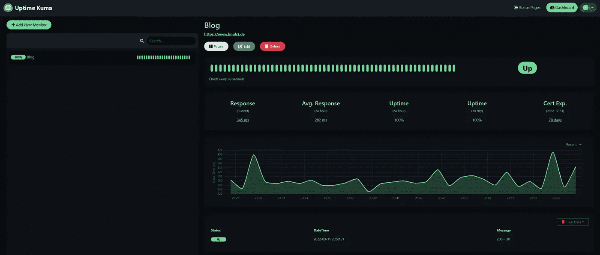
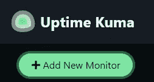
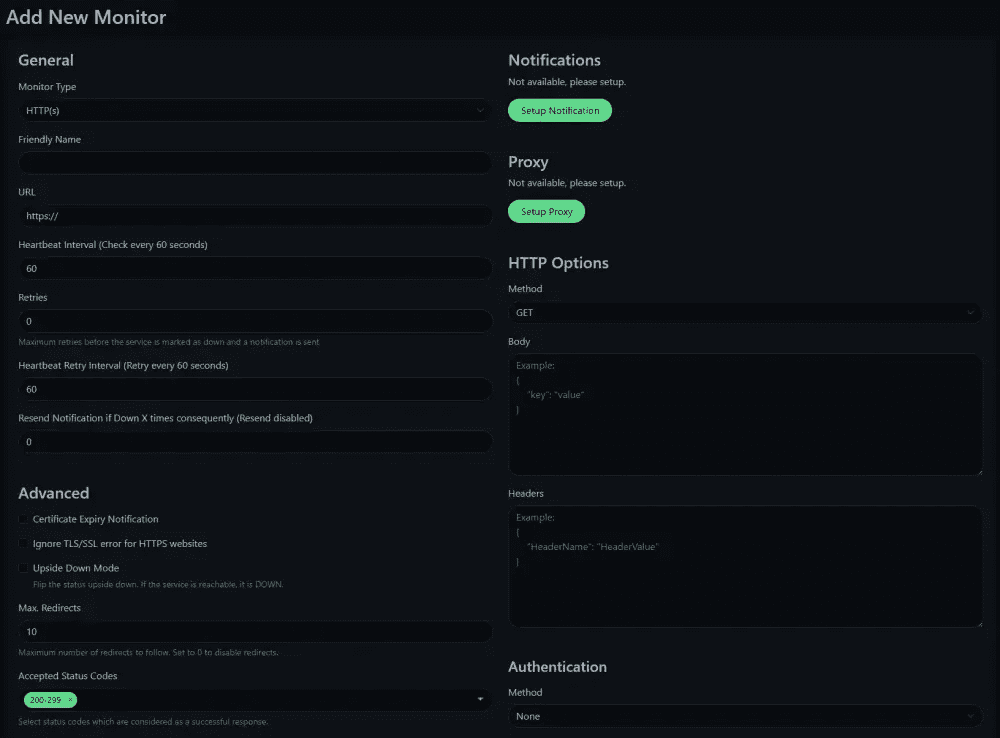
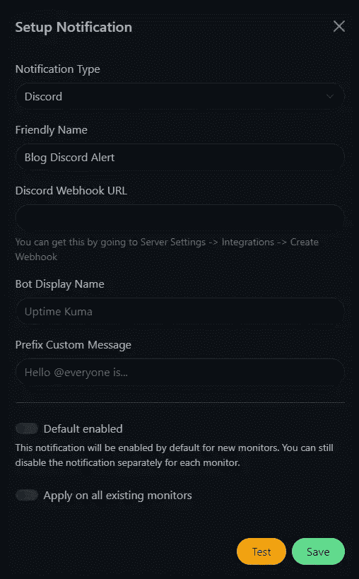

# 使用 Docker、Uptime 库马和 Traefik 来监控您的网站

> 原文：<https://levelup.gitconnected.com/use-docker-uptime-kuma-and-traefik-to-monitor-your-website-593373f9e0c2>

## 确保稳定性和可用性，您的网站，博客，否则与正常运行时间库马。直观、轻量级的 Docker 服务。



作者创建的正常运行时间库马仪表板示例

# 介绍

在这篇文章中，我想展示如何通过 Docker/Docker Swarm 从本地 PC 或服务器上设置网站监控。我不想使用复杂的监控栈，比如 prometheus、node-exporter 或 graphana，我想展示一个轻量级的替代方案，叫做 Uptime 库马，它是用 NodeJs 和 Vue 编写的。

该项目是开源的，可以在 GitHub 上找到:[https://github.com/louislam/uptime-kuma](https://github.com/louislam/uptime-kuma)

说服我使用这种替代方案的重要特性是:

*   UI 很好看！
*   Docker/Docker Swarm 的设置非常简单
*   难以置信的简单配置
*   通过不一致、松弛、电子邮件(SMTP)等方式发出通知。[点击这里查看完整列表。](https://github.com/louislam/uptime-kuma/tree/master/src/components/notifications)

# 先决条件

要在服务器或您的本地机器上运行正常运行时间库马，您必须准备您的环境。我个人喜欢将 [Traefik](https://traefik.io/) 作为反向代理运行在我的 Docker Swarm 中，并部署了 [Docker Compose](https://docs.docker.com/compose/) 。使用 Traefik，您可以创建一个单独的合成文件并部署任何服务，它会自动为您的域颁发 Let's Encrypt 证书。

我将很快解释这两个先决条件，然后将展示如何使用它们来部署正常运行时间库马。

## 码头工人

Docker 是一个广泛用于开发、发布和运行各种应用程序的平台。它使您能够将基础设施从应用程序中分离出来，以便快速地将软件从一台机器传送到另一台机器。

在使用 Docker 的同时实现软件通常会忽略基础设施问题，比如常见的“在我的机器上工作”问题:


用 memegenerator 创造的——灾难小子

要在你的系统或服务器上安装 Docker，你需要遵循 docker.com 的官方教程。

如果你只想在你的本地机器上运行库马，你使用的是 Windows，不允许安装 Docker 桌面，你可以遵循以下指南:

[](https://www.paulsblog.dev/how-to-install-docker-without-docker-desktop-on-windows/) [## 如何在 Windows 上不用 Docker 桌面安装 Docker

### 此外，学习如何使用 Portainer 作为 Docker 桌面的替代 Docker GUI。作为一个从 Linux 转行的开发者…

www.paulsblog.dev](https://www.paulsblog.dev/how-to-install-docker-without-docker-desktop-on-windows/) 

## 特拉菲克

什么是 Traefik？

> Traefik 让网络变得乏味
> 云原生网络堆栈刚刚工作。

Traefik 用于将传入的请求转发给 Docker 环境中部署的服务。此外，它还能够为由 *traefik* 管理的每个域自动创建[加密](https://letsencrypt.org/) SSL 证书。

要在您的 Docker 环境中设置本地 Traefik 服务，您可以[下载这个 Docker 合成文件](https://gist.github.com/paulknulst/68e5e63badaa6a9ac80b4227ca07baee#file-docker-compose-traefik-yml)并执行以下命令:

1.创建用于 Traefik 的外部网络

2.导出所需变量

3.启动容器

要访问 traefik 仪表板，您可以点击`[https://dashboard.yourdomain.de](https://dashboard.yourdomain.de/)`并使用以下信息登录:

```
username: devadmin
password: devto
```

要在 Docker Swarm 模式下在 Docker 环境中部署 Traefik，您可以[下载这个 Docker 合成文件](https://gist.github.com/paulknulst/ad038538542fb5dbb596719560a32148)，执行步骤 1 和 2，并使用以下命令进行部署:

**要更深入地了解 Traefik，您可以阅读本文** **中的** [**如何在 Docker 中部署它，以及本文**](https://www.paulsblog.dev/how-to-setup-traefik-with-automatic-letsencrypt-certificate-resolver/) **中的** [**如何在 Docker 群集模式中部署它。**](https://www.paulsblog.dev/services-you-want-to-have-in-a-swarm-environment/)

# 用 Docker 部署正常运行时间库马

可以在三种不同的环境中部署 Uptime 库马:在本地使用 Docker，在使用 Docker 和 Traefik 的服务器上，以及在以 Swarm 模式运行 Docker 和 Traefik 的服务器集群上。

## 在您的 Docker 环境中本地部署

测试库马正常运行时间的最简单方法是在您自己的设备上本地运行它，方法是创建一个新的 Docker 合成文件并将以下内容粘贴到其中:

这个 Docker 合成文件简单地使用了官方的 Uptime 库马映像，将端口映射到`1337`，并使用一个共享文件夹来保存 Uptime 库马的数据文件夹。

通过切换到文件夹并执行以下命令来运行 Docker 合成文件:

该命令完成后，您可以通过打开`[https://localhost:1337/](https://localhost:1337/)`来访问正常运行时间库马实例

## 使用 Traefik 在 Docker/Docker Swarm 上远程部署

如果你运行你自己的服务器，并且在集群模式下运行一个带有 Docker 的服务器或者一个带有 Docker 的服务器集群，你必须更新 Docker Compose 文件。

*我将假设你已经按照我的教程*中的描述设置了你的 Traefik 实例

创建一个新的 Docker 合成文件并粘贴以下内容:

在部署这个 Docker 合成文件之前，您必须像对 Traefik 一样导出您的域:

根据您的需要调整其他设置(域、容器名称、网络和卷)并部署正常运行时间库马:

对于 Docker Swarm 模式中的 Docker 和 Traefik，使用[这个合成文件](https://gist.github.com/paulknulst/58543c289a08d193d9fbe850750ce0a9)，在您想要保存数据的节点上创建一个名为`monitor`的新节点标签，导出您的`PRIMARY_DOMAIN`，并将其部署到:

几秒/几分钟后，Uptime 库马部署成功，您可以在`[https://monitor.PRIMARY_DOMAIN/](https://monitor.PRIMARY_DOMAIN/)`上访问您的实例

# 配置正常运行时间库马

在您第一次访问 Uptime 库马成功部署后，您必须配置一个安全的管理员密码。

完成后，按下此按钮开始添加您的第一台显示器:



启动正常运行时间库马仪表板后左上角的按钮

将弹出一个新的 UI，您可以在其中定义特定的行为:



用于创建新监视器的正常运行时间库马用户界面的屏幕截图

现在，您已经创建了第一个监视器，您应该配置任何类型的通知(不一致、电子邮件或其他)。如果您这样做，每次一台或多台显示器不按预期工作时，您都会收到通知。这样做通常是非常容易的，并且将在下面解释。

## 创建不一致通知(和时差、团队)

要启用不一致通知(或团队，懈怠),您需要一个不一致(或团队，懈怠)网络挂钩，用于库马正常运行时间发送警报的服务器和渠道。在 Discord 中，你可以打开服务器设置->集成->创建 Webhook。在你创建了你的网页钩子之后，复制网页钩子的 URL。无论是在团队中还是在空闲时间，效果都应该是一样的。

然后编辑您的显示器，并按下“设置通知”。在出现的对话框中，选择 choose Discord(或 Teams，Slack)，给它一个友好的名称，然后粘贴 Webhook URL。对于不一致，用户界面应该是这样的:



为不一致创建正常运行时间库马通知的屏幕截图

您可以将其设置为每个新创建的显示器的默认设置，也可以通过启用底部的复选框将其应用于所有现有的显示器。

## 创建电子邮件通知

如果您不想要不一致、团队或松弛通知，您也可以创建一个电子邮件通知。为此，您需要您的电子邮件帐户主机名、端口、用户名、密码、发件人/收件人电子邮件和身份验证方法设置(StartTLS 或 SSL)。您也可以将其作为新显示器的默认设置，并将其添加到所有现有显示器中。

# 结束语

在本文中，我展示了如何使用 Traefik 反向代理在本地和 Docker 或 Docker Swarm 环境中安装 Uptime 库马。我认为这个轻量级的工具非常适合监控任何网站，因为它很容易设置，并提供了很多配置选项。我会向任何软件开发人员或博客主持人推荐 Uptime 库马，以确保他们的服务或博客正常运行。

本教程到此结束。希望您现在能够设置它。如果你还有问题，你可以在评论区提问。

此外，如果你喜欢阅读这篇文章，考虑评论你的宝贵想法！我很想听到你的反馈。

请随意与任何人分享这篇文章，并在我的个人博客、[、LinkedIn](https://www.linkedin.com/in/paulknulst/) 、 [Twitter](https://twitter.com/paulknulst) 和 [GitHub](https://github.com/paulknulst) 上与我联系。

*这篇文章也发表在我的博客上:*[*https://www . paulsblog . dev/use-docker-uptime-kuma-and-trae fik-to-monitor-your-website/*](https://www.paulsblog.dev/use-docker-uptime-kuma-and-traefik-to-monitor-your-website/)