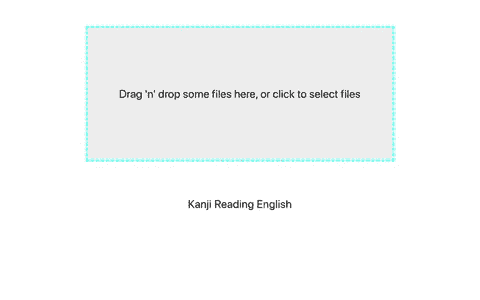
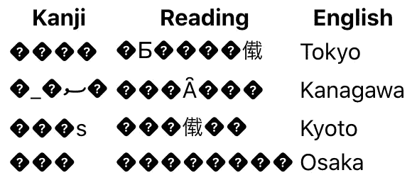
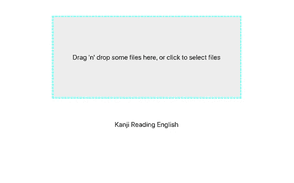

# 使用日语编码将 JIS 字符转换为 Unicode

> 原文：<https://levelup.gitconnected.com/use-encoding-japanese-to-convert-shift-jis-characters-to-unicode-8945d31f4906>

## 如何在 React 中创建 CSV 文件导入器:第三部分


由[马尔科·祖彭](https://unsplash.com/@stocktrader?utm_source=medium&utm_medium=referral)在 [Unsplash](https://unsplash.com?utm_source=medium&utm_medium=referral) 拍摄的照片

逗号分隔值(CSV)文件是包含数据列表的文本文件。它通常用于在不同的应用程序之间交换数据。

在这一系列文章中，我们将了解如何在 React 中创建 CSV 文件导入程序。这是一个由三部分组成的系列，我们将了解如何做到以下几点:

1.  [使用 React Dropzone 为文件创建一个拖放区](/use-react-dropzone-to-create-a-drag-n-drop-zone-for-files-f9c32dc722fc)
2.  [使用 Papa Parse 解析 React 应用程序中的 CSV 文件](/use-papa-parse-to-parse-a-csv-file-in-a-react-application-da570e0c346a)
3.  **使用编码日语将 Shift JIS 字符转换为 Unicode**

在第三篇文章中，我们将看看编码日语库。这个库将允许我们检测和转换 JavaScript 中的字符编码。如果你正在处理日本字符，这将是有帮助的。本文假设您对 React 有基本的了解。这个例子将从一个`create-react-app` starter 应用程序中创建。

在本文结束时，您应该对如何执行以下操作有所了解:

*   使用 FileReader API
*   检测字符的编码类型
*   转换字符的编码类型
*   使用文件 API 创建一个新的 CSV 文件

## 首先，什么是日语编码？

编码日语是一个库，帮助您转换 JavaScript 中的字符编码。它在 NPM[上的周下载量接近 20 万次。](https://www.npmjs.com/package/encoding-japanese)

如果您不熟悉， [*“在计算、数据存储和数据传输中，* ***字符编码*** *用于通过某种编码系统来表示一系列字符，该编码系统为每个字符分配一个数字表示。”*](https://en.wikipedia.org/wiki/Character_encoding)

这意味着你在电脑上看到的每个字符都有某种字符编码类型。标准编码是 UTF-8，它使用 Unicode 作为字符集。但是，在使用日语时，您可能会遇到另一种字符编码类型，称为移位 JIS。

我不会试图解释两者的区别；它变得相当专业，我自己对这个话题也没有最好的理解。对于本文，您只需要知道有各种类型的字符编码，有时您可能需要检测或转换它们。

在本系列的第一和第二部分中，我们已经创建了一个接受 CSV 文件的 dropzone。然后解析这个 CSV 文件，数据以基本表格的形式呈现在屏幕上。但是，根据字符编码类型的不同，您可能会看到类似这样的内容。



# 使用 FileReader API

首先，我们将添加我们在第一部分中创建的`onDrop`函数。当使用 React Dropzone 时，可以使用 [FileReader](https://developer.mozilla.org/en-US/docs/Web/API/FileReader/FileReader) API 访问文件内容。

首先，我们将创建 FileReader 的一个新实例。

```
const reader = new *FileReader*();
```

然后，我们将调用`readAsArrayBuffer`方法，将接受的文件作为参数传入。这将允许结果包含一个代表文件数据的 [ArrayBuffer](https://developer.mozilla.org/en-US/docs/Web/JavaScript/Reference/Global_Objects/ArrayBuffer) 。

```
const file = *acceptedFiles*[0];reader.readAsArrayBuffer(file);
```

接下来，我们可以访问 FileReader 的`onload()`事件处理程序。每次成功完成读取操作时，都会触发此事件。

```
reader.onload = () => {
  *// do something*
};
```

因此，每当我们将一个已接受的文件放入 dropzone 时，`onload`函数中的任何内容都将在文件加载后运行。

# 检测字符的编码类型

在`onload`函数中，我们可以在 FileReader 的 result 属性上访问添加文件的结果。有了结果，我们将首先创建一个 [Uint8Array](https://developer.mozilla.org/en-US/docs/Web/JavaScript/Reference/Global_Objects/Uint8Array) 对象。

```
const contents = new *Uint8Array*(reader.result);
```

然后，我们将使用编码日语库来检测字符编码类型。我们将把`contents`变量作为参数传递给`detect`方法。

```
const encodingType = Encoding.detect(contents);
```

# 转换字符的编码类型

接下来，我们可以使用编码日语中的`convert`方法将字符编码从任何类型转换为 Unicode。

```
const unicodeArray = Encoding.convert(contents, {
  to: 'UNICODE',
  from: encodingType,
});
```

然后，我们将把 Unicode 数组转换成一个字符串。我们可以使用日语编码中的`codeToString`方法，并将`unicodeArray`变量作为参数传递。

```
const unicodeString = Encoding.codeToString(unicodeArray);
```

# 使用文件 API 创建一个新的 CSV 文件

最后，我们需要将它转换回 CSV 文件，这样我们就可以解析它。我们可以使用[文件](https://developer.mozilla.org/en-US/docs/Web/API/File/File) API 创建一个新文件。

```
const newFile = new *File*([unicodeString], 'prefectures.txt', {
  type: 'text/csv',
});
```

然后，我们将调用我们在第二部分中创建的`parseFile`函数。这一次，我们将传递带有转换后的字符编码类型的`newFile`。

```
parseFile(newFile);
```

现在，无论您的文件使用哪种类型的字符编码，数据都将首先被转换为 Unicode，然后被解析。



# 结论

感谢阅读！我希望这篇文章对您开始编码日语有所帮助。当我试图解决这个问题时，我找不到太多的内容。如果你知道另一个库或者处理字符编码的方法，请告诉我！

如果你想看这个项目的完整源代码，请点击这里查看我的 GitHub 库。请务必查看名为*“第三部分”*的分支。

如果您错过了该系列的第一部分或第二部分，请查看下面的内容。

[](/use-react-dropzone-to-create-a-drag-n-drop-zone-for-files-f9c32dc722fc) [## 使用 React Dropzone 为文件创建拖放区

### 如何在 React 中创建 CSV 文件导入程序:第一部分

levelup.gitconnected.com](/use-react-dropzone-to-create-a-drag-n-drop-zone-for-files-f9c32dc722fc) [](/use-papa-parse-to-parse-a-csv-file-in-a-react-application-da570e0c346a) [## 使用 Papa Parse 在 React 应用程序中解析 CSV 文件

### 如何在 React 中创建 CSV 文件导入器:第二部分

levelup.gitconnected.com](/use-papa-parse-to-parse-a-csv-file-in-a-react-application-da570e0c346a)