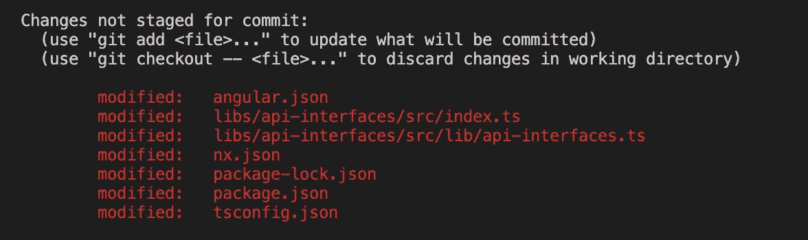
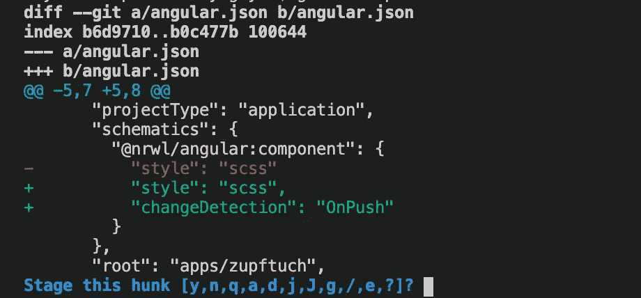
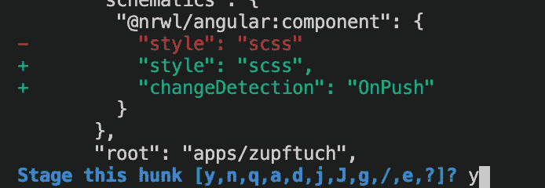
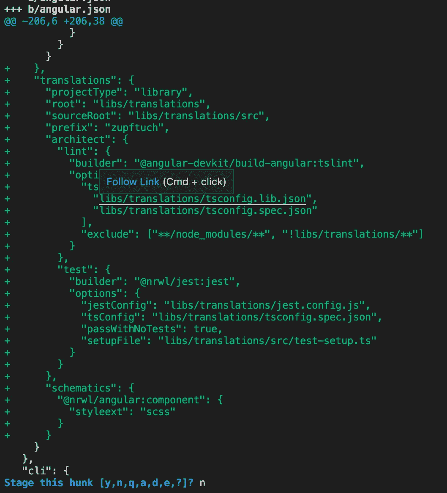
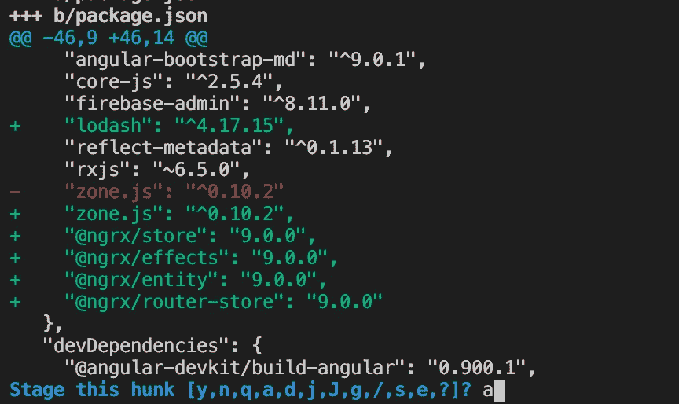
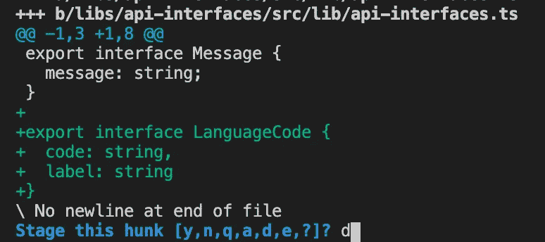
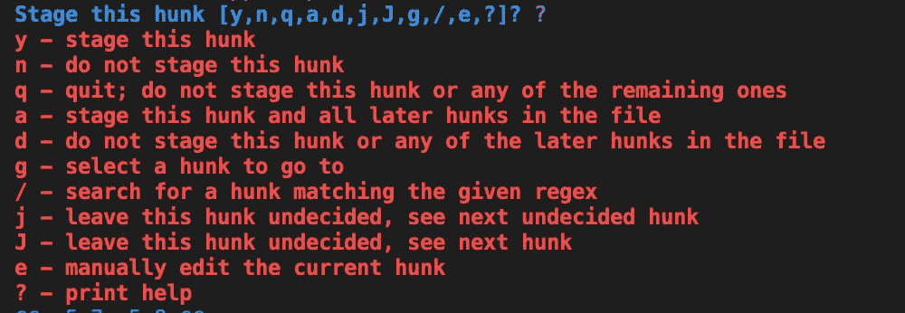

# 使用“git add”和“- patch”更智能

> 原文：<https://levelup.gitconnected.com/use-git-add-smarter-with-patch-cbe6bf5129e8>

您是否曾经提交了一个 commit，然后收到一个评论，说您在文件中留下了一个调试消息？在我发现 git 命令之前，这种情况一直发生在我身上:`**git add --patch**`

信用[pxfuel.com](https://www.pxfuel.com/)

# **简介**

当我第一次学习如何使用 git 时，我看到了一个需要遵循的步骤列表。首先，使用 ***git add -A*** 将所有更改的内容添加到提交中。第二，使用 ***git commit -m“这是我的消息”*** *创建一个带消息的 commit。*最后，***git push****将我的提交推送到代码库。很简单，对吧？*

*现在，如果你已经在一个已建立的代码库中做了相当多的编码工作，不管是开源的还是在一个公司里，你就会知道***git add-A****不是一个你经常使用的命令，如果根本不用的话。在大多数情况下，人们倾向于一次一个地将文件添加到提交中，使用 GUI 或者通过命令行使用***git add<file _ name>***。我对使用后一种方法感到内疚。像许多开发人员一样，我是通过命令行接触到 git 的，我从来没有真正想要学习一个可能会调用命令行的 GUI 工具。**

**总之， ***git add*** 的目的是告诉 git 将一个**文件**添加到一个暂存区，在那里它稍后将被发送到远程存储库。Git 不关心这些文件中的变化，这意味着，主要由开发人员决定签入什么。对于开发人员来说，这是令人难以置信的乏味工作，因为可能会有许多变化；一些变化是为了调试，一些是实验性的，一些是实际的功能代码。**

**因此，有许多工具可以帮助这个过程，比如 Sourcetree、Github Desktop 和 Visual Studio 源代码控制。虽然这些 GUI 工具是很好的选择，但是还有另一种不需要额外软件的方法；你甚至不需要你的鼠标。是的你猜对了， ***git add - patch*****

# ****什么是*补丁*选项？****

**根据官方文档，- ***补丁*** *或* ***-p*** 是***git add****命令的一个标志，它将允许您"*交互地在索引和工作树之间选择大块补丁，并将它们添加到索引中。这使用户有机会在将修改的内容添加到索引之前检查差异。* [*来源*](https://git-scm.com/docs/git-add#Documentation/git-add.txt---patch)***

**本质上，它是一个以交互方式审查和管理*“大块”(一个文件中的小块变更)的标志。这个标志将启动 git 提供的交互界面，并立即显示未提交文件中的第一大块。***

# ****演示****

**让我们来看看。假设我在运行 ***git 状态*** 后有以下未提交的文件。每一个都有一到多个大块。**

****

**git 状态**

**接下来，我运行 ***git add -p*** ，简写版***git add***-***补丁*****

****

**git add -p**

**这里我看到了 *angular.json* 文件中的第一部分。可以看到，红色部分是被删除的部分，绿色部分是新添加的代码。此外，我还看到了一个命令列表，告诉 git 在这里做什么。**

****

**“y”代表是**

**为了添加一个大块头，只需输入 **y** ，然后**输入**。瞧，我刚刚加了一大块！**

****

**“n”代表不**

**接下来，我在同一个文件中看到了这个巨大的块，我决定不把它添加到这个提交中。我简单按下 **n** ，**表示否，然后**回车。******

**请注意，由于只有该文件的一部分被添加到提交中，它将同时出现在已提交和未提交文件的列表中。这种只提交文件一部分的能力非常有用，因为它允许您跳过现在不想提交的内容，这样就不会中断流程。当然，你以后还有机会清理。**

****

**“a”表示在此文件中添加所有内容**

**在下一篇文章中，我看到了 *package.json* 文件中的变化。对于这个文件，我确信文件其余部分的所有更改；我不需要查看它们。因此，我将继续使用命令 **a** 告诉 git 添加整个文件。**

****

**“d”表示不添加其余部分**

**最后，我面对的是一个我不想承诺的对象。事实上，我根本不想提交这个文件中的任何内容。我将使用 **d** 命令告诉 git 忽略这个文件的其余部分。**

> **现在，在这一点上，你可能会想，“我不能记住所有这些，甚至有更多的命令！”。别着急，你只需要知道前 5 个，到目前为止我已经给你展示了 4 个。**

**最后一个是 **q** ，它简单地退出交互式命令提示符。仅此而已！**

**如果你忘记了这些命令的意思，就用**？**查看他们的文档。你也可以在这里看到同样的信息[。](https://git-scm.com/docs/git-add#Documentation/git-add.txt-patch)**

****

# ****提示****

**虽然描述是描述性的，但是要记住每个命令的作用是很困难的。所以，下面是一些如何记住它们的建议。**

****y** —是添加这个大块头。**

****n** —否不添加。**

****a** —添加该文件中的所有内容。**

****d** —不要添加该文件的其余部分。**

****问—** 退出。**

**这至少是我对他们的想法，我希望这是有帮助的。**

# **注意**

**在使用这种技术几年后，我注意到它迫使我在推送前更仔细地检查我的代码。我觉得它很优雅，因为它没有中断我离开命令提示符的流程。相反，我有机会一次只关注一段代码。这让我无数次避免了犯错误的代码。此外，在没有 GUI 的远程环境中，我从来没有错过拥有 GUI 的机会；我的工作流程保持不变。虽然这只是我个人的偏好，但如果人们觉得 GUI 更有用，我并不反对使用它。**

**我希望您喜欢这篇文章，如果您还没有，请尝试一下这个命令。只需输入***git add-p****，发现一个全新的世界！ *=)****

# **支持我的工作**

**我写文章是为了好玩，也赚点外快。请考虑关注我的更多内容，并帮助我在未来为社区做出更多贡献！干杯=)**