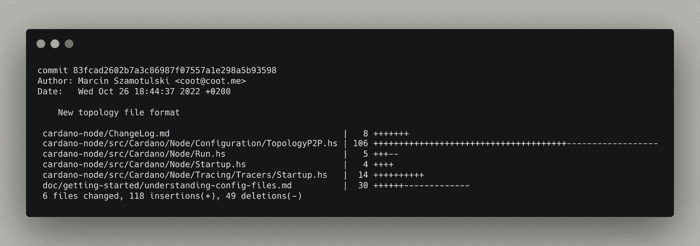

# 像高级工程师一样使用 Git

> 原文：<https://levelup.gitconnected.com/use-git-like-a-senior-engineer-ef6d741c898e>

## Git 是一个强大的工具，当你知道如何使用它时，用起来感觉很棒。

我已经在团队和项目中使用 Git 的这些特性很多年了。我仍然在围绕一些工作流(比如挤压或不挤压)发展自己的观点，但是核心工具是强大而灵活的(并且是可脚本化的！).

# 查看 Git 日志

Git 日志很难开箱即用。

## git 日志是基本的

使用`git log`给你一些信息。但它的分辨率极高，通常不是你想要的。

```
git log
```


git 日志

让我们现实一点。这些日志没给任何人留下深刻印象。他们很无聊。它们充满了你现在并不真正需要的信息。你试图对你的项目中正在进行的事情有一个高层次的理解。

有更好的方法。

## git 日志具有更高的可见性

使用`--graph`和`--format`，我们可以快速获得项目中 git 提交的概要视图。

```
git log --graph --format=format:'%C(bold blue)%h%C(reset) - %C(bold green)(%ar)%C(reset) %C(white)%an%C(reset)%C(bold yellow)%d%C(reset) %C(dim white)- %s%C(reset)' --all
```


git log-graph-format = format:'<>'-全部

哇！这些是一些好看的原木！它旁边甚至有一棵树枝的样子。

这些日志向您展示了谁在做什么，什么时候做了更改，以及您的更改在全局中的位置。

`--graph`将树形图添加到左侧。这不是最时髦的图表，但是它有助于可视化项目分支的变化。([看这里的文档。](https://git-scm.com/docs/git-log#Documentation/git-log.txt---graph))

`--format`让你自定义日志的格式。有预设的格式可供选择，也可以像这个例子一样自己编写格式。([看这里的文档。](https://git-scm.com/docs/git-log#_commit_formatting))

`--all`包括日志中的所有引用、标签和分支(包括远程分支)。你可能不想要所有的东西，所以你可以根据自己的需要来调整。([看这里的文档。](https://git-scm.com/docs/git-log#Documentation/git-log.txt---all))

[关于如何升级 git 日志的更多信息，请参见 git-log 文档。→](https://git-scm.com/docs/git-log)

# 了解特定的提交

您通常希望了解特定提交发生了什么。`git show`可以向您展示提交中的更改的高级视图，但它也让您看到对特定文件的更改。

## 查看提交的概要

```
git show <commit> --stat
```



git 显示 <commit>-统计</commit>

使用`--stat`标志，您将看到提交摘要，以及更改的文件和它们如何更改的细节。

## 查看提交的特定文件更改

当您想要深入到特定文件中的特定行更改时，使用带有文件路径的`git show`。

```
git show <commit> -- <filepath>
```


git 显示 <commit>-<filepath></filepath></commit>

这为您的文件提供了特定的行更改。默认情况下，它会向您显示行的更改以及两端的 3 个附加行，以便您了解更改的行在文件中的位置。

[参见 git-show 文档，了解如何提高对 git 提交的理解。→](https://git-scm.com/docs/git-show)

# 做出改变

您已经在项目上创建了一个分支，向您的分支提交了一些变更，并且您已经准备好将这些变更合并回`main`中。自从您分支后，另一位工程师对相同的文件进行了更改。😱

如果你使用的是 GitHub 这样的服务，你的公关会告诉你是否有合并冲突。


GitHub 合并冲突

Git 会提示您在将更改推回`main`之前解决这些合并冲突。这很好，因为你不想践踏其他人正在做的所有艰苦工作。

要开始在本地解决这个问题，你通常会选择两种途径中的一种:`merge`或`rebase`。

## git 合并与 git rebase

当`main`分支上有您想要合并到您的分支中的变更时，您可以*合并*中的变更或者*从不同的点重新调整*您的分支。

**合并**在一次*合并提交*中将一个分支的变更合并到另一个分支。

```
git merge origin/main your-branch
```

**重设基础**调整分支实际分支的点(即从基础分支移动分支到新的起点)。

```
git rebase origin/main your-branch
```

*一般来说，*当上游分支(比如`main`)中有您想要包含在您的分支中的变更时，您将使用`rebase`。当您想要将一个分支中的变更放回到`main`中时，您将使用`merge`。

## 挤压还是不挤压

我以前是职业壁球运动员。但是德里克·奥斯丁·🥳博士的一篇文章改变了我对此的看法。我推荐这篇文章，除了他所说的以外，我想我没有什么有用的东西可以补充。

[](https://betterprogramming.pub/why-i-prefer-regular-merge-commits-over-squash-commits-cadd22cff02c) [## 为什么我更喜欢常规的合并提交而不是挤压提交

### 我曾经认为壁球提交很酷，然后我不得不整天使用它们。以下是您应该避免的原因…

better 编程. pub](https://betterprogramming.pub/why-i-prefer-regular-merge-commits-over-squash-commits-cadd22cff02c) 

# 资源

*   [git-log 文档](https://git-scm.com/docs/git-log)
*   [git-show 文档](https://git-scm.com/docs/git-show)
*   [你什么时候使用 Git rebase 而不是 Git merge？](https://stackoverflow.com/a/804156)(堆栈溢出)