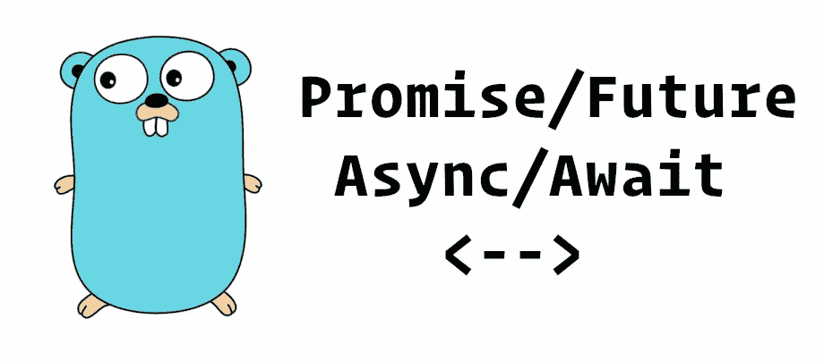

# 使用 Go 通道作为承诺和异步/等待

> 原文：<https://levelup.gitconnected.com/use-go-channels-as-promises-and-async-await-ee62d93078ec>

如果你曾经用 *Javascript* 编程，你肯定知道`Promise`和`async` / `await`。 *C#* 、 *Java、【Python】、*等一些编程语言都应用了同样的模式，只是用了其他的名字比如`Task`或者`Future`。

相反，围棋完全不按套路出牌。而是引入了`goroutines`和`channels`。然而，用`goroutines`和`channels`复制模式并不难。

# 单一异步/等待

首先，让我们试验一个简单的用例:`await`来自`async`函数的结果。

Javascript 与 Golang 中的单异步/等待

要在 Go 中声明一个“异步”函数:

*   返回类型为`<-chan ReturnType`。
*   在函数内，通过`make(chan ReturnType)`创建一个通道，并在函数结束时返回创建的通道。
*   通过`go func() {...}`启动一个匿名 goroutine，并在该匿名函数中实现函数的逻辑。
*   通过将值发送到通道来返回结果。
*   在匿名函数的开头，添加`defer close(r)`来关闭通道。

要“等待”结果，只需通过`v := <- fn()`从通道读取值。

# Promise.all()

我们开始多个异步任务，然后等待它们全部完成并收集它们的结果，这是很常见的。在 Javascript 和 Golang 中做到这一点非常简单。

我们必须用 2 行代码完成它，并引入 3 个变量，但是它足够干净简单。

我们可以不做`<-longRun(), <-longRun(), <-longRun()`，它会一个接一个的做`longRun()`而不是一次全做。

# 承诺.竞赛()

有时，可以从几个来源接收一条数据以避免高延迟，或者存在这样的情况，即生成多个结果，但它们是等效的，并且只消耗第一个响应。因此，这种先反应后胜利的模式很受欢迎。在 Javascript 和 Go 中实现这一点非常简单。

`select-case`是 Go 专为赛车频道运营设计的模式。我们甚至可以在每个案例中做更多的事情，但是我们只关注结果，所以我们让它们都为空。

# Promise.then()和 Promise.catch()

因为 Go 的错误传播模型与 Javascript 非常不同，所以有任何干净的方法来复制`Promise.then()`和`Promise.catch()`。在 Go 中，错误与返回值一起返回，而不是作为异常抛出。因此，如果您的函数可能失败，您可以考虑将您的返回`<-chan ReturnType`更改为`<-chan ReturnAndErrorType`，这是一个保存结果和错误的结构。