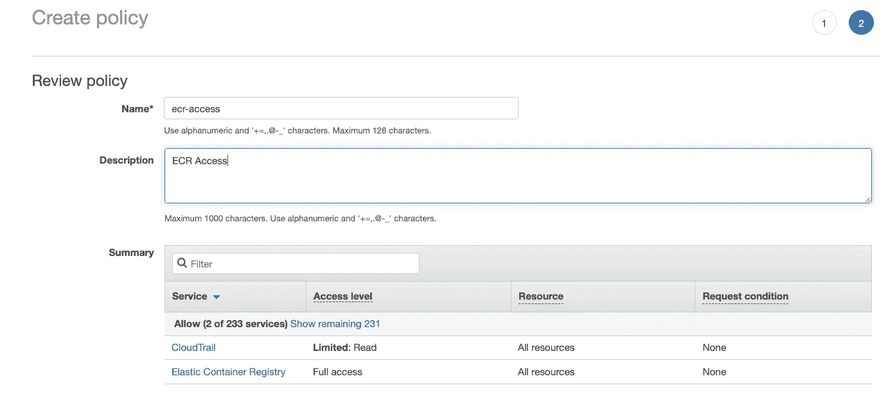

# 使用来自 ECR 的图像和 Kubernetes 上的 Jenkins pipeline。

> 原文：<https://levelup.gitconnected.com/use-images-from-ecr-with-jenkins-pipeline-on-kubernetes-f67dc83852e9>


作为 Cloudify.co 公司的 DevOps 工程师，我正在基于 Kubernetes 和 Jenkins 建立一个新的 CI/CD 管道。最近，我将弹性容器注册与我们基于 Jenkins 的 CI/CD 集成在一起。在本指南中，我将分享这方面的知识。

我们开始吧。

## 什么是 ECR —亚马逊弹性容器注册中心？

> Amazon Elastic Container Registry(ECR)是一个完全托管的 [Docker](https://aws.amazon.com/docker/) 容器注册表，它使开发人员可以轻松地存储、管理和部署 Docker 容器映像。亚马逊 ECR 与[亚马逊弹性容器服务(ECS)](https://aws.amazon.com/ecs/) 集成，简化你的开发到生产的工作流程。Amazon ECR 消除了操作自己的容器存储库的需要，也不用担心底层基础设施的扩展。

[https://aws.amazon.com/ecr/](https://aws.amazon.com/ecr/)

## 詹金斯是什么？

> *Jenkins 是一款独立的开源自动化服务器，可用于自动化与构建、测试、交付或部署软件相关的各种任务。*
> 
> [*https://jenkins.io/doc/*](https://jenkins.io/doc/)

## 詹金斯管道是什么？

> Jenkins Pipeline(或简称为“Pipeline”，大写字母为“P”)是一套插件，支持将*连续交付管道*实现和集成到 Jenkins 中。
> 
> [https://www.jenkins.io/doc/book/pipeline/](https://www.jenkins.io/doc/book/pipeline/)

## 先决条件

*   您必须有一个 AWS 帐户
*   Kubernetes 上的 Jenkins 在您的集群上运行

# 在 AWS 上创建具有 ECR 完全访问权限和编程访问权限的用户

## 创建对 ECR 具有完全访问权限的策略

在 AWS 帐户中，转到服务-> IAM ->策略->创建策略-> JSON

```
{
    "Version": "2012-10-17",
    "Statement": [
        {
            "Effect": "Allow",
            "Action": [
                "ecr:*",
                "cloudtrail:LookupEvents"
            ],
            "Resource": "*"
        }
    ]
}
```

单击查看并创建策略



## 使用我们创建的附加策略和编程访问权限创建一个用户

在 AWS 帐户中，转到服务-> IAM ->用户->添加用户

选择编程访问


附加创建的策略


创建用户并下载。带有 AWS 编程访问凭据的 csv 文件


## 将 AWS CLI 安装到您的计算机上

[https://docs . AWS . Amazon . com/CLI/latest/user guide/install-CLI v2 . html](https://docs.aws.amazon.com/cli/latest/userguide/install-cliv2.html)

## 在你的机器上安装 docker

[https://docs.docker.com/engine/install/](https://docs.docker.com/engine/install/)

# 如何用 ECR 认证？

所以基本上你有两个选择:

## 选项 1

将 AWS _ ACCESS _ KEY _ ID/AWS _ SECRET _ ACCESS _ KEY 作为环境变量导出到您的控制台/终端

```
$ export AWS_ACCESS_KEY_ID=Your_access_key_id_from_csv$ export AWS_SECRET_ACCESS_KEY=your_secret_access_ key_from_csv
```

## 选项 2

使用“aws configure”设置您的凭据和区域，它会将凭据永久存储在您的＄HOME/中。aws 目录

对于这两个选项，您需要使用 AWS _ ACCESS _ KEY _ ID/AWS _ SECRET _ ACCESS _ KEY，您可以在下载中找到它。csv 文件

# 创建亚马逊弹性容器注册中心

在 AWS 帐户中，转到服务->弹性容器注册表

点击“开始”


为测试创建一个名为 hello-world 的存储库


在**美国东部-1** 地区创建 ECR， **796556984717** 是您的 AWS 账户 id

# **用 docker 登录到 AWS**

```
$ aws ecr get-login-password --region us-east-1 | docker login --username AWS --password-stdin 796556984717.dkr.ecr.us-east-1.amazonaws.com
```

# **测试您对 ECR 的访问权限**

确保你像我解释的那样配置了 AWS 或者导出了需要的变量，并且用 docker 登录了

```
$ aws ecr list-images --repository-name hello-world --region=us-east-1
```

如果你得到了类似这样的回复

```
{ "imageIds": []}
```

这意味着一切都配置正确，否则，你会得到拒绝访问的消息。

# 如何创建图像并推送到 ECR？

让我们构建一个示例图像，并将它推送到 ECR

示例图像的 Dockerfile 文件

```
FROM alpine:3.4RUN apk update && \
    apk add curl && \
    apk add git && \
    apk add vim
```

从 Dockerfile 构建 hello-world 映像

```
$ docker build -t hello-world .
```

## **标记图像**

```
 $ docker tag hello-world:latest 796556984717.dkr.ecr.us-east-1.amazonaws.com/hello-world:1.1
```

## **推至集控室**

```
$ docker push 796556984717.dkr.ecr.us-east-1.amazonaws.com/hello-world:1.1
```

我们将我们的映像推送到 hello-world 存储库，版本是 1.1

## 检查 hello-world 存储库中是否存在我们的图像

```
$ aws ecr list-images --repository-name hello-world --region=us-east-1
```

响应必须与此类似

```
{
  "imageIds": [
    {
      "imageDigest": "sha256:6045a7fdc628f8764cc52f6d0fe640029a2eb9b860bfc265c3ff9a5048068546",
      "imageTag": "1.1"
    }
  ]
}
```

# 那么如何在 Kubernetes 上使用带有 Jenkins 管道的 ECR 中的图像呢？

我使用“Jenkins Kubernetes”插件在 Jenkins 上运行 Kubernetes 的工作流

## Jenkins 的 Kubernetes 插件是什么？

> *在 Kubernetes 集群中运行动态代理的 Jenkins 插件。*
> 
> *插件为每个启动的代理创建一个 Kubernetes Pod，由 Docker 映像定义运行，并在每次构建后停止它。*
> 
> [*https://plugins.jenkins.io/kubernetes/*](https://plugins.jenkins.io/kubernetes/)

您的管道的 pod 模板必须与此相似

```
apiVersion: v1
kind: Pod
spec:
  containers: 
    - name:  hello-world
      image: 796556984717.dkr.ecr.us-east-1.amazonaws.com/hello-world:1.1
      command:
      - cat
      tty: true
```

这意味着我们以一种常规的方式使用一个带有 ECR 路径的图像

```
image: 796556984717.dkr.ecr.us-east-1.amazonaws.com/hello-world:1.1
```

## 那么，在这种情况下，为什么我们不需要权限来访问我们管道中的 ECR 呢？

如果您像我一样使用 EKS 集群，它是使用 eksctl 实用程序或 AWS CloudFormation 模板创建的，默认情况下，所有创建的工作节点都需要 IAM 权限来访问 ECR。

每个工作节点都有“AmazonEKSWorkerNodePolicy”和所需的 IAM 策略权限。

如果不是这样，您需要将此策略附加到您的工作节点策略

```
{
  "Version": "2012-10-17",
  "Statement": [
    {
      "Effect": "Allow",
      "Action": [
        "ecr:BatchCheckLayerAvailability",
        "ecr:BatchGetImage",
        "ecr:GetDownloadUrlForLayer",
        "ecr:GetAuthorizationToken"
      ],
      "Resource": "*"
    }
  ]
}
```

[https://docs . AWS . Amazon . com/AmazonECR/latest/user guide/ECR _ on _ eks . html](https://docs.aws.amazon.com/AmazonECR/latest/userguide/ECR_on_EKS.html)

# 结论

我在本指南中解释了如何在您的帐户中配置 ECR，创建一个映像并将其推送到 ECR 存储库，然后使用 Kubernetes 上的 Jenkins pipeline 从 ECR 中提取一个映像，我还解释了为什么在许多情况下在 Kubernetes 集群(如 EKS)上默认情况下它会工作。

我希望这个指南对你有所帮助，感谢你的阅读。

你也可以在我的博客中读到:[https://igorzhivilo.com/](https://igorzhivilo.com/)

对于咨询演出，你可以通过 [Upwork](https://www.upwork.com/freelancers/warolv) 联系我

# 参考

[https://docs . AWS . Amazon . com/AmazonECR/latest/user guide/getting-started-CLI . html](https://docs.aws.amazon.com/AmazonECR/latest/userguide/getting-started-cli.html)

[https://docs . AWS . Amazon . com/CLI/latest/user guide/install-CLI v2 . html](https://docs.aws.amazon.com/cli/latest/userguide/install-cliv2.html)

[https://docs.docker.com/engine/install/](https://docs.docker.com/engine/install/)

[https://docs . AWS . Amazon . com/AmazonECR/latest/user guide/ECR _ on _ eks . html](https://docs.aws.amazon.com/AmazonECR/latest/userguide/ECR_on_EKS.html)