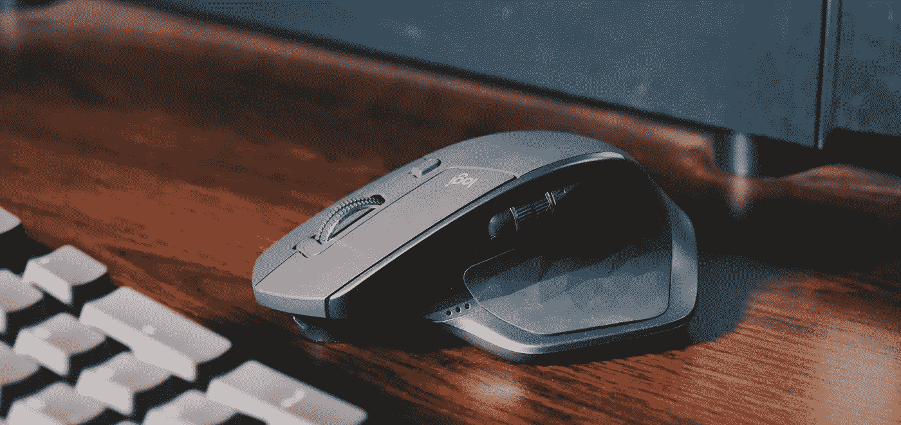
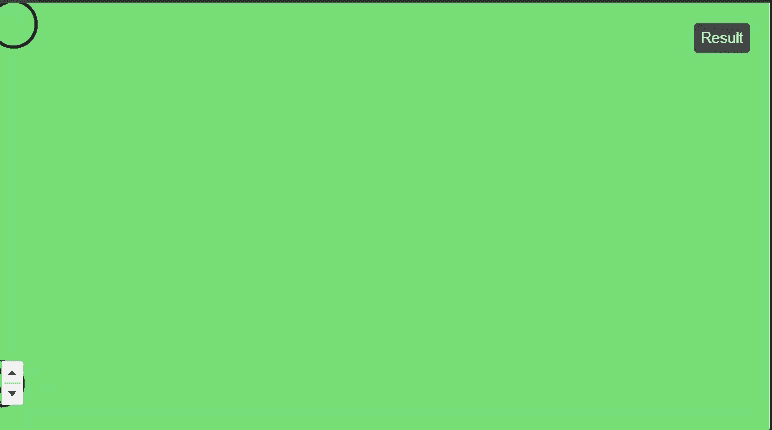
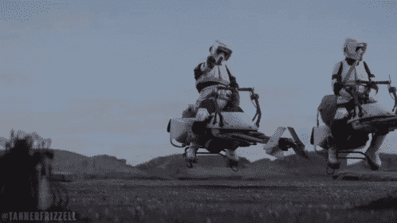
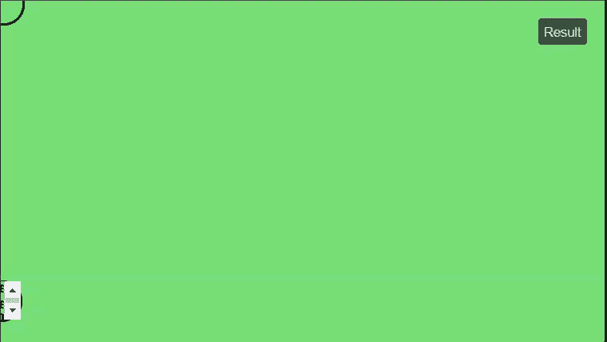
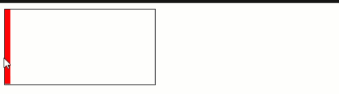

# 使用 JavaScript 使元素跟随光标

> 原文：<https://levelup.gitconnected.com/use-javascript-to-make-an-element-follow-the-cursor-3872307778b4>

## event.pageY 和 event.offsetY 的区别



亚辛·哈桑在 Unsplash 上的照片

我最近回答了一个关于堆栈溢出的问题，OP 想要一个 HTML 元素跟随用户的光标。OP 给 HTML 元素(一个`div`)绝对定位，并使用`event.offsetY`和`event.offsetX`来确定`top`和`left` CSS 值。最终的结果是一个跟随光标的“故障”圆圈，但会跳回到文档的左上角。



很抱歉质量不好。实际上，圆圈会更靠近光标，但最终会跳回左上角。

这是 HTML…

```
<html>
  <body>
    <div id="circle"></div>
  </body>
</html>
```

…CSS…

```
body{
  margin:0;
  padding:0;
  overflow:hidden;
  background-color:#77dd77;
}
div{
  position:absolute;
  transform:translate(-50%,-50%);
  height:35px;
  width:35px;
  border-radius:50%;
  border:2px solid black;
}
```

…最后是 JavaScript。

```
document.addEventListener('mousemove', function(e) {
  let body = document.querySelector('body');
  let circle = document.getElementById('circle');
  let left = e.offsetX;
  let top = e.offsetY;
  circle.style.left = left + 'px';
  circle.style.top = top + 'px';
});
```

那么是哪里出了问题呢？简而言之，问题在于 OP 在试图设置`top`和`left` CSS 值时使用了错误的事件属性。他们应该用`event.pageY`和`event.pageX`来代替。

`offset...`参照**父容器**工作，这里是`body`元素。除非 OP 设置了`body`标签的高度(他们没有设置)，否则`body`不会有任何高度。这是因为绝对定位的元素已从父流中移除。在这种情况下，`div`是`body`的唯一子代。由于 flow 中没有子元素，所以它不需要更新它的高度来适应它的内容，从而产生一个基本上为`0px`的高度。

由于没有高度，鼠标事件很难保持对`offsetY`和`offsetX`的一致跟踪。当您记录结果时，您会看到奇怪的情况，无论鼠标的实际位置在哪里，`offset`值都会回落到类似于`10`或`15`的值。由于对父容器的引用不准确，`div`的赋值`left`和`top`是……嗯……不准确的。



`page...`另一方面，与文档整体相关地工作。这样，唯一的高度限制就是网页的高度。

鉴于`onmousemove`事件处理程序仅应用于文档，网页中的高度变化是不相关的，因为`onmousemove`事件仅在网页上被拾取。这将为我们提供更一致的鼠标位置参考，从而为`left`和`right`提供更准确的值。

> 通过创建一个[中型合作伙伴计划账户](https://matt-croak.medium.com/membership)和[订阅我的电子邮件](https://matt-croak.medium.com/subscribe)，获取我所有的最新内容。:)

让我们看看更新后的 JavaScript。

```
let circle = document.getElementById('circle');const onMouseMove = (e) =>{
  circle.style.left = e.pageX + 'px';
  circle.style.top = e.pageY + 'px';
}document.addEventListener('mousemove', onMouseMove);
```

我决定将`div`存储在函数外部的变量中，这样它只需声明一次。我删除了`body`的变量，因为它没有被使用。最后，我没有将`e.pageX`和`e.pageY`存储在变量中，而是直接将这些值连接起来。更新后的代码给出了下面的结果。



比如 buttah

这篇文章最重要的一点是`pageY`和`pageX`是由鼠标相对于整个文档的位置决定的值，而`offsetY`和`offsetX`是相对于父容器的。如果您想根据鼠标相对于容器的位置来填充容器，后者会很有用。见下文。



上述示例的代码可以在这个 codesandbox 中找到。

[*在这里将你的免费媒体会员升级为付费会员*](https://matt-croak.medium.com/membership) *每月只需 5 美元，你就可以获得数以千计作家的无限量、无广告的故事。这是一个附属链接，你的会员资格的一部分帮助我为我创造的内容获得奖励。谢谢大家！*

# 参考

[](https://stackoverflow.com/questions/62347848/im-trying-to-get-a-div-element-to-follow-my-mouse-javascript-but-it-keeps-gl/62347962#62347962) [## 我试图让一个 div 元素跟随我的鼠标(javascript ),但是它总是出错

### 感谢贡献一个堆栈溢出的答案！请务必回答问题。提供详细信息并分享…

stackoverflow.com](https://stackoverflow.com/questions/62347848/im-trying-to-get-a-div-element-to-follow-my-mouse-javascript-but-it-keeps-gl/62347962#62347962) 

# 分级编码

感谢您成为我们社区的一员！升级正在改变技术招聘。在最好的公司找到你最理想的工作。

[](https://jobs.levelup.dev/talent) [## 提升——改变招聘流程

### 🔥让软件工程师找到他们热爱的完美角色🧠寻找人才是最痛苦的部分…

作业. levelup.dev](https://jobs.levelup.dev/talent)