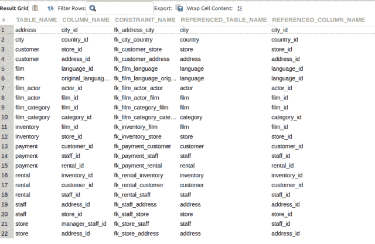
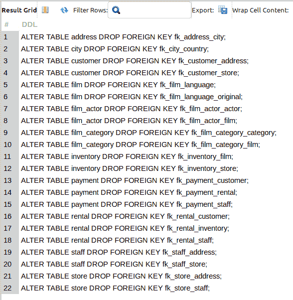
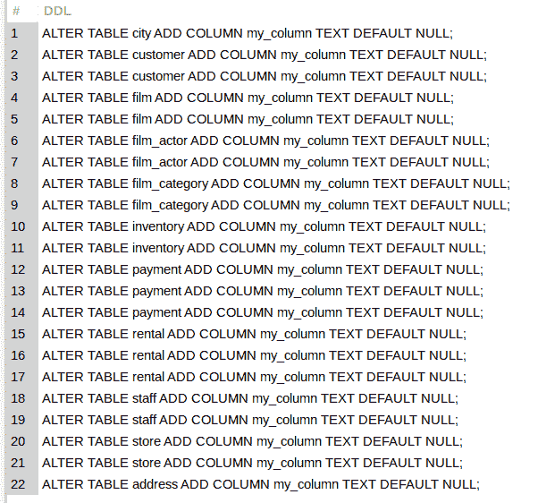

# 使用 MySQL 为管理任务生成 MySQL

> 原文：<https://levelup.gitconnected.com/use-mysql-to-generate-mysql-for-admin-tasks-2324b3970c53>

我最近学习了如何使用 MySQL 为我需要在服务器上执行的几个*管理*类型的数据定义语言(DDL) SQL 查询生成 MySQL 语句。对于许多 DBA 来说，这可能不是什么新东西，事实上，这是他们工具包中一个常用的工具。然而，我主要关注与开发人员相关的任务，所以这是一次*记忆犹新的*学习经历。继续阅读了解更多信息…

## 一些背景故事

我最近一直在将一个现有的普通 PHP 应用程序移植到 CodeIgniter 4。*的新*特性之一是*根据从. fxl 文件解析的信息动态引导*所有必要的 MySQL `CREATE TABLE`语句(从结构上看，它与. xml 文件*很接近】。*

每个`CREATE TABLE`语句都有`FOREIGN KEY`约束子句，以确保链接表之间的数据完整性。

想要为表格创建过程执行几个*冒烟测试*，我遇到了这样一种情况，我需要为每个表格执行`DROP`T4，然后一旦每个约束*被禁用*就执行`DROP`所有表格。对于 60 多个表，手工执行这么多语句是不可行的。

我该怎么办？

Google 并学习针对`INFORMATION_SCHEMA`数据库的特定查询，以及使用`CONCAT()`函数，并生成所有需要的 SQL 语句。

虽然我不会在我构建的应用程序中使用我处理的表格和数据，但我将使用熟悉的 [sakila 实践数据库](https://dev.mysql.com/doc/sakila/en/)作为示例。

自我推销:

如果你喜欢这里写的内容，尽一切办法，把这个博客和你最喜欢的帖子分享给其他可能从中受益或喜欢它的人。既然咖啡是我最喜欢的饮料，如果你愿意，你甚至可以给我买一杯！

## SQL 到 SQL

数据库中的表充满了好吃的东西。以下查询返回“sakila”数据库中所有表的所有约束:

**相关**:数据库`INFORMATION_SCHEMA`中的[REFERENTIAL _ CONSTRAINTS _ TABLE](https://joshuaotwell.com/using-the-referential_constraints-table-in-mysql-foreign-key-awareness/)是关于`FOREIGN KEYS`的另一个重要信息来源。

假设出于某种原因，我们想要删除每个表的`FOREIGN KEY`约束？这是大量的`ALTER TABLE`语句

在这里，我们可以使用一点点*技巧*和`CONCAT()`函数，通过这个`SELECT`查询生成所有必要的 DDL 语句:

所有单独的`ALTER TABLE`语句都可以保存到脚本中，并在需要时运行。

如果你发现我的写作和工作有价值，你可以在我的[小费罐](https://digitalowlsprose.ck.page/products/appreciation-support)里捐一点钱来支持我。每一笔钱都非常感谢。谢谢你。

## MySQL 到 MySQL —向多个表添加一列

基于同样的概念，如果我们需要向模式中的所有表添加一个相同的列，我们可以使用`CONCAT()`函数和一个`SELECT`查询来查询`INFORMATION_SCHEMA`中的同一个表，并生成必要的`ALTER TABLE`语句，如下所示:

**注意:**像这样编写大量的 DDL 语句是一项很棒的技能。但是，您必须小心，因为您正在对数据库中的大量表进行更改，无论是好是坏！

***值得注意的是:*** 还有，这是我*第一次用`INFORMATION_SCHEMA`数据库里的表碰到*。请让我知道示例查询是否不准确或不适合其目的，以及是否需要任何其他替代或纠正措施。

***你最喜欢的脚本技巧和窍门是什么？***

我很想知道你的脚本技巧是什么。如果你愿意，请在下面的评论中分享它们，非常感谢！

一如既往，如果你有任何问题或看到代码中的任何错误，请通过评论让我知道。建设性的意见有助于我提供准确的博客帖子，我非常感激。感谢您的阅读

你是[中等](http://medium.com/)会员吗？如果是这样的话，[会在我每次发表博客文章时收到一封电子邮件通知](https://parabollus.medium.com/subscribe)如果你喜欢媒体平台的话。不是会员？别担心！使用[我的注册链接](https://parabollus.medium.com/membership)(我将免费向您收取佣金)并加入。我真的很喜欢阅读所有伟大的内容，我知道你也会！！！

喜欢你读过的？看到什么不正确的吗？请在下面评论，感谢阅读！！！

# 行动的号召！

感谢你花时间阅读这篇文章。我真心希望你发现了一些有趣和有启发性的东西。请在这里与你认识的其他人分享你的发现，他们也会从中获得同样的价值。

访问 [Portfolio-Projects 页面](https://wp.me/P28ctb-3KD)查看我为客户完成的博客帖子/技术写作。

[**咖啡是我绝对喜欢的饮料！**](https://ko-fi.com/joshlovescoffee)

要在最新的博客文章发表时收到来自本博客(“数字猫头鹰散文”)的电子邮件通知(绝不是垃圾邮件)，请点击“点击订阅！”按钮在首页的侧边栏！(如有任何问题，请随时查看 [Digital Owl 的散文隐私政策页面](https://wp.me/P28ctb-3gI):电子邮件更新、选择加入、选择退出、联系表格等……)

请务必访问[“最佳”](https://joshuaotwell.com/where-blog_post-in-digital-owls-prose-best-of/)页面，收集我的最佳博文。

[Josh Otwell](https://joshuaotwell.com/about/) 作为一名 SQL 开发人员和博客作者，他热衷于学习和成长。其他最喜欢的活动是让他埋头于一本好书、一篇文章或 Linux 命令行。其中，他喜欢桌面 RPG 游戏，阅读奇幻小说，并与妻子和两个女儿共度时光。

免责声明:本文中的例子是关于如何实现类似结果的假设。它们不是最好的解决方案。所提供的大多数(如果不是全部)示例都是在个人发展/学习工作站环境中执行的，不应被视为生产质量或就绪。您的特定目标和需求可能会有所不同。使用那些最有利于你的需求和目标的实践。观点是我自己的。

## 在你走之前…

我正在为 PHP 和 MySQL 开发者发布时事通讯， ***OpenLamp.tech*** 。如果你有兴趣加入这个社区，[在这里注册](http://openlamptech.substack.com)(离线链接)。它是完全免费的。

**促销**:我正在[我的 Etsy 商店](https://www.etsy.com/shop/digitalowlsprose/)制作 Gmail HTML 电子邮件签名模板。让你的电子邮件*脱颖而出*和*流行*你自己的。

*原载于 2021 年 11 月 24 日 https://joshuaotwell.com***。**