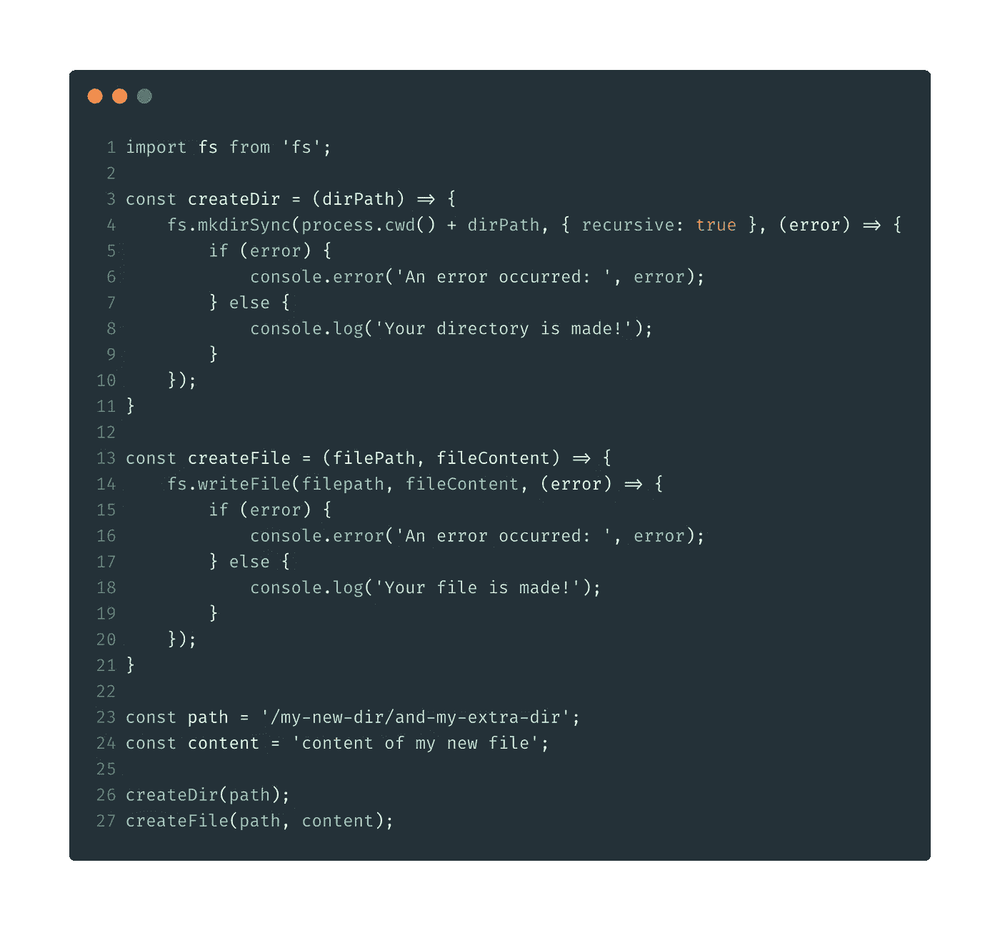

# 使用 Node.js 创建目录和文件

> 原文：<https://levelup.gitconnected.com/use-node-js-to-to-create-directories-and-files-734063ce93ec>

## 在几秒钟内开始在正确的目录中生成文件

照片由[诺德伍德主题](https://unsplash.com/@nordwood?utm_source=medium&utm_medium=referral)在 [Unsplash](https://unsplash.com?utm_source=medium&utm_medium=referral) 上拍摄

这将是一篇短文，因为它相当简单。代码可以更优化或可重用，但这只是一个演示，让你马上开始。

> **TL；**博士:`mkdirSync`和`writeFile`同`fs`

## 我们的最终结果将是这样的:

我们需要的是一个`js`文件，我们用`import fs from 'fs';`导入文件系统模块。这里我们有两个函数，一个用于创建目录，一个用于创建文件。

## 创建目录

我们从制作有一个参数`dirPath`的`createDir`函数开始。在这个函数中，我们将使用`fs.mkdirSync`。这个函数将被传递给这个方法三个参数。

*   第一个会是`process.cwd()`。这是您当前目录的完整路径，加上我们新的自定义路径，我们在`createDir`函数中将其作为参数传递。
*   接下来，我们将`recursive`设置为 true，这样我们可以立即创建嵌套目录，否则，我们将得到父目录尚不存在的错误。
*   最后一个参数是一个`error callback function`。在本例中，我放置了一个“if else ”,它将记录我们的目录是否成功创建。

## 创建文件

我们的下一个函数叫做`createFile`，它有两个参数`filePath` 和`fileContent`。为了创建文件，我们使用`fs.writeFile`。同样，这个方法将传递三个参数。

*   第一个参数是路径，包括要创建文件的目录。
*   第二个参数是文件的内容。
*   最后一个参数是一个`error callback function`。这与我们创建目录时使用的方法相同。

## 总结并测试我们的功能

此时，我们已经将`fs`导入到我们的`js`文件中，并编写了两个函数。现在创建一个`const`字符串，这是我们想要创建的新目录路径。还用您的文件内容创建一个`const`字符串。

我们需要做的最后一件事是首先调用`createDir`函数，然后调用`createFile`。

## 就是这样！

# 感谢您的阅读！我的 [Github](https://github.com/jeroenouw/) 。如果你觉得这篇文章有用，可以考虑看看我的其他文章:

 [## 面试中的 10 个高级打字问题及答案

### 检查你的候选人是否有能力回答这些更高级的打字问题

levelup.gitconnected.com](/10-advanced-typescript-questions-for-an-interview-with-answers-6f0513b1688e)  [## 角度 8-与其他元件共享元件数据

### 使用 Angular 的输入、输出、EventEmitter 和 ViewChild 共享组件数据。

levelup.gitconnected.com](/angular-7-share-component-data-with-other-components-1b91d6f0b93f)  [## 可靠智能合同剖析

### 今天，我将向你解释一个样本 Solidity 智能合同的剖析。本文将就此作一简要说明…

medium.com](https://medium.com/coinmonks/solidity-smart-contract-anatomy-fb8bfb72e7ec)