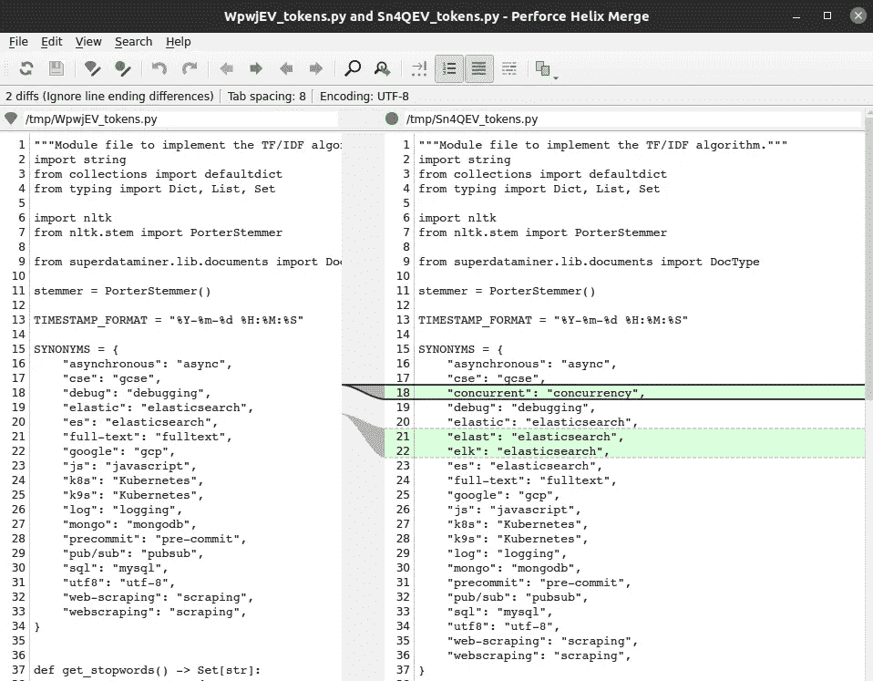

# 使用 P4Merge 通过一个漂亮的 Nice GUI 方便地检查代码更改

> 原文：<https://levelup.gitconnected.com/use-p4merge-to-check-code-changes-conveniently-30d7ce56ffcb>

## 学习使用方便的图形工具检查代码差异


[图片由 geralt 在 Pixabay 制作](https://pixabay.com/illustrations/space-gallery-woman-face-person-1059760/)

在我们的日常编码实践中，我们经常需要检查提交或分支之间文件变更的差异。例如，我们通常希望在将文件推送到远程存储库之前，对本地存储库中的所有文件进行最终检查。找出所有被更改的文件并查明详细的更改是很麻烦的。幸运的是，P4Merge 可以将我们从这些繁琐的事情中拯救出来。使用 P4Merge，我们可以通过一个漂亮的 GUI 非常方便地检查提交/分支之间所有文件的差异。在这篇文章中，我们将介绍如何安装和配置 P4Merge，以及如何使用它来检查与`git difftool`的代码差异。

## 下载并安装 P4Merge

你可以从[这个链接](https://www.perforce.com/downloads/visual-merge-tool)为你自己的操作系统下载 P4Merge 并相应安装。在 Linux 和 Mac 上，您只需要解包并正确设置路径:

```
$ **tar zxvf p4v.tgz -C $HOME**
$ **export PATH=$PATH:$HOME/p4v-2022.2.2336701/bin**
```

如果您想保存更改，您需要将`PATH`更新添加到`.bashrc`中，否则，一旦您关闭控制台，`PATH`将会重置。

现在你可以在命令行运行`p4merge`命令并为它打开一个窗口:


你可以使用 P4Merge 直接检查两个文件的区别。然而，这并不常用，至少对我来说是这样。P4Merge 最重要的用例是用`git difftool`检查 Git 的不同提交/分支之间的差异。

## 为 P4Merge 配置 Git

现在让我们为 P4Merge 配置 Git。我们可以使用`git config`命令或者直接编辑`.gitconfig`文件。让我们先使用`git config`命令，然后显示`.gitconfig`的内容，这样你就可以知道如何直接编辑了。

我们需要指定合并工具和工具的路径:

关键点:

*   我们将`git diff`的工具设置为 P4Merge。
*   指定工具的绝对路径。注意路径字段的特殊语法，即`difftool.p4merge.path`。
*   `git difftool`的提示被禁用，这样 P4Merge 可以自动打开。

Git 的设置可以在`$HOME/.gitconfig`中找到，它应该有如下新内容，这是由上面的`git config`命令添加的:

一旦知道了语法，就可以直接编辑这个文件。

## 使用 P4Merge 通过 git difftool 检查代码差异

现在我们可以使用 P4Merge 和`git difftool`命令来检查代码差异。您可以使用它来检查两个提交、两个分支或不同提交/分支中的同一文件之间的差异:

当`git difftool`运行时，P4Merge 窗口将会打开并显示所有在两个提交/分支之间改变的文件的差异。注意如果没有更改要显示，P4Merge 不会打开，如果有多个文件被更改，那么 P4Merge 会为每个文件打开，真的很酷很方便。



P4Merge 是一个非常方便的检查代码差异的工具。在这篇文章中，我们演示了如何安装和配置 P4Merge，以及如何使用它来检查与`git difftool`的代码差异。除此之外，顾名思义，它还可以用来合并文件，我认为不是那么常用，因为有很多替代方案。我个人更喜欢合并文件，用 VS 代码解决代码冲突。但是，如果您更喜欢使用 P4Merge，您可以将上面所有命令中的“diff”替换为“Merge ”,并且您也可以设置和使用 P4Merge 来解决 Git 合并冲突。

相关文章:

*   [了解不同的 Git 状态和对应的文件状态](https://lynn-kwong.medium.com/understand-different-git-states-and-the-corresponding-file-states-fc62348e81d7)
*   [让你的 VS 代码更高效的一些技巧](/some-tips-to-make-your-vs-code-more-efficient-db77ec7071f8)