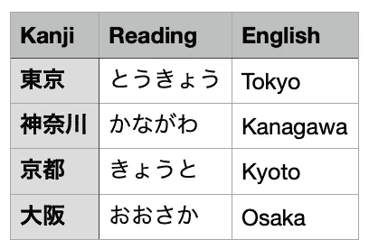
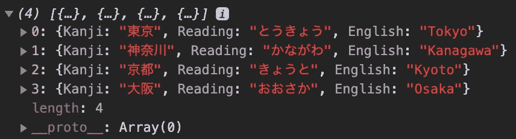
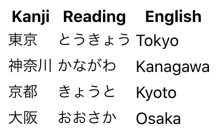
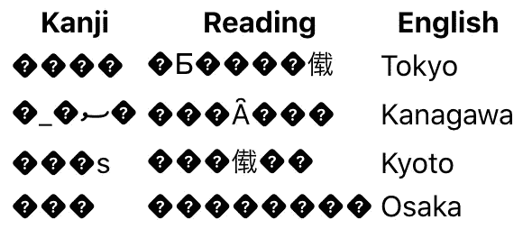

# 使用 Papa Parse 在 React 应用程序中解析 CSV 文件

> 原文：<https://levelup.gitconnected.com/use-papa-parse-to-parse-a-csv-file-in-a-react-application-da570e0c346a>

## 如何在 React 中创建 CSV 文件导入器:第二部分


照片由[尼克·费因斯](https://unsplash.com/@jannerboy62?utm_source=medium&utm_medium=referral)在 [Unsplash](https://unsplash.com?utm_source=medium&utm_medium=referral) 拍摄

逗号分隔值(CSV)文件是包含数据列表的文本文件。它通常用于在不同的应用程序之间交换数据。

在这一系列文章中，我们将了解如何在 React 中创建 CSV 文件导入程序。这是一个由三部分组成的系列，我们将了解如何做到以下几点:

1.  [使用 React Dropzone 为文件创建一个拖放区](/use-react-dropzone-to-create-a-drag-n-drop-zone-for-files-f9c32dc722fc)
2.  **使用 Papa Parse 解析 React 应用程序中的 CSV 文件**
3.  [使用编码日语将 Shift JIS 字符转换为 Unicode](/use-encoding-japanese-to-convert-shift-jis-characters-to-unicode-8945d31f4906)

在第二篇文章中，我们将看看 Papa 解析库。我们将使用 Papa Parse 来解析一个 CSV 文件，并将其转换为 JSON。本文假设您对 React 有基本的了解。这个例子将从一个`create-react-app` starter 应用程序中创建。

在本文结束时，您应该对如何执行以下操作有所了解:

*   解析 CSV 文件
*   设置解析函数的配置选项
*   处理解析的数据

## 首先，Papa Parse 是什么？

Papa Parse 是*“最快的浏览器内 CSV(或分隔文本)JavaScript 解析器”*。它在 npm 上的周下载量接近 90 万次。基本上，这个库将允许您将 CSV 文件转换为 JSON。还有许多其他功能，包括:

*   反向解析(将 JSON 转换成 CSV)
*   自动检测分隔符
*   工作线程保持你的网页反应
*   标题行支持
*   暂停、继续、中止

# 解析 CSV 文件

要开始使用 Papa Parse，首先要导入库。

```
import Papa from 'papaparse';
```

使用 parse 函数时，您可以选择解析带分隔符的文本字符串、本地文件或远程文件 URL。

对于本例，我们将解析第一部分中从 React Dropzone 收到的本地文件。

我们将创建一个`parseFile`函数。这个函数将一个文件作为参数。在这个函数中，我们将调用`Papa.parse()`，并将文件作为参数传递。

```
const parseFile = *file* => {
  Papa.parse(*file*);
};
```

每当我们将文件放入 dropzone 时，我们都会调用这个函数。调用我们之前在第一部分中创建的`onDrop`函数中的`parseFile`函数。我们将把接受的文件作为参数传递。

```
const onDrop = useCallback(*acceptedFiles* => {
  **if (*acceptedFiles*.length) {
    parseFile(*acceptedFiles*[0]);
  }**
}, []);
```

# 设置解析函数的配置选项

Papa Parse 的`parse`函数也将一个配置对象作为可选的第二个参数。该对象定义解析过程中使用的设置、行为和回调。如果我们没有在配置对象上指定任何属性，它将被设置为默认值。你可以在这里查看所有的配置属性[。](https://www.papaparse.com/docs#config)

对于本例，我们将向 config 对象添加两个属性。

*   **标题** —布尔值，如果为真，解析数据的第一行将被解释为字段名称
*   **完成** —解析完成时执行的功能

```
const parseFile = *file* => {
  Papa.parse(*file*, **{
    header: true,
    complete: // do something,
  }**);
};
```

第一个配置是`header`属性。我们将把它设置为 true，因为我们的 CSV 文件数据设置如下。它将获取我们的 CSV 文件，并将第一行用作字段名:Kanji、Reading 和 English。



# 处理解析的数据

解析完成后，执行`complete`函数。为了处理解析的数据，我将使用 React 的`useState`钩子创建一个状态值。然后我将结果数据设置为状态值。

```
**const [parsedCsvData, setParsedCsvData] = useState([]);**const parseFile = *file* => {
  Papa.parse(*file*, **{
    header: true,
    complete: results => {
      setParsedCsvData(results.data)
    },
  }**);
};
```

解析后的数据将在对象数组中返回，如下所示。



一旦将这些数据存储在`parsedCsvData`值中，您就可以对它做任何想做的事情。对于这个例子，我们将返回一个表中的数据。

```
<table>
  <thead>
    <tr>
      <th>Kanji</th>
      <th>Reading</th>
      <th>English</th>
    </tr>
  </thead>
  <tbody>
  {parsedCsvData &&
    parsedCsvData.map((*parsedData*, *index*) => (
      <tr *key*={*index*}>
        <td>{*parsedData*.Kanji}</td>
        <td>{*parsedData*.Reading}</td>
        <td>{*parsedData*.English}</td>
      </tr>
    ))}
  </tbody>
</table>
```

现在，将我们的 CSV 文件放入 dropzone 后，该文件将被解析，然后存储在`parsedCsvData`状态变量中。然后它将被呈现到表中。它将看起来像下面的图像。这是一张日本各县的表格，有正确的汉字、阅读和英语。



但是，根据您选择的字符编码，您也可能会看到类似这样的内容。



我们将在本系列的第三部分中研究如何处理这个问题。敬请关注即将发布的那篇文章！

# 结论

感谢阅读！我希望这篇文章对您开始使用 Papa Parse 有所帮助。当谈到编程时，解析 CSV 文件可能不是最有趣的话题，但这是您在工作中可能遇到的一个非常常见的任务。

如果你想看这个项目的完整源代码，请点击这里查看我的 GitHub 库。一定要去看看名为*“第二部分”*的分店。

查看第三部分[这里](/use-encoding-japanese-to-convert-shift-jis-characters-to-unicode-8945d31f4906)，我们将看看如何将字符编码从 JIS 转换为 Unicode。

如果您错过了我们学习 React Dropzone 的第一部分，请查看下面的内容。

[](/use-react-dropzone-to-create-a-drag-n-drop-zone-for-files-f9c32dc722fc) [## 使用 React Dropzone 为文件创建拖放区

### 如何在 React 中创建 CSV 文件导入程序:第一部分

levelup.gitconnected.com](/use-react-dropzone-to-create-a-drag-n-drop-zone-for-files-f9c32dc722fc)