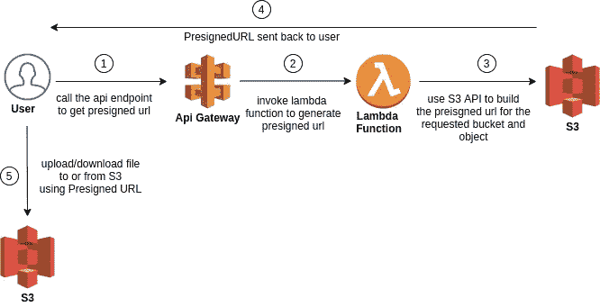
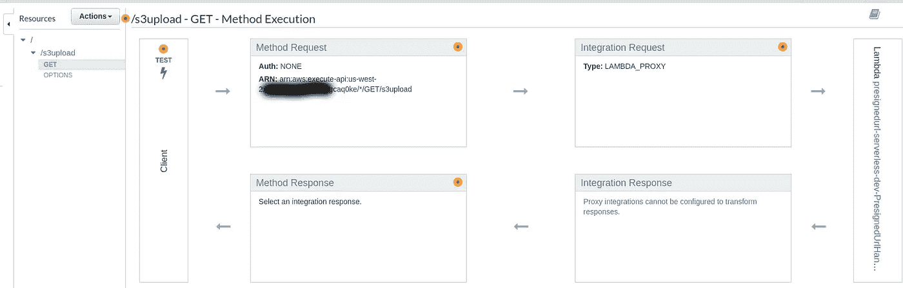
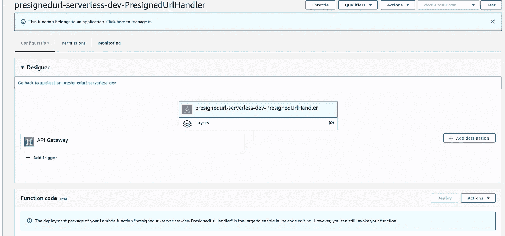
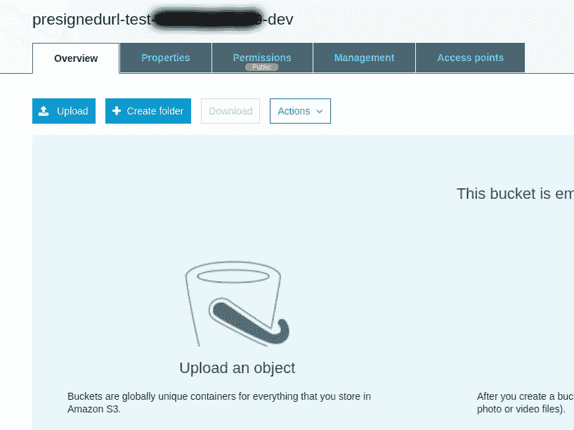
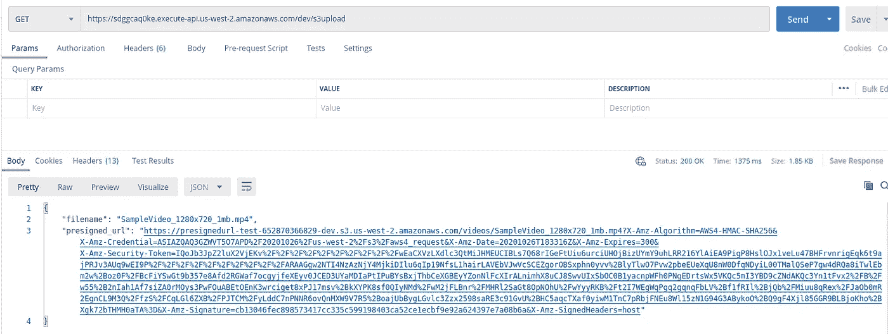
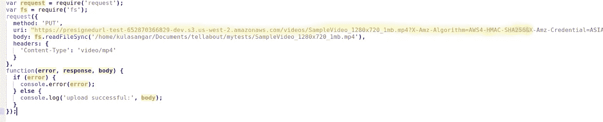
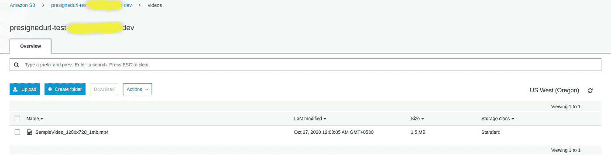

# 使用预先指定的 URL 将文件上传到 AWS S3

> 原文：<https://levelup.gitconnected.com/use-presigned-url-to-upload-files-into-aws-s3-db6b7a8c2cc9>

在这篇博文中，我将介绍如何利用预先设计的 url 功能将文件上传到 AWS S3。[无服务器](https://www.serverless.com/)将被用来为这个职位提供必要的 AWS 资源。

## 为什么我们首先需要一个预先设计的 URL？

预先指定的 URL 可用于这样的情况，例如客户/用户想要将文件上传到他/她没有访问权限的 S3 存储桶中。因此，这种机制可以作为一种安全的方式，允许未经授权的用户执行上传/下载，进入或来自 S3。从用户的角度来看，这减轻了使用 AWS 凭证(accesskey + secretkey)进行请求的负担。预先指定的 URL 也有一个截止日期和时间，因此它可以被多次使用，直到用完。

## 先决条件:

必须配置 AWS CLI 和无服务器。如果你还没有设置的话，你可以跟随[这个](https://www.serverless.com/framework/docs/providers/aws/guide/credentials/)。

## **我们需要的 AWS 资源:**

*   一个 S3 桶
*   AWS Lambda 函数
*   API 网关端点

## **工作流程**

用户检索预先指定的 URL，并将文件上传到 S3 或从其下载文件

## **步骤**

1.  通过使用 [S3 API](https://docs.aws.amazon.com/AWSJavaScriptSDK/latest/AWS/S3.html#getSignedUrl-property) 创建 nodejs lambda 函数来生成预先指定的 url。你可以选择任何你想要的语言，我使用 nodejs 进行测试。

生成预先设计的 URL 的 Lambda 函数

2.创建一个无服务器模板，为我们的测试提供所有必需的 AWS 资源(S3、Lambda 函数和 API 网关)。

3.通过进入模板位置并执行以下命令，将无服务器模板部署到您的 AWS 环境中:

**sls 部署**

4.验证是否已调配资源:

API 网关

λ函数

S3 水桶

5.使用 Postman 或任何其他 HTTP 客户端向创建的 API 端点发出 GET 请求，以检索预先指定的 url:

如果请求成功，您将能够看到作为响应返回的预先签名的 url。

6.上面的 URL 可用于将文件上传到指定的 s3 存储桶，如下所示

上传文件. js

原文可以在[这里](https://github.com/Kulasangar/upload-file-s3-presigned-url/blob/master/test_presigned_url/upload_video.js)找到。请确保相应地更改预先指定的 url。

7.在使用接收到的 URL 更新脚本之后，尝试运行 upload_file.js 来查看文件是否已经作为对象上传到适当的 S3 存储桶中。您可以按如下方式运行该文件:

**节点上传 _ 文件. js**

8.检查您的 s3 存储桶是否已上传:

上传的文件

正如你所看到的，我使用的视频文件已经成功上传。

就是这样。就这么简单。通过使用 CORS，您甚至可以进一步保护您的 API 调用。在这种情况下，确保在无服务器模板中创建 API 网关时只包含允许的来源。您还可以编辑 bucket 的 CORS 配置，以便只允许来自该源的特定 API 调用将文件上传到 S3 bucket。

完整的例子可以在[这里](https://github.com/Kulasangar/upload-file-s3-presigned-url)找到。

参考资料:

*   [https://docs . AWS . Amazon . com/Amazon S3/latest/dev/presigneduruploadobject . html](https://docs.aws.amazon.com/AmazonS3/latest/dev/PresignedUrlUploadObject.html)

# 分级编码

感谢您成为我们社区的一员！在你离开之前:

*   👏为故事鼓掌，跟着作者走👉
*   📰查看[升级编码出版物](https://levelup.gitconnected.com/?utm_source=pub&utm_medium=post)中的更多内容
*   🔔关注我们:[Twitter](https://twitter.com/gitconnected)|[LinkedIn](https://www.linkedin.com/company/gitconnected)|[时事通讯](https://newsletter.levelup.dev)

🚀👉 [**加入升级人才集体，找到一份神奇的工作**](https://jobs.levelup.dev/talent/welcome?referral=true)