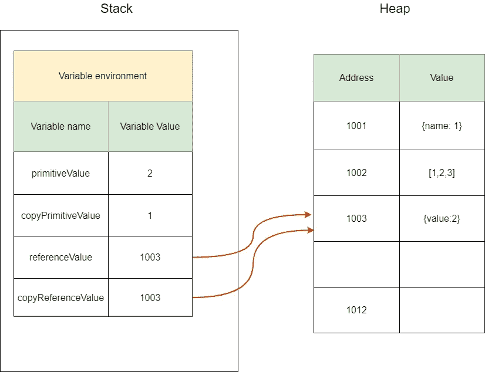
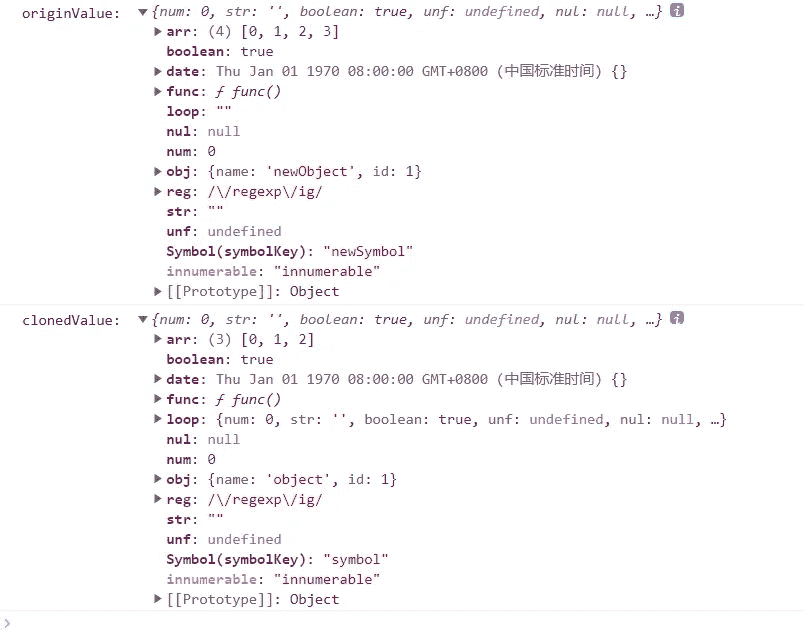

# 如何在 JavaScript 中获得完美的深度拷贝？

> 原文：<https://levelup.gitconnected.com/use-pure-javascript-to-get-a-perfect-deep-copy-5fdc2d9e3d42>

## 实现大约 20 行的几乎完美的深度复制


照片由[你好我是尼克](https://unsplash.com/@helloimnik?utm_source=medium&utm_medium=referral)在 [Unsplash](https://unsplash.com?utm_source=medium&utm_medium=referral)

# 先验知识

Javascript 中的数据类型可以分为基元值类型和引用值类型。当我们进行数据操作时，它们会有一些差异。

```
let primitiveValue = 1;
const copyPrimitiveValue = primitiveValue;primitiveValue = 2;
console.log('primitiveValue: ', primitiveValue); // 2
console.log('copyPrimitiveValue: ', copyPrimitiveValue); // 1const referenceValue = { value: 1 };
const copyReferenceValue = referenceValue;referenceValue.value = 2;
console.log('referenceValue: ', referenceValue); // { value: 2 }
console.log('copyReferenceValue: ', copyReferenceValue); // { value: 2 }
```

看上面的代码，不难发现，当原值类型改变时，其复制的变量不会有任何影响；但是当引用值类型改变时，其复制的变量也会改变。为了解释这一点，我们必须首先了解数据在 Javascript 中是如何存储的。

如上所述，数据类型可以分为两种。原始值类型包括 undefined、null、number、string、boolean、symbol 和 bigint 引用值类型包括从对象、函数对象等派生的数组对象。基元值类型直接存储在堆栈上，而引用值类型存储在堆上，堆栈上有一个地址指向它。



这样，我们就可以解释上述现象了。对于原始值类型，直接复制副本，对于引用值类型，复制地址，这导致 reference value 和 copyReferenceValue 都指向堆上的同一块数据。换句话说，这两个地址都可以改变堆上的同一块数据。

# 浅拷贝

浅拷贝是指只拷贝对象的一层，对象的深层直接拷贝一个地址。Javascript 中有很多原生方法是浅层拷贝。例如，使用`Object.assign` API 或 spread 操作符。

```
const target = {};
const source = { a: { b: 1 }, c: 2 };Object.assign(target, source);
source.a.b = 3;
source.c = 4;console.log(source); // { a: { b: 3 }, c: 4 }
console.log(target); // { a: { b: 3 }, c: 2 }// Same effect as Object.assign
const target1 = { ...source };
```

# 深层拷贝

深度拷贝意味着克隆两个相同的对象，但彼此之间没有任何联系。

**1。JSON.stringify API**

```
const source = { a: { b: 1 } };
const target = JSON.parse(JSON.stringify(source));source.a.b = 2;
console.log(source); // { a: { b: 2 } };
console.log(target); // { a: { b: 1 } };
```

嗯，看起来 JSON.stringify 可以实现深度复制，但是有一些缺陷。例如，它不能复制函数、未定义的、日期、不能复制不可枚举的属性、不能复制循环引用的对象等等。你可以在 [*MDN*](https://developer.mozilla.org/en-US/docs/Web/JavaScript/Reference/Global_Objects/JSON/stringify#description) 上查看详细描述。

**2。近乎完美的深度复制**

上面的代码是最后的结果，我来解释一下它是怎么来的。

1.  首先，我们使用 WeakMap 作为哈希表来解决循环引用问题，可以有效防止内存泄漏。可以在 [*MDN*](https://developer.mozilla.org/en-US/docs/Web/JavaScript/Reference/Global_Objects/WeakMap) 上查看 WeakMap 的描述。
2.  对于特殊类型 Date 和 RegExp，将直接生成并返回一个新实例。
3.  使用`Object.getOwnPropertyDescriptors`获取当前对象的所有属性描述，使用`Object.getPrototypeOf`获取当前对象的原型。将这两项作为参数传递给`Object.create` API，创建一个具有相同原型和相同属性的新对象。
4.  使用`Reflect.ownKeys`迭代当前对象的所有属性，包括不可枚举属性和符号属性，以及普通属性。这样，深层的值就可以在循环和递归中不断地复制到当前的新对象中。
5.  在循环判断中，除了函数是直接赋值的，其他都是通过递归重新复制的。

接下来，我们可以使用测试代码来验证。

```
const symbolKey = Symbol('symbolKey');
const originValue = {
  num: 0,
  str: '',
  boolean: true,
  unf: void 0,
  nul: null,
  obj: { name: 'object', id: 1 },
  arr: [0, 1, 2],
  func() {
    console.log('function');
  },
  date: new Date(0),
  reg: new RegExp('/regexp/ig'),
  [symbolKey]: 'symbol',
};
Object.defineProperty(originValue, 'innumerable', {
  // writable is true to ensure that the assignment operator can be used
  writable: true,
  enumerable: false,
  value: 'innumerable',
});// Create circular reference
originValue.loop = originValue;
// Deep Copy
const clonedValue = deepClone(originValue);
// Change original value
originValue.arr.push(3);
originValue.obj.name = 'newObject';
// Remove circular reference
originValue.loop = '';
originValue[symbolKey] = 'newSymbol';console.log('originValue: ', originValue);
console.log('clonedValue: ', clonedValue);
```



太好了，它似乎工作得很完美！接下来，我们来看另一个解决方案。

**3。结构化克隆 API**

感谢 [Andrew Wooldridge](https://medium.com/u/486eaf1c976?source=post_page-----5fdc2d9e3d42--------------------------------) 在回复区提到了`structuredClone` API。我发现它可以原生实现深度复制，但是只能克隆 [*结构化-可克隆类型*](https://developer.mozilla.org/en-US/docs/Web/API/Web_Workers_API/Structured_clone_algorithm) *。*例如，函数对象不能被克隆，会抛出 DataCloneError 异常。它也不克隆 setters、getters 和类似的类似元数据的特性。

这是一个非常新的 API，我们可以期待它的未来发展。在 chrome 98 版本已经支持，可以在 [*MDN*](https://developer.mozilla.org/en-US/docs/Web/API/structuredClone) 上查看使用情况，在 [*上查看兼容性，可以使用*](https://caniuse.com/?search=structuredClone) 。

就这样，很棒，不是吗？在这个阶段，使用选项 2 允许我们在 Javascript 中有一个几乎完美的深层副本。

今天就到这里。我是 Zachary，我会继续输出与 web 开发相关的故事，如果你喜欢这样的故事并想支持我，请考虑成为 [*中级会员*](https://medium.com/@islizeqiang/membership) *。每月 5 美元，你可以无限制地访问媒体内容。如果你通过* [*我的链接*](https://medium.com/@islizeqiang/membership) *报名，我会得到一点佣金。*

你的支持对我来说非常重要——谢谢。