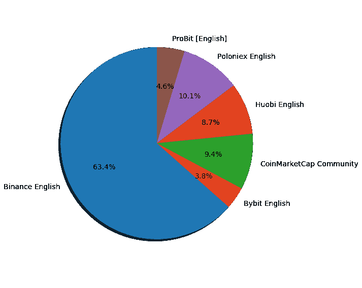
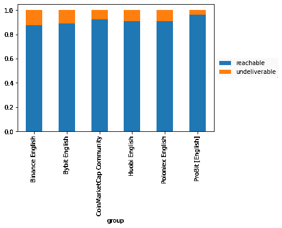
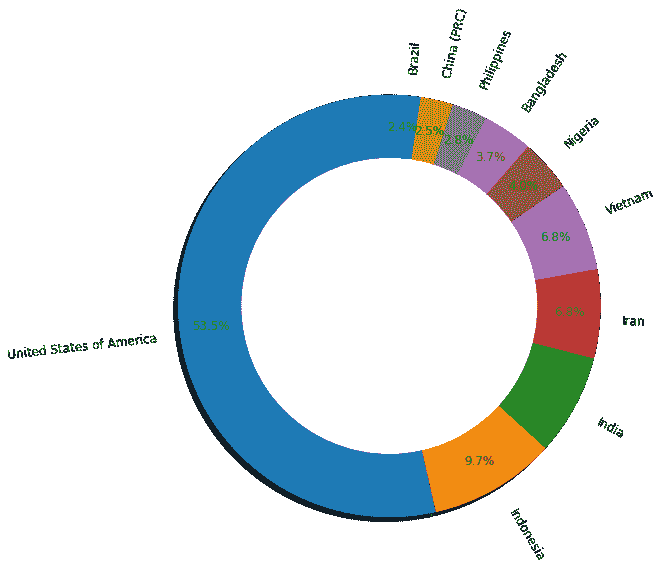
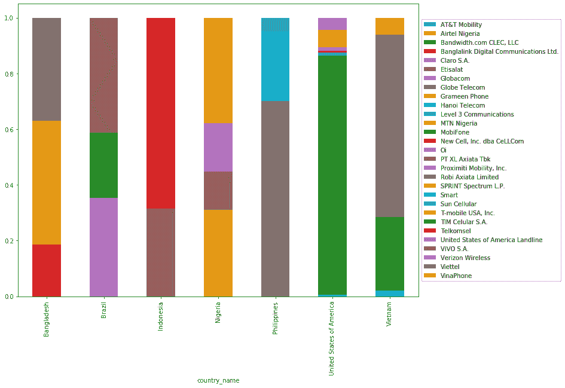

# 使用 Python 和 Number Insights API 分析销售线索

> 原文：<https://levelup.gitconnected.com/use-python-and-the-number-insights-api-to-analyze-leads-5b61866a3145>

考虑到接触未知潜在客户所需的时间和精力，电话推销是一项非常昂贵的活动。著名企业家大卫·卡明斯估计，每一个陌生电话的费用是 1.72 美元，没有任何转换的保证。获客一定要这么费钱吗？有了 [Vonage Number Insights API](https://developer.nexmo.com/number-insight/overview) ，就有可能大幅降低这些成本。

# Vonage API 帐户

要完成这个教程，你需要一个 [Vonage API 账户](http://developer.nexmo.com/ed?c=blog_text&ct=2020-09-17-use-python-and-the-number-insights-api-to-analyze-leads-dr)。如果你还没有，你可以今天[注册](http://developer.nexmo.com/ed?c=blog_text&ct=2020-09-17-use-python-and-the-number-insights-api-to-analyze-leads-dr)并开始用免费信用点数进行构建。一旦你有了一个帐户，你可以在 [Vonage API 仪表板](http://developer.nexmo.com/ed?c=blog_text&ct=2020-09-17-use-python-and-the-number-insights-api-to-analyze-leads-dr)的顶部找到你的 API 密匙和 API 秘密。

# 使用数字洞察力

想象一个在区块链社区寻找潜在投资者的用例。一名销售主管从 CoinMarketCap 加密社区和其他五家最大的加密货币交易所(币安、波洛涅克斯、Huobi、ProBit 和 Bybit)获取了电话细节。

之后，可以对 Vonage Number Insights API 进行 API 调用，以从电话号码中获取深入的客户数据。此 Python 脚本展示了如何处理 API 调用，以及如何构建生成的数据以供进一步分析:

# 提高效率

Number Insights API 承诺为该活动节省大量成本，因为它减少了在无效和不可及的号码上浪费的时间和精力。例如，在使用我们的示例案例研究时，30%的电话号码被确认为有效且无法接通。这意味着可以避免 854 个(70%)电话，至少节省 1，500 美元，投资回报率高达 4，050%。

> 我们从哪里得到这些数字的？70%是 854 个号码*每次通话 1.72 美元= 1，469 美元。总共有 1228 个数字，这等于每个 API 调用$37 = 1228 * $0.03。1，500 美元/37 美元* 100 = 4，050%

数据清理是必不可少的，因为它提高了活动团队的效率和准确性，因此他们可以及时接触到正确的受众。

此脚本可用于查找有效的数字，并在条形图中显示结果:

同样重要的是要明白，数量并不代表销售线索的质量。如前所示，币安提供了最多的电话记录，但它也有最高比例的无法送达的号码。与币安相比，Poloniex 似乎是一个更好的铅生产商，因为它兼顾了高质量和高数量。

# 按国家列出的目标

Number Insights API 还可以用来收集关于接触投资者的最佳渠道的关键信息。例如，此脚本可用于按国家汇总和绘制数字:

我们观察到，在 91 个拥有有效和可达数字的国家中，有三个国家占记录的 70%以上(图 1)。因此，该活动应该以排名前 10 位的国家为起点，而不是随机致电来自 91 个国家的 91 名投资者。这将进一步节省时间，并定制营销信息，以触及顶级潜在客户。

为了让生活更轻松，我们可以了解每个国家的哪些电信运营商在为这些潜在投资者服务。我们可以通过这些网络运营商捆绑促销或更容易地接触到这些投资者:

[Vonage Number Insights API](https://developer.nexmo.com/number-insight/overview) 让您有机会更好地了解您的销售线索、您的客户和市场。无论您是想研究移动用户更换号码的频率，还是想对电信市场的竞争力进行实地调查，该 API 都能快速为您提供做出更好决策所需的信息，帮助您节省时间和资金。

*最初发布于*[*https://www . NEX mo . com/blog/2020/09/17/use-python-and-the-number-insights-API-to-analyze-leads-dr*](https://www.nexmo.com/blog/2020/09/17/use-python-and-the-number-insights-api-to-analyze-leads-dr)