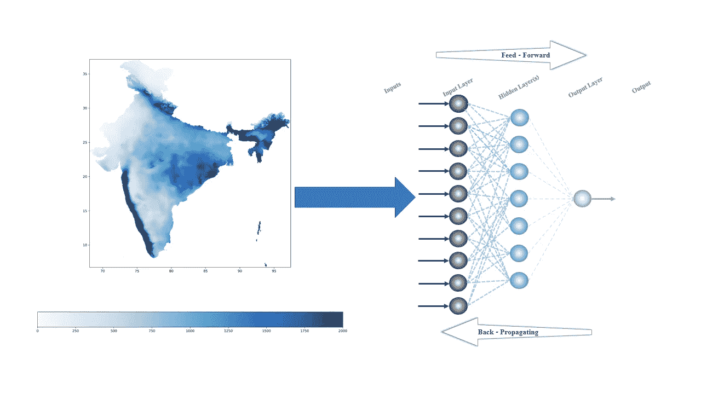
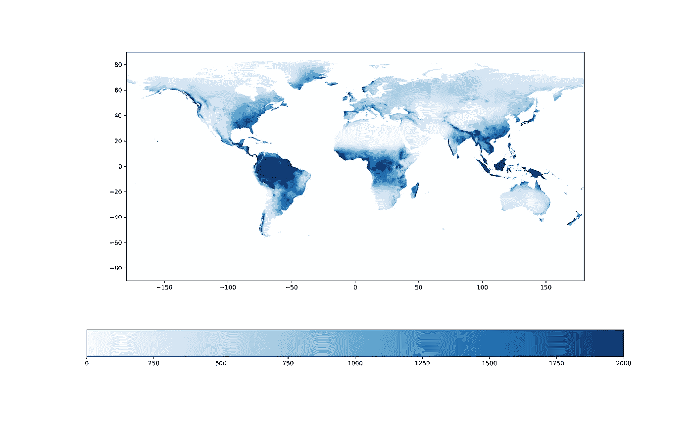
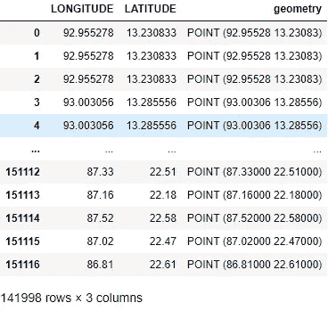
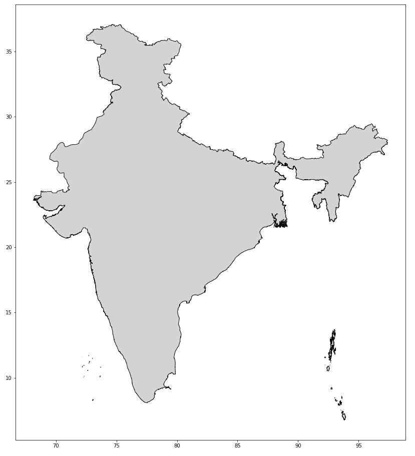
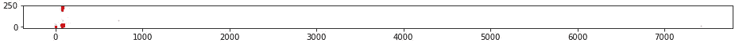
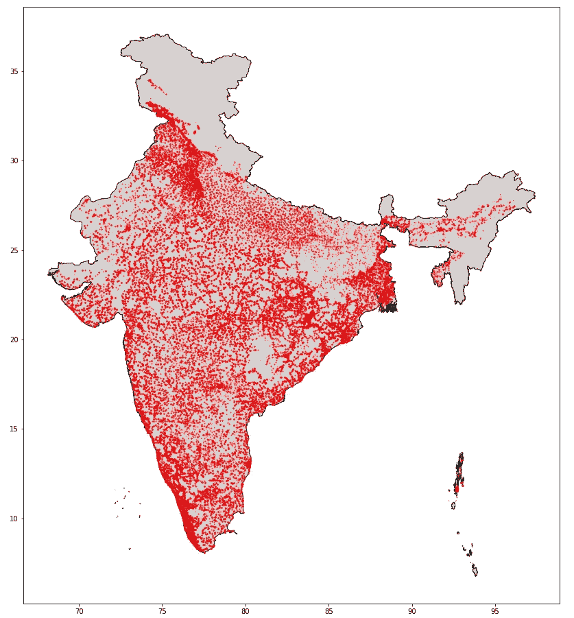
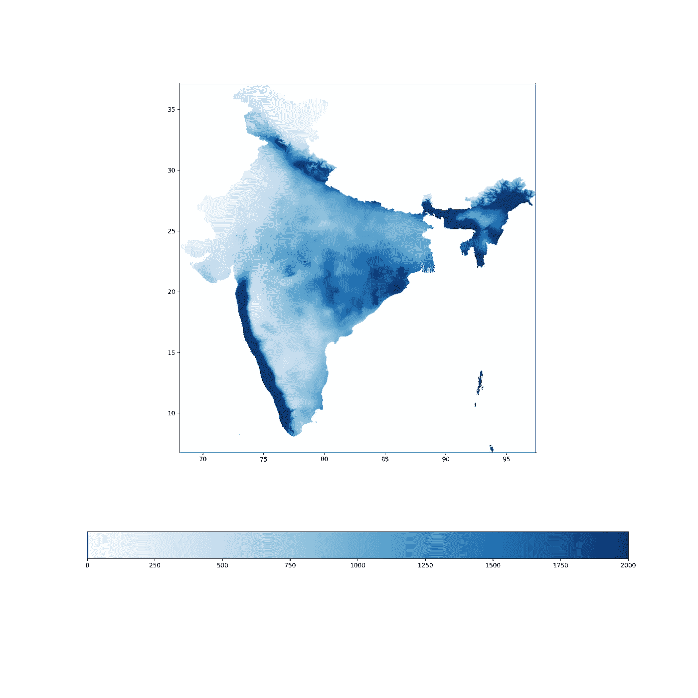
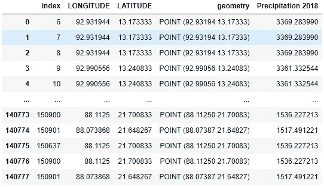

# 将栅格数据用作 ML 和 AI 输入

> 原文：<https://levelup.gitconnected.com/use-rasters-data-as-ml-and-ai-inputs-b6cc6ea31f84>

## 了解如何将栅格数据提取到用于机器学习和人工智能模型输入的数据帧中。

ML 和 AI 模型的栅格(图片由作者提供)

我的研究重点是开发用于水质监测的机器学习和人工智能算法。在这个领域，真实世界的数据很复杂，很难找到，每当我得到数据时，它都不包含太多的特征。这就是为什么我必须添加许多可能影响我要预测的目标的元数据特征。几个月前，我发现有很多数据存储在名为“栅格”的图片中。因此，在本文中，我将展示如何获取该栅格并提取其数据，以便将其用作 ML 和 AI 模型的输入。

## 什么是栅格？

光栅图像是一种图像文件格式，由一个像素和与之关联的一个或多个数字定义。数字代表像素的位置、大小或颜色。光栅图像常见的有 [BMP](https://www.computerhope.com/jargon/b/bmp.htm) 、 [GIF](https://www.computerhope.com/jargon/g/gif.htm) 、 [JPEG](https://www.computerhope.com/jargon/j/jpeg.htm) 、 [PNG](https://www.computerhope.com/jargon/p/png.htm) 、 [TIFF](https://www.computerhope.com/jargon/t/tiff.htm) 文件。这些文件可以代表几乎任何数据—地理、地质、气候、天气、人口等等。此外，这些文件具有坐标，因此可以投影到地图上或作为地图显示。

2018 年全球累计降水量[毫米/年](图片由作者提供)

## 我们开始吧

像往常一样，我们必须导入我们将使用的所有库，在此之前，我们将要求 Jupyter 笔记本内联呈现所有图形。首先，数据库将在 [Pandas](https://pandas.pydata.org/docs/) 中管理，这是一个为 Python 编写的用于数据操作和表格数据分析的库软件，以及它的地理空间双胞胎 [GeoPanda](https://geopandas.org/en/stable/) ，它允许操作和分析地理空间数据。显然，我们将导入 [Matplotlib](https://matplotlib.org/) 用于稍后绘制图形，导入 [Numpy](https://numpy.org/) 用于一些数学操作。最后，我们将导入[栅格数据](https://rasterio.readthedocs.io/en/latest/)，它将用于打开栅格数据，对其进行操作和绘图。

## 加载数据

我们将用作示例的数据是水样的位置，但没有其他数据。首先，我们将使用`.read_excel()`方法将 excel 表作为 pandas DataFrame 加载，并使用 NaNs 删除行，`axis=0`是指删除行(而不是列)。接下来，我们将清除数据中的非数值，因为一些坐标是无效的(我们可以修复它们，但这对于本例并不重要)。

现在，我们需要将其转换为地理数据框架。这个方法需要两个最重要的参数:(1)数据本身和(2)我们想要表示数据的几何图形。在我们的例子中，我们将把数据表示为点，在这些点上，位置是用带两个参数的`.points_from_xy()`方法确定的:经度和纬度。

纬度是 Y 轴，经度是 X 轴。

最后一部分是改变坐标参考系统(CRS ),这是一个基于坐标的本地、区域或全球系统，用于定位地理实体。空间参考系统定义了特定的地图投影，以及不同空间参考系统之间的变换。如果你不确定你应该使用什么样的 CRS，你可以查看这个网站。对于印度大陆，我们将使用 EPSG:4243。

因此，我们现在的数据框架是地理数据框架，它因“几何”列而有所不同。

我们现在拥有的地理数据框架(图片由作者提供)

接下来，我们将加载印度的 shapefile，该格式是地理信息系统软件的地理空间矢量数据格式。这也可以通过 GeoPandas 和采用 shapefile 路径作为参数的`.read_file()`方法来完成。然后，我们必须记住使用`.set_crs()`方法将 shapefile 的 CRS 设置为与我们的数据相同。让我们画出来看看它是什么样子的:

shapefile 示例(作者提供的图片)

w 可以看到我们以坐标轴为坐标得到了印度(包括其岛屿)的边界。让我们画出这些点，看看它们在地图上的样子:

哎呀，这不是我们所期望的(图片由作者提供)

从两个轴都可以看到——我们有坐标错误的点。如果它是一个小数据集或对示例很重要，我会尝试找出哪些是错误的并进行更正，但在这种情况下，我们将过滤印度边界之外的所有数据点，因为在接下来的步骤中，它们不会从栅格中获得任何实际数据。这些点很可能在记录的时候出现了错误。

GeoPandas 为我们提供了一个很好的简单方法来筛选这些数据。我们将在数据集和 shapefile 之间使用空间连接，并且只保留坐标位于 shapefile“内部”的点。这可以通过[完成。sjoin()](https://geopandas.org/en/stable/docs/reference/api/geopandas.sjoin.html) 法。使用此方法后，我们的 DataFrame 也将由 index_right 和 Area 列组成，因此我们将删除这些列并绘制以查看结果:

那看起来好多了(图片作者)

## 提取数据

最后一步。我们将从栅格和 shapefiles 中空间连接每个数据点的数据，以便每个点根据坐标保存其数据。为此，我们需要确保对栅格也使用相同的 CRS。下面的代码是为提取多个栅格并将它们添加到数据框而编写的，因此它使用 os 和 glob 库以及保存所有栅格的文件夹的路径。

印度 2018 年累积降水量[mm/yr]，我们将在本例中使用(图片由作者提供)

首先，我们需要将所有点的经度和纬度提取为 x 和 y，这可以通过`.x`和`.y`方法轻松完成。接下来，我们将使用 Rasterio 的`.open`方法打开光栅，因为下面的线是这一部分的中心。通过使用将坐标列表作为输入的 Rasterio 的`.sample`方法，我们将对该位置的每个坐标的栅格值进行采样。此外，在同一行中，我们已经将值赋给了 DataFrame 中的新列(赋予它与栅格相同的名称，只是没有')。TIF’，在这个例子中)。

最后，我们得到了我们想要的结果，并且我们已经准备好进行 ADE，建立一个模型或者任何你需要的数据。

栅格数据被添加为最后一列(作者提供的图像)

## 真的是这样！

我就讲到这里，你可以在这里找到[的完整代码，包括我跳过的一些部分，比如把全球栅格裁剪成印度的等等。如果你有任何想法或问题，请随时留下评论🙂](https://github.com/Waeara/Use-Raster-s-Data-as-ML-and-AI-Inputs)

感谢阅读！👍

# 分级编码

感谢您成为我们社区的一员！在你离开之前:

*   👏为故事鼓掌，跟着作者走👉
*   📰更多内容请查看[升级编码刊物](https://levelup.gitconnected.com/?utm_source=pub&utm_medium=post)
*   🔔关注我们:[推特](https://twitter.com/gitconnected) | [LinkedIn](https://www.linkedin.com/company/gitconnected) | [时事通讯](https://newsletter.levelup.dev)

🚀👉 [**加入升级人才集体，找到一份神奇的工作**](https://jobs.levelup.dev/talent/welcome?referral=true)