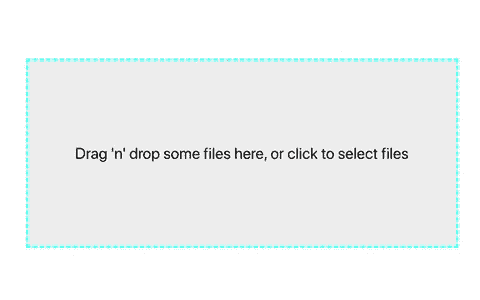

# 使用 React Dropzone 为文件创建拖放区

> 原文：<https://levelup.gitconnected.com/use-react-dropzone-to-create-a-drag-n-drop-zone-for-files-f9c32dc722fc>

## 如何在 React 中创建 CSV 文件导入程序:第一部分


照片由[伊莫·威格曼](https://unsplash.com/@macroman?utm_source=medium&utm_medium=referral)在 [Unsplash](https://unsplash.com?utm_source=medium&utm_medium=referral) 拍摄

在这一系列文章中，我们将了解如何在 React 中创建 CSV 文件导入程序。这是一个由三部分组成的系列，我们将了解如何做到以下几点:

1.  **使用 React Dropzone 为文件创建一个拖放区**
2.  [使用 Papa Parse 解析 React 应用程序中的 CSV 文件](/use-papa-parse-to-parse-a-csv-file-in-a-react-application-da570e0c346a)
3.  [使用编码日语将 Shift JIS 字符转换为 Unicode](/use-encoding-japanese-to-convert-shift-jis-characters-to-unicode-8945d31f4906)

在第一篇文章中，我们将看看 React Dropzone 包，并使用它在 React 应用程序中为文件构建一个拖放区。本文假设您对 React 有基本的了解。这个例子将从一个`create-react-app` starter 应用程序中创建。

在本文结束时，您应该已经了解了如何做到以下几点:

*   使用 useDropzone 挂钩
*   创建 dropzone 组件
*   处理丢弃的文件
*   设置接受的文件类型
*   设置拖放区的样式

## 首先，什么是 React Dropzone？

React Dropzone 是一个*“简单的 React 挂钩，为文件创建一个 HTML5 兼容的拖放区。”*它在 [npm](https://www.npmjs.com/package/react-dropzone) 上有超过 130 万的周下载量。基本上，它是一个 React 挂钩，使创建拖放区变得容易，而不是从头开始构建。

在本例中，我们将使用 React Dropzone 创建一个 CSV 文件导入程序。但是，当您想要为任何类型的文件输入构建 dropzone 时，也可以使用它。

# 使用 useDropzone 挂钩

开始使用 React Dropzone 最简单的方法是使用`useDropzone`钩子。你可以在一个功能组件中调用`useDropzone`钩子。

```
const {
  getRootProps,
  getInputProps,
  isDragActive,
  isDragAccept,
  isDragReject,
} = useDropzone();
```

这个钩子返回下列属性和方法。


对于本例，我们需要以下内容:

*   **getRootProps()** —返回根元素所需属性的对象的函数
*   **getInputProps()** —返回输入元素所需属性的对象的函数
*   **isDragActive** — boolean，如果文件被拖动到 dropzone 区域，则为 true
*   **isDragAccept** — boolean，如果文件被拖动到 dropzone 区域并包含在可接受的文件类型中，则为 true
*   **isDragRegect** — boolean，如果文件被拖过 dropzone 区域并且不包括在可接受的文件类型中，则为 true

# 创建 dropzone 组件

我们现在已经拥有了创建 dropzone 组件所需的一切。我们需要一个根元素和一个输入元素。

根元素可以是您想要的任何元素。对于这个例子，我们将使用一个`<div>`。输入元素必须是一个`<input>`。在根元素中，通过调用`getRootProps()`函数传递根属性，并将属性传播到元素中。在 input 元素中，通过调用`getInputProps()`函数传递输入属性，并将属性传播到元素中。

```
<div {...getRootProps()}>
  <input {...getInputProps()} />
  <p>Drag 'n' drop some files here, or click to select files</p>
</div>
```

如果我们检查我们的应用程序，我们只会看到下面的文本。


但是，您会注意到这个文本是可点击的，当您点击它时，文件输入将打开。`getRootProps()`和`getInputProps()`函数将所需的属性添加到元素中。

# 处理丢弃的文件

接下来，我们将处理丢弃的文件。目前，我们可以将文件拖放到我们的组件中，但是我们还没有对这些文件做任何事情。

现在，我们只是将文件信息记录到控制台。在本系列的第 2 部分中，我们将看看如何解析文件数据。

首先，让我们创建一个`onDrop`函数，每当文件被放入 dropzone 时都会调用这个函数。这个函数将获取一组接受的文件，并将这些文件记录到控制台。

```
const onDrop = useCallback(*acceptedFiles* => {
  console.log(*acceptedFiles*);
}, []);
```

我们之前调用的`useDropzone`钩子也将一个配置对象作为可选参数。您可以在这里看到配置参数[的完整列表。](https://react-dropzone.js.org/#src)

`onDrop`属性接受一个回调函数作为值。当 drop 事件发生时调用该函数。我们将把它添加到我们的`useDropzone`钩子调用中。

```
const {
  getRootProps,
  getInputProps,
  isDragActive,
  isDragAccept,
  isDragReject,
} = useDropzone(**{
  onDrop
}**);
```

现在，如果我们选择一个文件或将一个文件放入 dropzone，我们将看到记录到控制台的文件数据。

# 设置接受的文件类型

我们将使用的`useDropzone`钩子配置对象的另一个属性是`accept`。此属性将字符串或字符串的联合作为值。

`accept`属性将设置 dropzone 接受的文件类型。对于这个例子，我们正在构建一个 CSV 文件导入器。因此，我们不希望用户添加图像文件或其他任何东西。

我们可以使用 mime 类型设置可接受的文件类型。你可以在这里阅读更多关于 mime 类型的信息。

```
const {
  getRootProps,
  getInputProps,
  isDragActive,
  isDragAccept,
  isDragReject,
} = useDropzone({
  onDrop,
  **accept: 'text/csv'**,
});
```

请记住，跨平台的 mime 类型确定并不可靠。例如，CSV 文件在 macOS 下报告为 text/plain，但在 Windows 下报告为 application/vnd.ms-excel。在某些情况下，可能根本没有 mime 类型集。参见:[](https://github.com/react-dropzone/react-dropzone/issues/276)

# *设置拖放区的样式*

*最后，有趣的部分！我们可以随心所欲地设计拖放区的样式。我在他们的文档和其他一些例子中看到的一种常见样式显示了 dropzone 的这种样式。*

**

*让我们创建一些类似的东西。*

*你可以使用任何你想要的库。对于这个例子，我们将坚持使用普通的 CSS。首先，我将向 dropzone 添加以下样式。*

```
**.dropzone* {
  background: #eee;
  display: flex;
  justify-content: center;
  align-items: center;
  margin-top: 100px;
  padding: 20px;
  cursor: pointer;
  height: 150px;
  width: 400px;
  border: 2px dashed cyan;
  outline: none;
}*
```

*现在，我们的 dropzone 应该看起来像这样。*

**

*还记得来自`useDropzone`钩子的`isDragActive`、`isDragAccept`和`isDragReject`属性吗？我们现在可以使用这些属性有条件地向 dropzone 呈现不同的样式。*

*例如，我们可以像这样再创建两个 CSS 属性。*

```
**.dropzoneReject* {
  border: 2px dashed red;
}*.dropzoneAccept* {
  border: 2px dashed green;
}*
```

*然后，我们可以有条件地将这些样式添加到 dropzone 组件中。需要记住的一点是，无论何时向根元素添加道具，它们都应该通过`getRootProps()`函数传递，而不是应用到元素本身。这是为了避免道具被覆盖。*

```
*<div className="App">
  <div
    {...getRootProps(**{
      className: `dropzone
      ${isDragAccept && 'dropzoneAccept'}
      ${isDragReject && 'dropzoneReject'}`,
    }**)}
  >
    <input {...getInputProps()} />
    **{isDragActive ? (
      <p>Drop the files here ...</p>
    ) : (
      <p>Drag 'n' drop some files here, or click to select files</p>
    )}
  </div>
  <button>Import</button>**
</div>*
```

*在上面的组件中，我们有条件地添加了`dropzoneAccept`和`dropzoneReject`的 CSS 属性。当我们拖动到 dropzone 上的文件是可接受的类型时，边框将变为绿色。如果文件不是可接受的类型，边框将变为红色。我们还在 dropzone 中有条件地呈现文本。*

*我们的 dropzone 组件现在应该看起来像这样。*

**

# *结论*

*感谢阅读！我希望这篇文章对你开始使用 React Dropzone 有所帮助。当您需要在 React 应用程序中创建拖放区时，这是一个有用的包。*

*如果你想看这个项目的完整源代码，请点击这里查看我的 GitHub 库[。请务必查看名为*“第一部分”*的分支。](https://github.com/chadmuro/medium-csv-import/tree/part-one)*

*查看第二部分[这里](/use-papa-parse-to-parse-a-csv-file-in-a-react-application-da570e0c346a)，我们将了解如何使用 Papa Parse 解析 CSV 数据。*

*查看第三部分[这里](/use-encoding-japanese-to-convert-shift-jis-characters-to-unicode-8945d31f4906)，我们将看看如何将字符编码从 JIS 转换为 Unicode。*