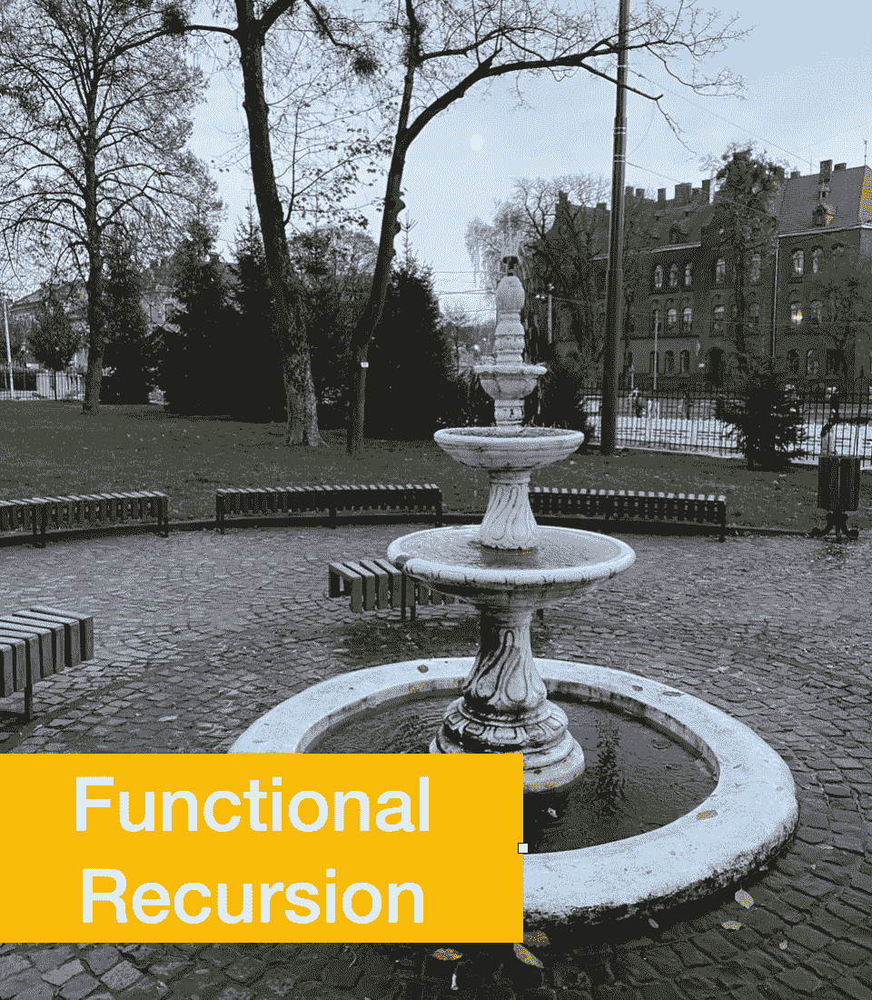

# 谨慎使用递归

> 原文：<https://levelup.gitconnected.com/use-recursion-cautiously-5482342b9903>

假设你要写一个函数，把嵌套数组的每个元素都乘以一个整数。快速实现是这样的:

上面的解决方案利用了函数递归技术。不管怎样，**大多数现代编程语言和编译器都不支持递归函数调用**。此外，像 *JavaScript* 这样的语言取消了对函数自身调用次数的人为限制。为什么会这样呢？答案是一叠。*栈*是一个特定的内存位置( *RAM* )，保存所有的参数和函数调用链。它在尺寸上有限制。函数递归方法过度使用堆栈内存，导致在运行大量输入时出现堆栈溢出异常。

在需要大量输入数据的生产环境中，应该使用循环或其他替代技术重新考虑具有函数递归的位置，以尽可能避免堆栈溢出异常。

有趣的是，一些有意设计来支持函数递归的函数语言不允许显式地应用它。例如，在 *Clojure* ( *LISP* 方言为 *JVM* )中，使用了一个名为*recurve*的特定操作符，而不是递归函数调用。操作员向解释程序发出指令，应用内部优化，避免超出堆栈内存。

让我们回到第一个列表，将嵌套数组乘以一个因子，并将这段代码重写为 *LISP/Clojure* :

看起来更简洁。尽管如此，它仍然包含一个对*嵌套列表*函数的直接递归函数调用，该函数不能更改为*递归*，因为*递归*只能位于尾部位置，而不能位于 map 的函数参数内。不便的限制。在这种情况下，需要递归，因为它处理递归数据结构。

但是，有些情况下使用*recurve*可能会有好处。例如，如果您需要在不使用内置的 *map* 函数的情况下实现 map 功能，代码将如下所示:

可以通过将*自定义映射*调用改为*循环*来改进该代码:

与直接调用*自定义映射*函数相比，该代码可更好地使用堆栈内存，即有可能在不超出堆栈限制的情况下处理更长的映射。