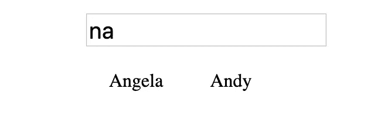

# 使用正则表达式和 JavaScript 改进搜索结果

> 原文：<https://levelup.gitconnected.com/use-regex-and-javascript-to-improve-search-results-870932050d08>


能够根据用户输入准确高效地过滤搜索结果对于确保积极有效的用户体验至关重要。在这篇文章中，我们将使用 JavaScript、HTML 和 CSS 创建一个搜索栏。给定一个姓名列表，我们应该能够根据用户的输入过滤出姓名。

实现这一点的常见方法是简单地使用 JavaScript 的`[.filter()](https://developer.mozilla.org/en-US/docs/Web/JavaScript/Reference/Global_Objects/Array/filter)`函数，并检查是否有任何元素`[.includes()](https://developer.mozilla.org/en-US/docs/Web/JavaScript/Reference/Global_Objects/String/includes)`是用户输入的。

```
filterFunction = (userInput) =>{
   var filteredNames = names.filter((x)=>{ 
       return x.includes(userInput)
   } return filteredNames
}
```

这个函数检查用户的输入是否与数组中的任何一个名字相匹配。如果我们的名称数组包含“Tom”、“Jerry”、“Larry”、“Barry”，并且用户在“T”中键入，则过滤后的列表将只包含一个名称，因为“Tom”是列表中唯一包含字母“T”的名称。

这种方法非常有效，但是有一点限制，因为用户必须键入字母的准确顺序，否则将不会返回任何结果。假设用户想从我们的名字列表中找到 Larry，但是不小心输入了“Lrary”。尽管事实上字母是正确的，顺序只差一个字母，但搜索结果将会是空的。


所以在这篇文章中，我们除了使用`.includes()`之外，还将使用正则表达式，以便更好地返回更方便的结果，而不会影响搜索的准确性。首先，让我们准备好 HTML 和 CSS。见下面的 HTML。

```
<div class="containerDiv"> <input type='text' onkeyup="onChange();"/> <div id="nameContainer"></div></div>
```

还有我们的 CSS。

```
.containerDiv{
    display: block; 
    margin: auto; 
    width: 300px;
}#nameContainer > p {
    display: inline-block;
    margin: 20px;
}input{
   width: 200px;
   font-size: 20px;
}
```

我使用了`[onkeyup](https://www.w3schools.com/jsref/event_onkeyup.asp)`事件而不是`onchange`,因为`onchange`只有在填写完输入后提交/按 enter 键时才会触发。`onkeyup`打字后一抬手指就触发。


是的，又一个办公室。原因如下:

现在，转到 JavaScript。

我们将要使用的数组包含了一个角色的名字列表，这些角色来自于历史上最伟大的电视剧之一《办公室》。

```
const office = ['Kelly', 'Creed', 'Stanley', 'Oscar', 'Michael', 'Jim', 'Darryl', 'Phyllis', 'Pam', 'Dwight', 'Angela', 'Andy', 'William', 'Ryan', 'Toby', 'Bob']
```

让我们来看一下将在容器中呈现所有结果的函数，`appendNodes`。

```
appendNodes = (filteredOffice) => {
   var container = document.getElementById('nameContainer'); if (filteredOffice != "no results"){
        container.innerText = ""
        filteredOffice.map((name)=>{
           var p = document.createElement("P")
           p.innerText = name
           container.appendChild(p)
        })
    } else {
        container.innerText = "no results"
    }
}
```

向该函数传递一个数组作为参数。我们遍历数组并使用 JavaScript 的`[createElement](https://developer.mozilla.org/en-US/docs/Web/API/Document/createElement)`函数为数组中的每一项创建一个`p`标签。然后，我们将该迭代中的名称添加到那个`p`标签的`innerText`中，这将表示搜索结果。

一旦我们创建了`p`标签并添加了`innerText`，我们就可以使用 JavaScript 的`[appendChild](https://developer.mozilla.org/en-US/docs/Web/API/Node/appendChild)`函数将创建的`p`标签及其内容追加到`nameContainer`。我们可以用`[document.onDOMContentLoaded](https://developer.mozilla.org/en-US/docs/Web/API/Document/DOMContentLoaded_event)`中的 office 数组调用这个函数来初始化我们的结果。

```
document.addEventListener("DOMContentLoaded", () => {
    appendNodes(office)
});
```

在所有这些之后，我们有了自己的网页。


是的。

现在，看看我们的过滤函数。

```
onKeyUp = () => {
    var str = event.target.value.toLowerCase() var filteredArr = office.filter((x)=>{
        return x.toLowerCase().includes(str)){
    }) if (arr.length > 0){
        appendNodes(arr)
    } else {
        appendNodes("no results")
    }
}
```

该函数根据任何字符名称是否包含用户输入来过滤 office 数组。我们还使用`toLowerCase()`来改进输入验证。请记住，“pam”不等于“pam”，因此如果不将数组中的字符名称和用户输入都改为小写，用户键入“Pam”将不会产生任何搜索结果。如果没有结果，该函数将“没有结果”传递给我们的`appendNodes()`函数。


该死的。

即使在将姓名和输入转换成小写字母之后，这种功能仍然存在不足。如果用户键入“apm ”,他们将不会产生任何搜索结果。如果用户输入“mcihael”，情况也是一样的。这两个输入很可能是“pam”和“michael”。那么，我们如何解释这样的小拼写错误，并相应地纠正我们的搜索结果呢？

介绍， [**Regex**](https://www.regular-expressions.info/) 。

Regex 是“正则表达式”的缩写，是描述搜索模式的特殊文本字符串。我们将使用 regex 实现一个搜索模式，它获取字符名称的前三个字母，并将其与输入的前三个字母进行比较。为什么不将整个名称与整个输入进行比较呢？

虽然这似乎是一个好主意，但在某一点上，辅助搜索将开始通过压倒性的结果来与自己作对。见下文。


它仍然有助于我们的搜索，但“an”更接近于“Angela”或“Andy”的意外拼写错误，而不是“Ryan”或“Stanley”。通过包含更多的字母进行比较，你增加了建立匹配的可能性，在某一点上可能会适得其反。当我们只使用输入和字符名称的前三个字母时，将上面的结果与下面的结果进行比较。



如您所见，这些搜索结果更加精确。我们已经减少了 50%的搜索结果，当你考虑我们的列表有多小时，这可能会真正影响搜索结果的大小。我们改进的结果可以归功于函数`checkName()`。

```
checkName = (name, str) => {
    var pattern = str.split("").map((x)=>{
        return `(?=.*${x})`
    }).join(""); var regex = new RegExp(`${pattern}`, "g") return name.match(regex);
}
```

我们来分析一下。

`?=`是一个[正向前瞻](https://www.regular-expressions.info/lookaround.html)。

`.`匹配除换行符以外的任何字符。

`*`匹配一个字符的零个或多个实例。

`()`是一个捕获组，用于在正则表达式中将字符组合在一起，以便我们可以应用其他运算符(`?=.*`)。

`g`是全局修饰符，它执行字符串的全局搜索来寻找匹配。您也可以将`i`添加到`g`中，使其成为一个不敏感的(不区分大小写)搜索，但是在我的例子中，我已经将输入和字符名称转换成小写字母，所以`g`修饰符就足够了。

这个函数分割我们的用户输入，遍历字符并使用字符串插值将每个字母添加到星号后面的`(?=.*)`正则表达式中。一旦我们有了一个正则表达式模式的数组，我们就将数组中的所有项连接起来，创建一个包含所有字母的更大的正则表达式模式。由此，我们可以使用`[new RegExp](https://developer.mozilla.org/en-US/docs/Web/JavaScript/Reference/Global_Objects/RegExp)`从连接的模式中创建一个正则表达式。

我们为每个字母创建的单独模式将匹配包含该字母的任何字符串。组合它们会将所有单个捕获组应用到整体模式，使它们都成为字符串的可匹配模式。这将弥补`.includes(str)`的不足。

如果用户试图找到“Kelly ”,但是错误地键入了“e”作为第一个字母。`x.toLowerCase().includes(str)`会起作用，但是如果用户继续输入，然后输入‘k ’,前面的检查就不起作用了。


总有一个主题。

如果我们将‘ek’传递给`checkName()`，我们可以创建正则表达式`(?=.*e)(?=.*k)`，它将匹配包含‘e’和‘k’的字符串，而不考虑顺序。我们将该正则表达式应用于“kelly”的前三个字母，这三个字母也被传递给函数`name`。如果满足正则表达式，那么`[.match()](https://developer.mozilla.org/en-US/docs/Web/JavaScript/Reference/Global_Objects/String/match)`将返回 true。否则将返回 false。

现在我们知道了我们想要完成什么，以及如何去做，让我们看看修改后的`onKeyUp()`函数。

```
onKeyUp = () => {
   var str = event.target.value.toLowerCase().substring(0, 3) var filteredArr = office.filter((x)=>{
      var xSub = x.substring(0, 3).toLowerCase()
      return x.toLowerCase().includes(str) || checkName(xSub, str)
   }) if (filteredArr.length > 0){
      appendNodes(filteredArr)
    } else {
      appendNodes("no results")
    }
}
```

我们使用`[substring()](https://www.w3schools.com/jsref/jsref_substring.asp)`获取输入的前三个字母和角色的名字。然后我们检查`x.toLowerCase().includes(str)`是否为真。如果是，我们跳过正则表达式验证，因为`.includes()`是一个更准确的匹配，因为它实际上是字符名称、顺序和字符方式的一部分。如果`x.toLowerCase().includes(str)`为假，我们使用`checkName()`来应用我们的正则表达式验证。这将改善用户的搜索结果，而不会过于严格，也不会损害整体搜索的准确性。


如果你喜欢这篇文章或者需要澄清任何提到的事情，请在评论中告诉我。请随意分享和留下掌声！

# 参考

[](https://developer.mozilla.org/en-US/docs/Web/JavaScript/Reference/Global_Objects/Array/filter) [## Array.prototype.filter()

### filter()方法创建一个新数组，其中所有元素都通过了由提供的函数实现的测试。var…

developer.mozilla.org](https://developer.mozilla.org/en-US/docs/Web/JavaScript/Reference/Global_Objects/Array/filter) [](https://www.w3schools.com/jsref/jsref_replace.asp) [## JavaScript 字符串替换()方法

### 返回一个字符串，其中“Microsoft”替换为“W3Schools”:Try it Yourself“更多“Try it Yourself”示例…

www.w3schools.com](https://www.w3schools.com/jsref/jsref_replace.asp) [](https://developer.mozilla.org/en-US/docs/Web/API/Document/createElement) [## Document.createElement()

### 在 HTML 文档中，document.createElement()方法创建由 tagName 或…

developer.mozilla.org](https://developer.mozilla.org/en-US/docs/Web/API/Document/createElement) [](https://developer.mozilla.org/en-US/docs/Web/API/Node/appendChild) [## Node.appendChild()

### 方法将一个节点添加到指定父节点的子节点列表的末尾。如果给定的…

developer.mozilla.org](https://developer.mozilla.org/en-US/docs/Web/API/Node/appendChild) [](https://developer.mozilla.org/en-US/docs/Web/API/Document/DOMContentLoaded_event) [## 文档:DOMContentLoaded 事件

### DOMContentLoaded 事件在初始 HTML 文档被完全加载和解析后触发，无需等待…

developer.mozilla.org](https://developer.mozilla.org/en-US/docs/Web/API/Document/DOMContentLoaded_event)  [## 正则表达式. info —正则表达式教程、示例和参考—正则表达式模式

### 正则表达式(简称 regex 或 regexp)是描述搜索模式的特殊文本字符串。你可以…

www.regular-expressions.info](https://www.regular-expressions.info/)  [## 前视和后视零长度断言

### Lookahead 和 look ahead 统称为“lookaround ”,是零长度断言，就像…

www.regular-expressions.info](https://www.regular-expressions.info/lookaround.html) [](https://developer.mozilla.org/en-US/docs/Web/JavaScript/Reference/Global_Objects/RegExp) [## 正则表达式

### RegExp 构造函数创建一个正则表达式对象来匹配文本和模式。对…的介绍

developer.mozilla.org](https://developer.mozilla.org/en-US/docs/Web/JavaScript/Reference/Global_Objects/RegExp) [](https://developer.mozilla.org/en-US/docs/Web/JavaScript/Reference/Global_Objects/String/match) [## String.prototype.match()

### 方法检索字符串与正则表达式匹配的结果。正则表达式对象。如果一个…

developer.mozilla.org](https://developer.mozilla.org/en-US/docs/Web/JavaScript/Reference/Global_Objects/String/match) [](https://www.w3schools.com/jsref/jsref_substring.asp) [## JavaScript 字符串 substring()方法

### 下面有更多“自己尝试”的例子。substring()方法从字符串中提取两个…

www.w3schools.com](https://www.w3schools.com/jsref/jsref_substring.asp)