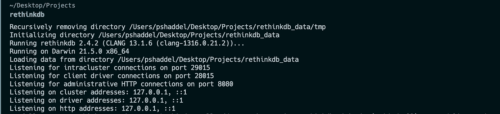
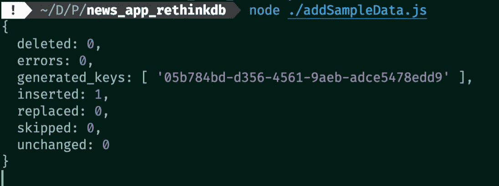
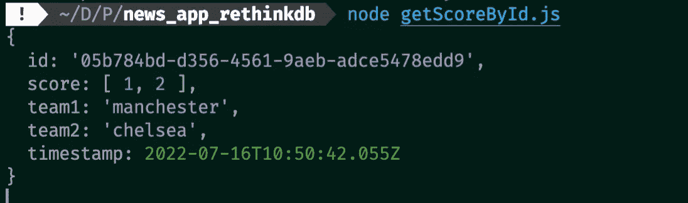
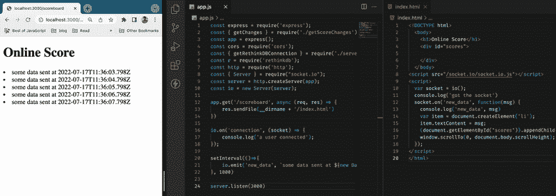
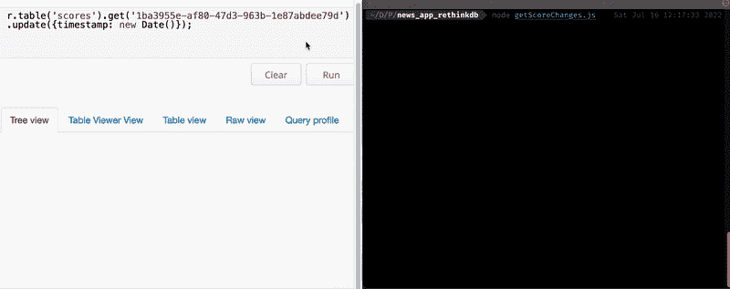
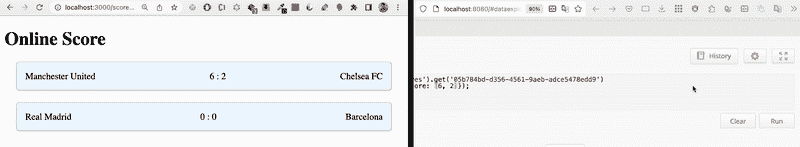

# 对实时应用程序使用 RethinkDB 和 Node

> 原文：<https://levelup.gitconnected.com/use-rethinkdb-and-node-for-real-time-apps-85c435b89be4>

在本帖中，我们将使用一个以实时为理念的数据库。我们的用法将是最简单的，所以它会很短，你会明白这个想法，你也有一些代码来运行这个基本的例子，所以让我们开始…


# 什么是 RethinkDB？

RethinkDB 是一个 ***非 SQL*** 数据库。是 ***开源*** 你可以在这里找到资源库[。它的显著特点是 ***实时*** 并让你查询变化。是用 c++写的。](https://github.com/rethinkdb/rethinkdb)

# 为什么我要写这个？

*   这是一个开源项目，值得尊重。
*   实时应用对某些领域来说非常重要和关键(陈旧的数据没有任何价值)
*   当你在一个特定的领域工作时(在这种情况下*实时*)，你的工具很有可能成为那个特定领域的最佳选择。
*   它支持你对数据库的所有期望，比如可伸缩性、可用性，你还可以使用各种查询和聚合，甚至是时间序列。

# 其他数据库能做 RethinkDB 在做的事情吗？

答案是肯定的，也是否定的，RethinkDB 正在努力的是成为最好的实时 DB。其他数据库也有监听变化的功能，例如 MongoDB 有[变化流](https://www.mongodb.com/docs/manual/changeStreams/)，在 MySQL 和 PostgreSQL 上我们有一个可以读取的 changelog 文件，或者我们可以为需要实时数据的情况创建触发器。它们都具有为我们提供实时数据的功能，但没有一个是专门为此设计的，因此我们需要更多的努力来做同样的事情。

# 安装 RethinkDB

在 Mac 或 Linux 上，如果您有`brew`使用此命令:

```
brew update && brew install rethinkdb
```

对于 Ubuntu，请查看这个页面。

如果安装成功，您应该能够使用以下命令启动 RethinkDB:



运行 RethinkDB

# 空谈不值钱！

*示例定义* :
一个 Node.js 应用程序，它连接到一个 RethinkDB 数据库，当我们在这个数据库表中进行一些更改时，用户可以听到这些更改，并获得最新的结果。

## 连接到数据库

首先安装`rethinkdb` nodejs 库:

`npm i rethinkdb`并且记住默认端口是`28015`。

连接到 RethinkDB

这是基于文档的方法，但是如果你问我你可以使用[单例模式](https://en.wikipedia.org/wiki/Singleton_pattern)并且[承诺](https://stackoverflow.com/questions/22519784/how-do-i-convert-an-existing-callback-api-to-promises)连接回调，因为我们在不同的地方需要连接。让我们这样做:

更好的连接处理

现在如果有人使用`getRethinkDBConnection()`功能就可以接入连接。

## 创建我们的第一个表

默认情况下，数据库`test`在 RethinkDB 中，所以我们将继续。
为了创建名为“ ***分数*** 的表格，我们只需要连接，因此我们应该导入`getRethinkDBConnection`:

创建 RethinkDB 表

现在运行:`node createTable.js`在 RethinkDB 中创建第一个表。

## 插入样本数据

为此，我们将实现我们的插入函数:

将示例数据添加到 RethkinkDB

通过运行以下代码:

```
node ./sampleData.js
```



插入数据

## 获取我们插入的样本数据

`generated_keys`是“id ”,默认情况下是主键。我们可以用它来取这个。让我们实现`getScoreById`功能:

按 Id 获取分数

我们已经使用了`get`命令来获取基于`id`的项目，并且我们承诺回调来实现`getScoreById`功能。



get 查询的结果

## 记分牌

让我们用一个简单的 express 应用程序来实现记分板。

首次安装 express:

```
npm i express;
```

这是我们简单的快递应用程序:

应用程序初始化

现在使用 node 或 nodemon 运行您的服务器:

```
node app.js
```

**这里如何实现实时更新？**

我们有两种方式: [***HTTP 轮询***](https://www.educative.io/answers/what-is-http-long-polling) 和*[***web sockets***](https://developer.mozilla.org/en-US/docs/Web/API/WebSockets_API)*。**

*最直接的方法是使用 WebSocket 库。众所周知的是[插座。IO](https://socket.io) 。让我们看看是否可以向客户端发送更新:
这是服务器端的实现:*

*   *我们需要在我们服务的 HTTP 实例上创建我们的套接字*
*   *通过使用时间间隔，我们每秒发送一次数据，我们将在客户端接收该数据。*
*   *用户向`/scoreboard`发送请求，我们正在向用户发送`index.html`文件。*
*   *下一步，我们将创建`index.html`作为套接字客户端，我们将根据来自后端的数据更新用户界面。*

*套接字 io 有助于发送实时更新*

## *客户端实现*

*我们在这里也使用了`socketio`，我们正在监听来自开放套接字的事件:*

*套接字 io 客户端实现*

*我们有 id 为`scores`的`div`，每次我们收到一条消息，我们都会在第 16 行添加一个项目`<li>message</li>`。
让我们看看一切是否正常:*

**

*使用 SocketIO 更新 UI*

## *从 RethinkDB 获取更改*

*使用`changes`的方法，我们可以简单地从 RethinkDB 获得数据变更:*

*获取分数变化*

*我们只需要传递一个**回调函数**来处理数据。Changes 函数返回*光标*，我们可以对其进行迭代并记录值。*

*通过传递这个选项`{ includeInitial: true }`，我们在第一个事件中获得表的所有数据。*

*让我们看看实际情况，我将对`scores`进行一些随机更新，我们可以看到这些变化。默认情况下，我们可以使用端口`8080`上的 RethinkDB UI:*

**

*使用更改功能记录更改*

## *使用 SocketIO 发送乐谱更改*

*现在是时候将这些更改发送到 response 了。*

*我们需要做的就是传递一个回调函数给`getChanges`函数:*

*将数据库更改写入响应*

*每次在`scores`表中发生变化时，我们的回调函数都会被执行，结果它会向前端发出新的变化。*

## *让我们让 index.html 使用套接字数据*

*为了显示每次从服务器返回数据的结果，我们创建了以下元素:*

```
*<li>
  <span> Team1 </span>
  <span> Score </span>
  <span> Team 2 </span></li>*
```

*如果文档已经存在，我们将[用新的分数元素替换](https://developer.mozilla.org/en-US/docs/Web/API/Element/replaceWith)当前的分数元素:*

*使用套接字数据的工作示例*

*让我们看看演示:*

**

*更改分数并在线查看更改*

# *后续步骤*

*   *为玩家创建另一个表，并在文档中存储得分，RethinkDB 支持连接。*
*   *在监听变化时使用过滤器，在本例中，您可以根据联盟进行过滤。*
*   *让用户在另一个表格中对每个游戏发表评论或反应*

*你可以签出这个 github 项目中的文件*

*[](https://javascript.plainenglish.io/working-with-nodejs-streams-a0d35aca0cc0) [## 使用 Node.js 流

### 什么是流，我们在哪里使用它们？

javascript.plainenglish.io](https://javascript.plainenglish.io/working-with-nodejs-streams-a0d35aca0cc0) [](https://medium.com/meroxa/stream-your-database-changes-with-change-data-capture-aa8797fa9070) [## 通过变更数据捕获，流式传输您的数据库变更

### 没有人想看仪表盘或用昨天的数据做决定。我们生活在一个实时…

medium.com](https://medium.com/meroxa/stream-your-database-changes-with-change-data-capture-aa8797fa9070)*