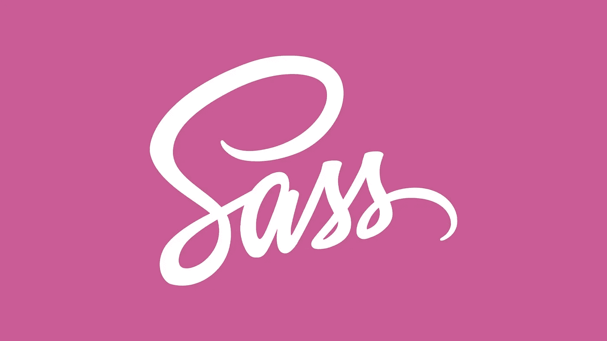
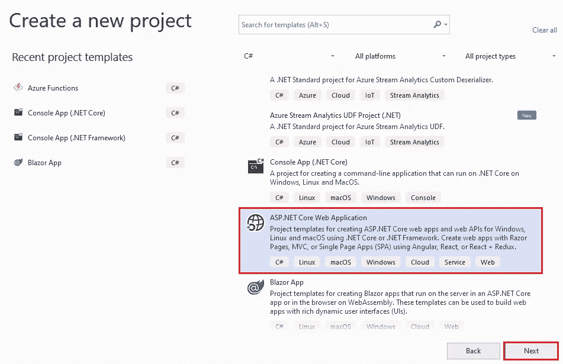
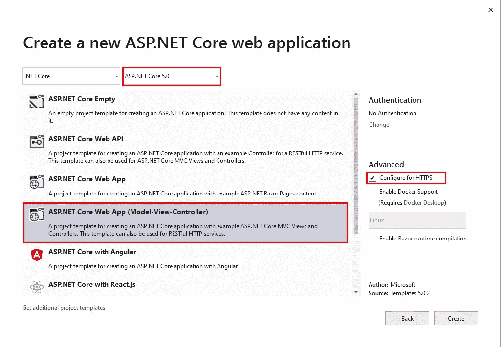

# 在 ASP.NET MVC 应用程序中使用 Sass

> 原文：<https://levelup.gitconnected.com/use-sass-in-an-asp-net-mvc-application-207811b61048>

## 如何创建一个 ASP.NET MVC 应用程序并使用 Sass 进行设计，而没有 webpack 或 grunt 的麻烦。



图片由[Silvawebdesigns.com](https://silvawebdesigns.com/wp-content/uploads/2020/10/useful-sass-scss-mixins-for-every-website.jpg)

# 介绍

默认的 ASPNET MVC 模板自带 [Bootstrap 4](https://getbootstrap.com/) 。这是一个已经编译好的 Bootstrap 版本。为了[定制](https://getbootstrap.com/docs/4.5/getting-started/theming/)Bootstrap 元素的外观，您需要能够覆盖 Bootstrap 的默认值，并从 Sass 源代码编译 Bootstrap。根据我自己的经验，我知道我喜欢使用源 Sass 文件并覆盖它们。

不幸的是，在 MVC 应用程序中使用 Sass 并不像看起来那么简单。有一些使用 webpack 或 grunt 的教程。但这对我来说似乎有点过了。为什么不让我们的 MVC 应用程序来做所有的艰苦工作呢？由于我没有找到任何关于这个问题的教程，我决定自己来做。

# 目标

我们的目标是:

1.  创建一个示例应用程序
2.  将 Sass 添加到项目中
3.  将 Sass 编译为 CSS

对于示例项目，我想让你参考我的 GitHub 项目:[https://github.com/koenvzeijl/sass-aspnet-mvc](https://github.com/koenvzeijl/sass-aspnet-mvc)

顺便说一句，如果你只是想为 C#使用 SaSS 编译器，你也可以使用我创建的这个包:[https://github.com/koenvzeijl/AspNetCore.SassCompiler](https://github.com/koenvzeijl/AspNetCore.SassCompiler)

# 假设

本文假设如下:

*   Node.js 已安装。如果你没有它，先去[安装它](https://nodejs.org/)。
*   您使用的 IDE 可以运行像 Visual Studio 或 Rider 这样的 ASP.NET MVC 应用程序

# 创建一个示例应用程序

在开始所有的设置之前，我们需要创建一个示例应用程序。你有两个选择，你可以通过命令行或者在你喜欢的 IDE 中创建一个。对于这个示例项目，我将使用一个**。NET 5.0 MVC** 应用。

要从命令行创建 MVC 应用程序，请使用以下命令:

```
dotnet new mvc --name ExampleApplication
```

要使用 Visual Studio 创建示例应用程序，请按照下列步骤操作:

*   打开 Visual Studio
*   点击“创建新项目”。
*   选择“ASP。NET 核心 Web 应用程序”



然后选择。NET Core 版本，然后单击创建。



现在我们有了一个示例应用程序，是时候添加我们的 Sass 样式了。在这个例子中，我们将对所有的`.scss`文件使用`/Styles`文件夹。首先，创建一个`site.scss`，这将是我们项目的基础文件。在我的示例项目中，基本文件如下所示:

# 使用 NPM

是时候为我们的项目设置 Sass 了。即使我们正在编写一个 MVC 应用程序，我们也将使用[节点包管理器](https://www.npmjs.com/) (npm)来安装 Sass 所需的组件。为此，我们将在`package.json`中添加包。需要将该文件添加到项目的根目录中，这可以通过在命令提示符下运行以下命令来完成。

```
npm init
```

现在我们有了一个`package.json`，一次安装所有包的最简单方法是将所有这些包添加为 devDependencies，然后运行`npm install`:

```
{ "autoprefixer": "^10.2.6", "cssnano": "^5.0.5", "cssnano-preset-advanced": "^5.1.2", "postcss-cli": "^8.3.1", "sass": "^1.34.1"}
```

**设置 postcss**

我们需要做的另一件事是设置我们的 postcss 设置。为此，我们需要做的第一件事是在我们的`package.json`中添加另一行:

```
"main": "postcss.config.js"
```

这一行将确保检查 postcss 设置的`postcss.config.js`文件。有关`package.json`中主要属性的更多信息，请查看[此链接](http://postcss.config.js)。

现在用以下内容创建一个`postcss.config.js`:

这将确保 autoprefixer 能够像我们期望的那样为老版本的浏览器工作。这就需要 cssnano 来做到这一点。

现在我们差不多完成了，我们需要在 package.json 中添加一些脚本，以允许我们的 MVC 应用程序实际生成。css 文件。

完成后的 package.json 应该如下所示:

这就是我们设置 NPM 所需的一切，让我们来看看我们的 web 应用程序。

# 设置 MVC 应用程序

在我们的 web 应用程序中，我们希望实现两件事，使开发尽可能愉快。首先，我们至少要确保`.scss`文件是**转换的**到`.css`文件。第二，为了让我们作为开发人员的生活稍微轻松一点，我们希望我们的应用程序能够在`.scss`文件中有任何变化的时候**自动生成**文件。

如上所述，我们首先要确保生成了`.css`文件。为此，我们需要将以下几行添加到我们的`.csproj`文件中:

在上面的代码片段中，我们添加了两个任务。第一个任务是确保在构建项目之前，正确的包已经安装在 npm 中。当在同一个项目中与多人合作时，或者当在 CI/CD 管道中构建时，这尤其有用，因为他们不需要手动运行 `npm install`。这段代码既适用于 Linux，也适用于 Windows。

第二部分将使用我们之前在`package.json`中添加的`build:css`脚本将`.scss`文件转换为`.css`文件。该脚本将查看我们之前创建的`/Styles`文件夹，并在`wwwroot/css`文件夹中生成适当的`.css`文件。

在脚本执行之后，它还会将`site.css`文件复制到 publish 文件夹中以自动包含它。

# 观察 Sass 变化

正如前面已经提到的，我们希望开发尽可能简单。如果`.scss`文件中有任何变化，我们希望我们的应用程序**自动生成`.css`文件**。首先，我们需要创建一个文件监视器。为此，在项目的根目录下创建一个包含以下内容的`NpmWatchHostedService.cs`。

上面的代码片段将在调试模式下使用 npm 设置一个文件监视器，并在`/Styles`文件夹中的任何内容发生变化时生成`.css`文件。现在剩下的就是将`NpmWatchHostedService`包含在我们的`startup.cs`中，通过添加以下几行来完成:

# 结论

就是这样！你已经做到了。您成功地将 Sass 添加到您的 ASP.NET MVC 应用程序中，而不需要 webpack 或 Grunt。现在让你的生活更简单，开始写 Sass 而不是 CSS。我希望你从这个故事中学到了一些东西。

快乐编码😊

对于示例项目:

[](https://github.com/koenvzeijl/sass-aspnet-mvc) [## koenvzeijl/sass-aspnet-mvc

### 在 GitHub 上创建一个帐户，为 koenvzeijl/sass-aspnet-mvc 开发做出贡献。

github.com](https://github.com/koenvzeijl/sass-aspnet-mvc)