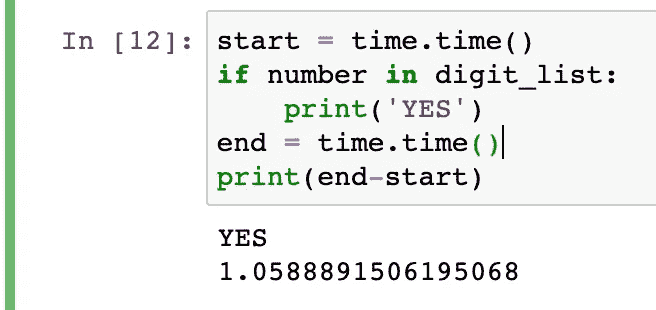
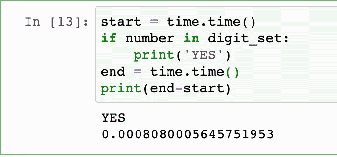

# 使用集合提高 Python 性能

> 原文：<https://levelup.gitconnected.com/use-sets-to-improve-python-performance-d7eb9ea97dc1>


尼古拉斯·霍伊泽在 [Unsplash](https://unsplash.com?utm_source=medium&utm_medium=referral) 上拍摄的照片

我在 Python 中学到的第一个概念是列表和遍历列表。列表无疑是一个非常重要的概念，但是我经常发现自己过度依赖它们，尤其是在成员测试的情况下(检查一个列表中的一个元素是否在另一个列表中)，这会对运行时性能产生负面影响。根据具体情况，不同的数据类型(如集合)可能是更好的解决方案。

## 面对面:列表和集合

作为程序员，经常出现的一个任务是检查一个值是否存在于一个值列表中。执行这项任务的一个简单方法是编写如下代码:

```
digit_list = [i for i in range(0, 100000000)
number = 99999999if number is in digit_list:
   print(f'{number} is in digit_list'
```

使用下面的代码片段计时该检查大约需要一秒钟:



除了列表，Python 还有其他几种数据类型来存储变量，其中一种是集合。在解释什么是集合之前，让我们运行相同的精确测试，但这次使用的是集合:

```
digit_set = set(digit_list)
```



使用集合而不是列表来执行这个成员测试要快得多。为什么会有如此大的提升？

## 解释列表和集合

列表和集合都存储一系列值，但存储方式不同。列表以类似于在一个很长的书架上排列书籍的方式存储值，如果你正在用 Python 寻找某本书，Python 会检查这个书架上的每本书，直到找到你正在寻找的书。与列表不同，集合中的值存储在哈希表中。你可以认为这类似于根据类型、年份或作者来组织书籍。当 Python 检查某本书是否在集合中时，它不会检查书架上的每本书，而是检查与该书相关联的类别或桶。自然，这减少了 Python 必须迭代的项目数量。

## 何时使用列表和集合

列表和集合相互之间没有*总体*优势，并且各有利弊。如果您希望保持数据的顺序，或者如果顺序很重要，列表是理想的选择——集合以无序的方式存储值——或者如果您需要更改列表中的任何数据——您可以添加或删除集合中的项目，但不能将现有值更改为集合中的另一个值。如果顺序不是特别重要，并且您正在执行一系列成员资格测试，那么集合是理想的。

## 结论:

列表并不总是答案，下次你做“日常检查”时，列表可能是更好的解决方案。事实上，如果这种检查是一个更大的脚本的一部分，sets 可以极大地提高程序的整体运行时间。