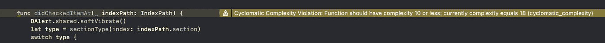
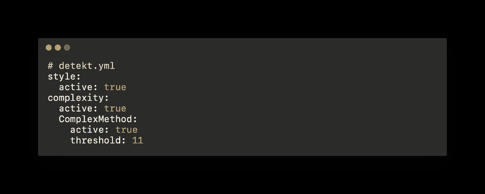

# 使用 Swiftlint 和 Detekt 检查 iOS 和 Android 项目中的圈复杂度

> 原文：<https://levelup.gitconnected.com/use-swiftlint-and-detekt-to-check-cyclomatic-complexity-on-ios-and-android-5b98f62597e8>


伊恩·施耐德在 [Unsplash](https://unsplash.com?utm_source=medium&utm_medium=referral) 上拍摄的照片

# **什么是圈复杂度？**

> 圈复杂度是由 Thomas McCabe 开发的一种度量方法，用于确定程序的稳定性和置信度。它测量通过程序模块的线性独立路径的数量。
> 
> 其公式为: **M = E — N + 2P** ，其中 E =边数，N =节点数，P =连通分量数

让我们通过这个例子来理解如何计算这个指标。

例如，我们有一个函数，它执行一些逻辑，如下图所示


我们有 **7 个节点和 8 条边**和 1 个连通分量，因此基于公式我们有

```
**M = E — N + 2P = 8-7 + 2 * 1 = 3**
```

# **一个函数圈复杂度的极限是多少？**

[McCabe 建议](https://en.wikipedia.org/wiki/Cyclomatic_complexity)一个函数的圈复杂度应该**小于或等于 10。**

除此之外，我们还有关于软件度量的 [ISO-2626](https://www.exida.com/Blog/software-metrics-iso-26262-iec-61508) ，它也建议圈复杂度应该从 **1 到 10。**

*   圈复杂度**小于 10:** 写得好的代码，可测试性高，花费和精力较少
*   圈复杂度**从 11 到 20:** 代码复杂，可测性中等，成本和工作量中等
*   圈复杂度**从 21 到 40:** 非常复杂的代码，可测性低，成本和工作量高
*   圈复杂度超过 40:根本不可测试，成本和工作量非常高

# 我们该如何解决这类问题？

**将你的高圈复杂度函数**拆分成一些更小的函数。如果你有一个圈复杂度等于 30 的函数，你应该把它分成至少 3 个圈复杂度等于或小于 10 的函数。

# **iOS Swift 项目如何检查圈复杂度？**

[Swiftlint](https://github.com/realm/SwiftLint) 是检查您的 Swift 代码风格和惯例的绝佳工具。你可以用这个来检查很多规则，以确保你的代码是好的。但我只想提一下圈复杂度。

通过**自制:**安装 **Swiftlint**

```
brew install swiftlint
```

然后，在项目目录中创建一个名为“. swiftlint.yml”的文件。


针对圈复杂度在. swiftlint.yml 文件中配置

现在，打开你的终端，进入一个项目目录，运行`swiftlint lint`或者只运行简单的`swiftlint`

这是一个错误的例子，我在我的项目中限制圈复杂度只有 10，但我有这个函数有 20。那是气味。


您还可以将 Swiftlint 实施到您的项目中，并通过以下方式在您构建应用程序时检查这些规则

*   转到您的项目设置，然后选择**构建阶段**
*   点击左上角项目应用名称旁边的 **+** 按钮，然后选择**新运行脚本阶段**
*   将该脚本粘贴到**运行脚本阶段**

在那之后，无论何时你构建你的应用程序，你都会得到这样的警告



# **如何检查 Android Kotlin 项目的圈复杂度？**

Detekt 将做与 Swiftlint 相同的事情。

通过**自制**安装**探测器**

```
brew install detekt
```

然后，必须在你的项目目录中创建一个文件名`detekt.yml`来设置规则。



设置`threshold: 11`以确保它仍然适用于圈复杂度= 10 的函数

之后，打开终端并转到您的项目目录，然后运行


一分钟后，你会在你的项目目录中得到文件名`cyclomatic_complexity_report.html`，打开它你会得到这样的报告


有了 **Swiftlint** 和**detek**现在你可以发现你的代码味道并改进它，除此之外还有一些高级规则，你应该在他们的文档页面上阅读，因为 Swiftlint 在这里是[这里是](https://realm.github.io/SwiftLint/rule-directory.html)，detek 在这里是[这里是](https://detekt.github.io/detekt/complexity.html)

# 参考

[](https://en.wikipedia.org/wiki/Cyclomatic_complexity) [## 圈复杂度-维基百科

### 圈复杂度是一种软件度量，用于表示程序的复杂度。这是一个定量的衡量标准…

en.wikipedia.org](https://en.wikipedia.org/wiki/Cyclomatic_complexity) [](https://github.com/realm/SwiftLint) [## GitHub - realm/SwiftLint:一个加强 Swift 风格和惯例的工具。

### 一个加强 Swift 风格和惯例的工具，大致基于现已存档的 GitHub Swift 风格指南。SwiftLint…

github.com](https://github.com/realm/SwiftLint) [](https://detekt.github.io/detekt/) [## 检测

### 基于代码逻辑行、McCabe 复杂性和…的 Kotlin 项目复杂性报告的代码味道分析

detekt.github.io](https://detekt.github.io/detekt/) [](https://www.guru99.com/cyclomatic-complexity.html) [## Mccabe 的圈复杂度:用流图计算(示例)

### 为了理解圈复杂度，让我们首先理解——度量只不过是大小的定量表示…

www.guru99.com](https://www.guru99.com/cyclomatic-complexity.html)