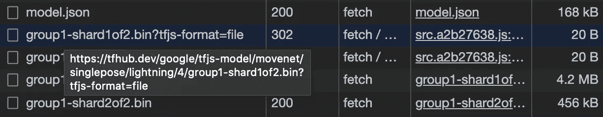
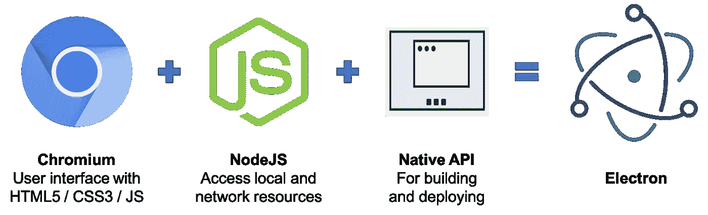
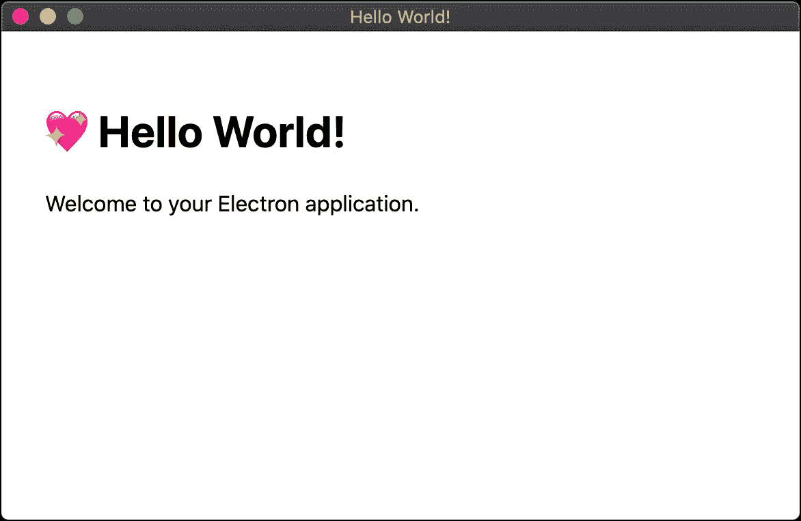
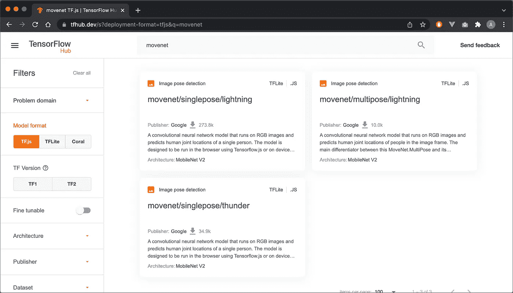
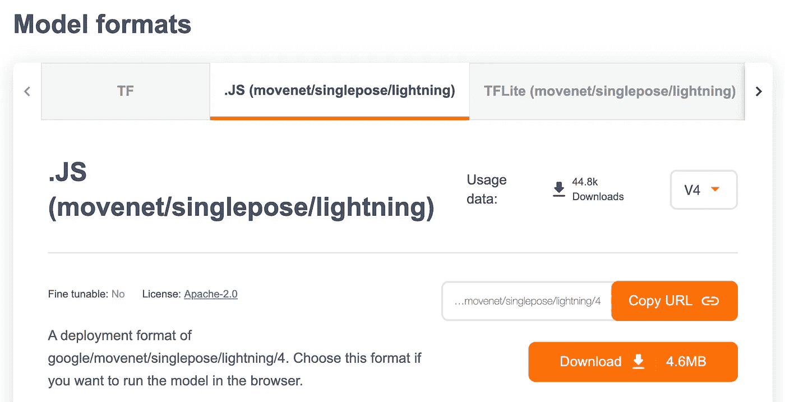

# 在脱机应用程序中使用 TensorFlow.js 模型的实用指南

> 原文：<https://levelup.gitconnected.com/use-tensorflow-js-models-in-offline-applications-a7b5b0c67d4>


安妮·斯普拉特的封面图片

TensorFlow.js (TFJS)是一款令人惊叹的软件。虽然有大量优秀的文档可用，但开发人员的一个常见问题似乎是:

> **如何让 TensorFlow.js 模型像** [**PoseNet**](https://github.com/tensorflow/tfjs-models/tree/master/pose-detection) **或者**[**hand pose**](https://github.com/tensorflow/tfjs-models/tree/master/hand-pose-detection)**在离线应用中工作？**

在许多真实的场景中，您希望离线部署 TFJS 支持的应用程序，例如:

*   Kiosk 应用
*   嵌入式应用
*   比赛

在本指南中，我将向您展示如何将 TensorFlow.js 模型打包到您的应用程序中，并离线运行它们。

*TL；DR，如果你只是为了源代码而来，你可以从我下面的库中下载一个完全可用的例子👇👇👇*

[](https://github.com/andypotato/tfjs-electron-template) [## GitHub-andypotato/tfjs-Electron-template:如何在电子邮件中使用 TensorFlow.js 的示例…

### 这是一个完整的工作示例，说明如何将 TensorFlow.js 模型打包到您的电子应用程序中以供离线使用…

github.com](https://github.com/andypotato/tfjs-electron-template) 

# 解释了离线应用程序面临的挑战

大多数人首先会尝试创建一个简单的 HTML / JS 包，然后从本地文件系统运行它。这通常会失败，并显示如下错误消息:

```
index.js:2 Fetch API cannot load file:///... URL scheme “file” is not supported. (anonymous)
```

**为什么会失败？**

**简短回答:**您的模型将使用 web 浏览器的[获取 API](https://developer.mozilla.org/en-US/docs/Web/API/Fetch_API) 在后台下载额外的资源文件(模型权重)，这对于本地资源不起作用。

**如果对你来说这已经足够说明了，那么** [**跳到下一节**](#cfcd) **。否则，留下来听我更深入的解释。**

为了理解这个错误来自哪里，你必须知道大多数流行的 TensorFlow.js 模型包需要额外的资源才能工作——所谓的[模型权重](https://hackernoon.com/everything-you-need-to-know-about-neural-networks-8988c3ee4491)。当您包含模型包时，权重通常会从 [TensorFlow Hub](https://tfhub.dev/) 网站自动下载。

打开开发者工具中的“网络”选项卡，查看详细信息:



浏览器从 TensorFlow Hub 下载模型权重

从上面的日志中，您可以看到通过 Fetch API 下载了额外的资源。只要资源是通过 HTTP(s)提供的，这种方法就可以很好地工作，但是如果出现以下任何一种情况，这种方法就会失败:

1.  请求是从“文件://”URL 发起的，或者
2.  请求的文件通过“文件://”协议加载

为了解决这个问题，我们需要找到一种方法来解决这些限制，并将模型权重与我们的应用程序捆绑在一起。

# 使用电子创建您的离线应用程序

Electron 是一个框架，可以将基于 HTML5 / JavaScript 的应用程序打包成一个独立的桌面应用程序，用于多种平台(Windows / macOS / Linux)。



电子堆栈

> 如果你想了解更多关于 electronic 的知识，你可以查看我不久前发表的关于用 electronic 构建 kiosk 应用程序的文章。

## 建立你的电子项目

对于本指南，我将使用方便的“[电子锻造](https://www.electronforge.io/)”工具，它会让一个新项目立即启动并运行。

Electron Forge 提供了一个方便的命令行安装程序，也允许您从一些预定义的模板中进行选择。我喜欢使用 [Webpack 模板](https://www.electronforge.io/templates/webpack-template)，因为它使得后期的配置更加容易。

**用**初始化您的新项目

```
npx create-electron-app tfjs-electron-example --template=webpack
```

要验证您的项目正在运行，请进入您的新项目目录并启动开发版本:

```
cd tfjs-electron-example
npm run start
```

如果一切安装正确，那么你应该看到一个“Hello World”应用程序在一个新窗口中运行。



向你的电子应用问好！

## 下载您的 TensorFlow.js 模型

我将以 [MoveNet 模型](https://github.com/tensorflow/tfjs-models/tree/master/pose-detection/src/movenet)为例，向您展示如何下载和安装模型包和模型权重文件。同样的过程也适用于大多数其他流行的模型，这些模型可以在 [TFJS 模型库](https://github.com/tensorflow/tfjs-models/tree/master)中找到。

**第一步:通过 NPM 或纱线安装模型包**

```
npm i --save @tensorflow-models/pose-detection
npm i --save @tensorflow/tfjs-core @tensorflow/tfjs-converter
```

**第二步:安装 GPU(推荐)或 WASM 后端**

```
npm i --save @tensorflow/tfjs-backend-webgl
- or alternatively -
npm i --save @tensorflow/tfjs-backend-wasm
```

**第三步:从 TensorFlow Hub 下载模型权重**

对于这一步，您首先需要选择要使用哪个版本的 MoveNet。目前，MoveNet 提供三种选择:

*   单一姿态检测/闪电后端(更快，默认精度)
*   单一姿态检测/ Thunder 后端(速度更慢，精确度更高)
*   多姿态探测/闪电后端

进入 [TensorFlow Hub 网站](https://tfhub.dev/)，搜索“movenet”。您将找到上述三种型号的[搜索结果](https://tfhub.dev/s?deployment-format=tfjs&q=movenet):



tfhub.dev 上的 MoveNet 模型

单击您希望使用的型号。在接下来的页面中选择“.”。JS”选项卡下的“模型格式”并单击“下载”按钮。



从 TensorFlow Hub 下载模型权重

## 将模型权重添加到应用程序包中

在应用程序的`src`文件夹中创建一个名为`models`的新文件夹，并将刚刚下载的文件内容解压到一个名为`movenet`的新子文件夹中。

> **注意:**如果您使用不同的文件夹名称，那么您还必须在下一步中更改路径配置。

您应该得到如下所示的文件/文件夹结构:

```
+- src
|
+--+- models
|  |
|  +--+- movenet
|  |  |
|  |  +--+- group1-shard1of2.bin
|  |     +- group1-shard2of2.bin
|  |     +- model.json
```

## 使您的应用程序能够加载静态模型文件

默认情况下，electronic 受到与 web 浏览器相同的限制，因此它不能通过 Fetch API 加载本地文件。然而，我们可以[在 Electron 中注册定制的文件加载器协议](https://www.electronjs.org/docs/latest/api/protocol)，这允许更细粒度的安全设置。

> **注意:**在开发过程中，电子会在后台启动 [Webpack DevServer](https://webpack.js.org/configuration/dev-server/) ，通过 HTTP 协议为你的所有文件提供服务。这将“神奇地”使您的应用程序在开发过程中工作。但是，如果没有此配置，它将无法在打包后加载模型权重！

**第一步:更新网络包配置**

安装`CopyWebpackPlugin`

```
npm i --save-dev copy-webpack-plugin
```

接下来，编辑应用程序的 Webpack 配置，从`/src/models`目录加载静态文件——这是您之前将模型权重文件提取到的目录。

> 确保第 8 行中的`assets`数组包含`models`目录，该目录将映射到应用程序中的`src/models`。如果您使用不同的文件夹名称，那么您必须相应地更新这一行。

**步骤 2:在电子系统中创建文件加载协议**

在第一步中，我们配置了模型路径，所以我们的应用程序知道 ***在哪里*** 寻找模型文件。现在我们需要告诉 Electron*它应该如何加载我们的文件，更具体地说是**应该应用哪些安全设置**。*

*更新`/src/main.js`的开头，如下例所示:*

*方法`registerSchemeAsPrivileged`(第 4 行)将声明我们使用一个名为`static`的定制协议，这个协议应该像一个支持 Fetch API 的标准协议一样。*

*实际的`static`协议是使用`registerFileProtocol`方法在下面几行(第 23 行)定义的。这将指示 Electron 在我们的 Webpack 配置中设置的位置查找静态文件。*

*有了这样的配置，我们现在可以使用像`static://models/movenet/model.json`这样的定制 URL 加载静态文件了——太棒了！*

## *配置您的 TensorFlow.js 模型*

*在最后一步中，我们需要配置模型，从我们的本地应用程序包而不是从 TensorFlow Hub 加载其模型权重。*

*您通常可以在模型文档中找到必要的配置参数。对于我们的 MoveNet 示例，[文档](https://github.com/tensorflow/tfjs-models/tree/master/pose-detection/src/posenet#create-a-detector)指出:*

> **modelUrl* (可选):可选字符串，指定 MoveNet 模型的自定义 Url。如果没有提供，它将从 tf.hub 加载由 *modelType* 指定的模型*

*因此，在我们的示例项目中，我们可以使用以下模型配置:*

*就这样，现在您应该能够直接从您的应用程序包中加载 MoveNet 模型，而不需要互联网连接。*

## *打包您的应用程序*

*完成应用程序开发后，您可以使用以下命令为目标操作系统创建一个包:*

```
*npm run package*
```

*构建过程完成后，您可以在`/out`文件夹中找到您的操作系统的应用程序包。对于大多数用途来说，这个包应该是开箱即用的，但是您可以使用 [Makers 配置](https://www.electronforge.io/config/makers)来配置和定制构建。*

*我的教程到此结束。请随意使用我的源代码作为您自己的应用程序的基础。如果您有任何意见、问题或建议，请在评论中开始对话。*

*也可以看看我的另一篇关于如何使用 ElectronJS 创建 kiosk 应用程序的教程。*

*[](https://medium.com/@andreas.schallwig/building-html5-kiosk-applications-with-vue-js-and-electron-c64ac928b59f) [## 使用 Vue.js 和 Electron 构建 HTML5 kiosk 应用程序

### 如何构建和部署您的第一个基于电子的 kiosk 应用程序——包含许多最佳实践的完整教程。

medium.com](https://medium.com/@andreas.schallwig/building-html5-kiosk-applications-with-vue-js-and-electron-c64ac928b59f) 

非常感谢您阅读本教程！给我留点掌声👏如果你喜欢的话——我很想看看你想出的所有酷的东西！️❤️*