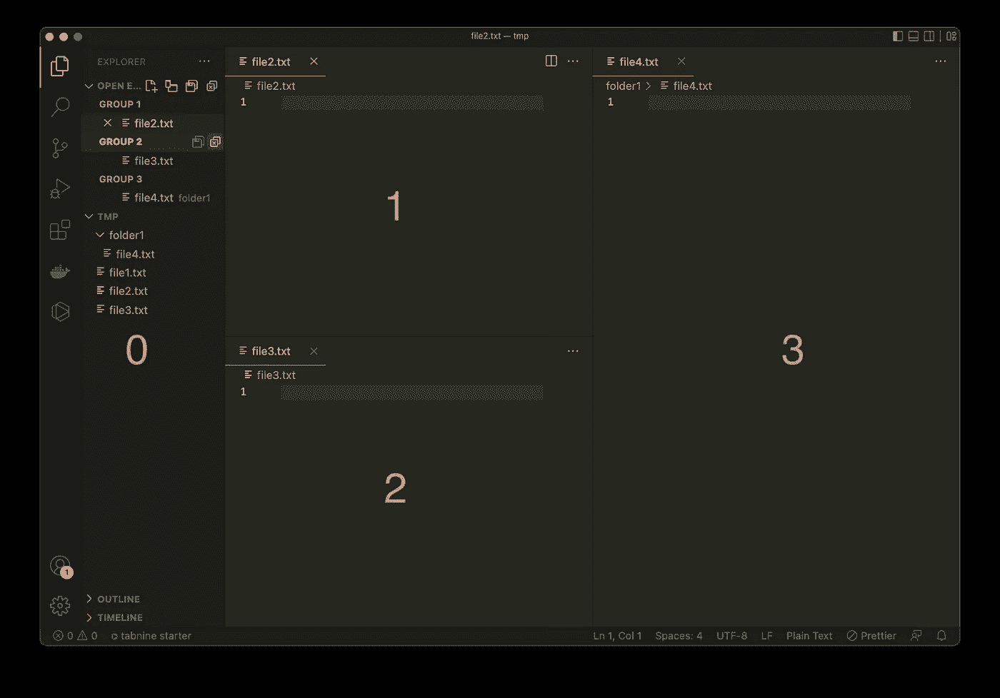

# 在 Visual Studio 代码(macOS)中通过键盘快捷键使用文件树

> 原文：<https://levelup.gitconnected.com/use-the-file-tree-via-keyboard-shortcuts-in-visual-studio-code-macos-22e226888cea>

Visual Studio 代码中用于在文件和编辑器窗口之间导航的一些重要(个人观点)快捷方式的简短概述。

卡斯帕·卡米尔·鲁宾在 [Unsplash](https://www.unsplash.com/) 上拍摄的照片

## 放弃

Windows 上的快捷方式可能有所不同。

Visual Studio 代码中的快捷方式比这里列出的要多得多。但是这里提到的至少对我个人有很大的帮助，使在文件树和编辑器窗口之间导航和查找文件成为一种流畅的体验。

## 导航的有用快捷方式

`CMD + Shift + e` →在 VSCode 中打开并聚焦文件浏览器

`up, down` →在文件之间向上/向下导航(当焦点在文件树上时)

`right, left` →浏览文件夹。如果您已经在一个文件夹上，该文件夹将关闭(当焦点在文件树上时)

`enter` →重命名当前文件(当焦点在文件树上时)

`CMD + down` →在 Visual Studio 代码中打开所选文件(当焦点在文件树上时)

`CMD + p` →打开文件搜索+显示最近访问的文件

`CMD + 0` →关注文件树

`CMD + 1` →关注第一个编辑组窗口

`CMD + 2` →关注第二个编辑组窗口

`CMD + X` →关注 X 编辑器组窗口

窗户号码

## 你想联系吗？

如果你想联系我，请在 LinkedIn 上给我打电话。

另外，请随意查看我的书籍推荐📚。

 [## 我的书籍推荐

### 在接下来的章节中，你可以找到我对所有日常生活话题的书籍推荐，它们对我帮助很大。

mr-pascal.medium.com](https://mr-pascal.medium.com/my-book-recommendations-4b9f73bf961b)  [## 通过我的推荐链接加入 Medium—Pascal Zwikirsch

### 作为一个媒体会员，你的会员费的一部分会给你阅读的作家，你可以完全接触到每一个故事…

mr-pascal.medium.com](https://mr-pascal.medium.com/membership)