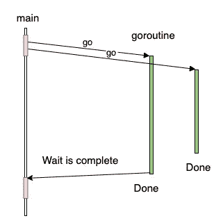

# 在 Go 的并发程序中明智地使用 WaitGroup

> 原文：<https://levelup.gitconnected.com/use-the-waitgroup-wisely-in-concurrent-programs-in-go-f40bb95267e4>

马尔科·洛佩斯在 [Unsplash](https://unsplash.com?utm_source=medium&utm_medium=referral) 上的照片

*WaitGroup* 是一个同步原语，它让你的程序知道一组 goroutines 何时完成。

在本帖中，我们将探讨何时以及如何使用它来同步 goroutines 的执行。

# 从一个例子开始

下面是 *WaitGroup* 用法的一个简单例子。

*   第 1 行:创建一个*等待组*变量
*   第 3 行到第 10 行:定义两个不同的函数在不同的 g *例程中运行。*
*   第 12 行:添加两个 *goroutines* 到 *WaitGroup。*
*   第 14–15 行:启动两条*go routine。*
*   行#17 **:** 主 goroutine 等待两个*go routine*完成
*   结束了

一系列 WaitGroup 示例

如示例所示，*等待组*类似于**一个可以递增和递减的并发安全计数器**。我们调用**加法*函数来递增计数器，调用*完成*函数来递减计数器。*

*当我们执行*等待*功能直到计数器变零时，主程序将会阻塞。*

# *何时使用它*

*我们知道，如果我们想要等待多个 goroutines 完成，我们使用 *WaitGroup* 同步原语。*

*然而，程序知道其他 goroutines 已经完成并不意味着它知道它们的运行状态。它对他们的结果一无所知，不管是成功还是失败。*

*因此 *WaitGroup* 同步原语适用于以下情况:*

*   *当我们不关心并发 goroutines 的结果时，*
*   *当我们有其他方法收集他们的结果时。*

# *使用注释*

1.  **添加*函数在他们帮助跟踪的 goroutines 之外被调用。如果我们不这样做，我们就会引入竞争条件。*

*2.如果一个 *WaitGroup* 被显式地传递到一个函数中，它应该由一个指针来完成。*

*3.将工作者调用封装在一个闭包中，告诉 WaitGroup 它已经完成。工作者不必知道在其执行中涉及的并发原语。*

*4.闭包内从“外部”作用域引用的任何变量都不是副本，而是引用。最好是将您想要任何参数传递给例程函数。*

*我希望你喜欢读这篇文章😄。如果你想支持我☕作为一个作家，考虑注册[成为一个媒体成员](https://jerryan.medium.com/membership)。你还可以无限制地访问媒体上的每个故事。*