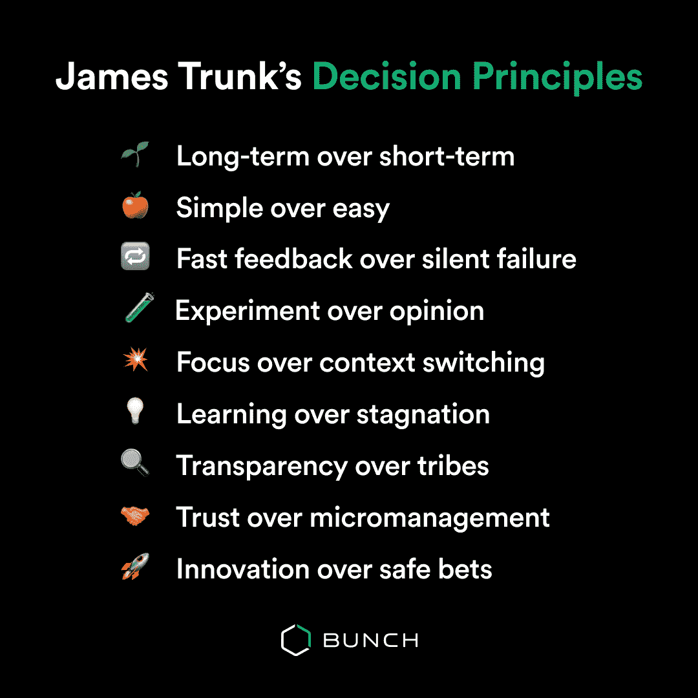
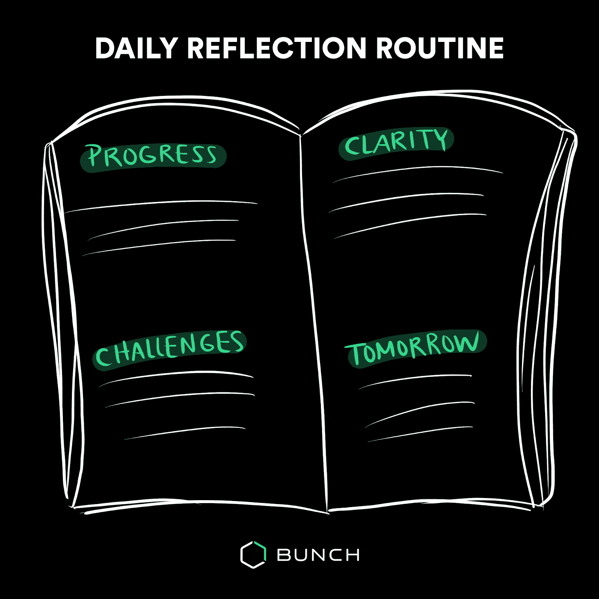
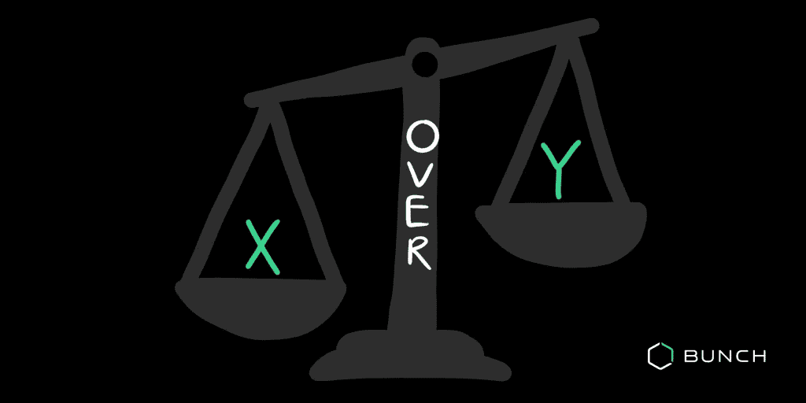
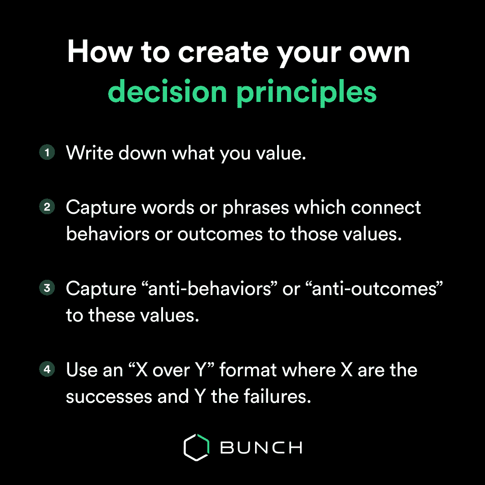

# 用这些原则来做任何决定

> 原文：<https://levelup.gitconnected.com/use-these-principles-to-make-any-decision-aa94fdbf3c65>

通过屏幕引导给团队和他们的管理员带来了严重的压力。你如何每天在那个小小的缩放窗口中真正传达激情、愿景、思维过程和同理心？这种新的工作方式迫使领导者更加关注他们的领导和沟通方式。

为了在自己的团队中实现有效的协作，James Trunk(Griffin 的工程副总裁)创建了他的 9 个决策原则。

如果你还没有读过，这里有:

让我们深入了解詹姆斯是如何定义和提炼他的原则的，并以一些反思问题和策略结束，这样你就可以创建自己的原则了。

# 你如何创造时间和空间来思考你的原则之类的事情？

**詹姆斯:**每天结束时，我会花 15 分钟反思我的学习和挑战。我把它们记录在我的工作日记中，标题是:**、进步、清晰、挑战和明天**。

在这个粒度级别上跟踪决策、结果和反思有助于我发现模式。这也给了我一个定期反思高层次想法的机会，比如决策原则。

# 你是如何选定这种形式的？你有过其他的方式吗？

**James:** 我的决策原则始于 2016 年的一次团队价值观会议。我与我们团队令人惊叹的敏捷教练 Ulrika 密切合作，为会议做准备。我们讨论了我们有多喜欢敏捷宣言的“X 超过 Y”格式给出的附加指导，并决定向团队推荐它。

团队喜欢我们的格式想法，在会议结束时，我们就五个共享的“X 比 Y”值达成了一致。

**我发现自己在决策会议和设计讨论中经常提到我们的价值观，这有助于我们的决策、沟通和协调。后来，我反思了自己是如何开始用这些价值观来指导自己的决策的。**

就在那时，我对指导决策的价值观的有用性有了顿悟。

我问自己这样一个问题:“如果我要列出一份个人价值观清单，明确地设计来帮助我做出更好的决定，那上面会有什么？”

我想出了六个“X 超过 Y”的价值观，其中两个与我们的团队价值观重叠。这些原始价值观中的三个仍然在我的列表中(简单胜于容易，实验胜于观点，专注胜于上下文切换)。

随着时间的推移，我的清单不断变化和发展，我反思了“价值观”是如何不是描述它们的正确词汇，我改用了“原则”。

# 你会给想要这个但又从零开始的人推荐什么？

詹姆斯:我建议从写下你重视的东西开始。从这里，你可以试着捕捉将积极行为或结果与这些价值观联系起来的单词或短语。思维导图可能是一个有用的工具。

如果你喜欢“X 比 Y”的形式，那么你也可以尝试捕捉每种形式的“反行为”或“反结果”。专注于你经历过成功和失败的地方。然后你可以把你的成功变成“X ”,把失败变成“Y”。

# 提出原则时，你最喜欢问自己哪些反思问题？

-我见过哪些导致成功的行为？

-我看到了哪些不良结果，与之相关的行为是什么？

-哪个人或公司在应对这一特定挑战方面走得最远，他们用了什么词？

-我工作过的最成功的团队的文化是什么？

-我工作过的最不成功的团队的文化是什么？

-据我所知，最成功的团队或公司的文化是什么？

随着你的领导和成长，你的原则可能会随之改变。在采用这些原则的第一年，詹姆斯经常改变自己的原则。

“我纠结于什么对我来说是重要的，哪些因素对我工作过的团队产生了积极或消极的影响，我测试了这些原则，看看它们对我的日常决策有多大帮助。”

原则是“活的文本”你对一个团队的看法可能会随着另一个团队而改变。一旦你有了第一份草稿，定期重温它们——这种反思和更新的周期将帮助你随着时间的推移产生更有针对性的影响和引导。

***想在一半的时间里做出更强的决策？下载*** [***一堆 AI 领导力蔻驰***](https://apps.apple.com/app/apple-store/id1500872908?pt=121075759&ct=james%20trunk%20decision%20principle&mt=8) ***app 每天 2 分钟成为更好的领导者。***

喜欢詹姆斯说的话吗？点击这里查看我们的[团队工作播客第](https://open.spotify.com/episode/5YUPGz0YkgT1KxVmt4Oulm?si=GGG8eB7QRxuGctIPZwWY-w)集，讲述他从个人贡献者到工程副总裁的历程。

🐦[在 Twitter 上关注我](https://bit.ly/3qwwVNB)或[查看我们的 YouTube 频道](https://bit.ly/3uaB8ZH)了解更多关于技术领导力的内容。

💌你也可以订阅每周简报，这是我的周日领导时事通讯。