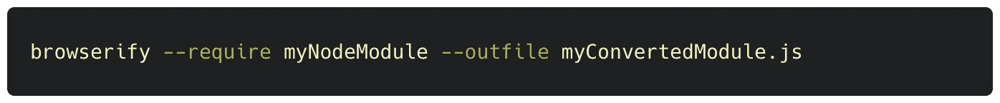
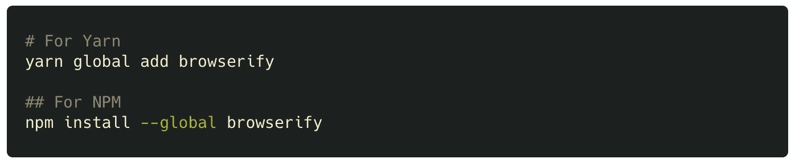
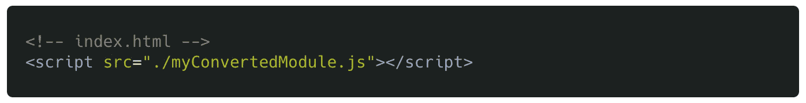
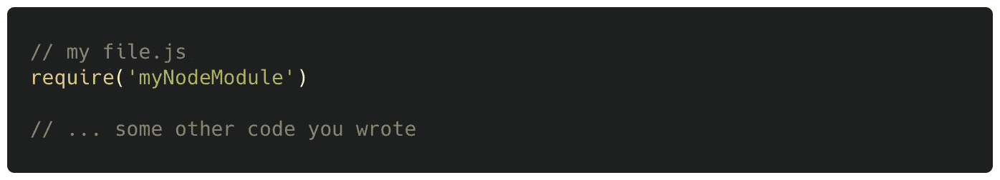
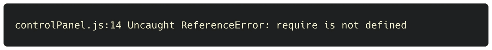
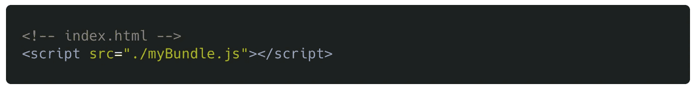

# 使用这个一行程序可以让任何 Node.js 模块在 Web 浏览器中运行

> 原文：<https://levelup.gitconnected.com/use-this-one-liner-to-make-any-node-js-module-run-in-a-web-browser-e25c74652530>

## 软件工程

## 使用这种零配置方法，您可以将任何 Node.js 模块转换为可以包含在 HTML 文件中的. js 文件

照片由[Ruben Bagües](https://unsplash.com/@rubavi78?utm_source=unsplash&utm_medium=referral&utm_content=creditCopyText)在 [Unsplash](https://unsplash.com/?utm_source=unsplash&utm_medium=referral&utm_content=creditCopyText) 上拍摄

# TL；速度三角形定位法(dead reckoning)

使用 Browserify 和零配置过程，可以将任何 node.js 模块转换为可以在浏览器中使用的. js 文件。您还可以例行地将 Node.js 的`**require**`语句包含在。js 文件，并让它们在 Node.js 和 web 浏览器中工作。以下是方法。

# 安装浏览器

首先，安装浏览器验证:

# 将节点模块转换为可以包含在 HTML 文件中的 JS 文件

browser fy*允许*用户在 web 浏览器中使用 Node.js 的`**require**`关键字(下一节)。但是，有时候，您可能希望保持 JS 文件的普通性，不要在其中混合任何 T2 语句。为了避免工作流变得复杂，您可能只想将一个节点模块(例如，从 NPM)转换成一个可以在浏览器中使用的. js 文件，并且在完成转换后与 Browserify 没有任何关系。

您可以使用这个单一的 *shell* 命令将节点模块转换为其 web 浏览器兼容版本:

(当然，你需要已经安装了`**myNodeModule**`。

然后您可以将它包含在您的 HTML 文件中:

顺便说一下，这适用于多文件模块。因此，如果您注意到想要转换的节点模块中有多个 JS 文件，您不必担心——browser ify 包含了所有这些文件。

也许有一天，你不能再停留在普通的 JS 上，而需要在你自己的 JS 中加入 T4 的陈述。js 文件。这些文件需要在 node.js 和 web 浏览器中都能工作。Browserify 可以提供帮助，并且比这种一行程序方法更有效。如果你想知道*如何*请继续阅读。

# 让您的脚本在浏览器中运行

假设您有一个 js 文件，其中需要一个节点模块。

如果您尝试在 web 浏览器中运行此文件，将会出现错误:

这正是 Browserify 的用武之地。它使得 Node 的`**require**`函数可以在浏览器中工作。它通过将`**require**`转换成浏览器可以处理的东西来实现这一点。

(更具体地说，Browserify 将`**myFile.js**`中*需要* d 的模块内容，连同`**myFile.js**`的原始内容一起复制粘贴到`**myBundle.js**`。这就是为什么我们倾向于将结果文件称为*包*。)

您可以转换您的。js 文件转换为与 web 浏览器兼容的文件，方法是使用:

然后，您可以在浏览器中运行生成的`**myBundle.js**`，方法是将它添加到您的 HTML 文件中:

(上图，`**./**`代表‘当前文件夹’。您也可以使用绝对路径。)

# 自动化流程

重复足够多的次数，即使是最小的努力也会变得繁琐。虽然我们学到的东西很有用，但如果每次对文件进行更改时都要用 Browserify 进行转换，那就没什么意思了。这就是为什么下一步，当你的代码改变时，你可能想使用 [watchify](https://www.npmjs.com/package/watchify) 来自动运行 Browserify。如果你想更进一步，你还可以使用 [beefy](https://www.npmjs.com/package/beefy) 自动刷新浏览器，并实现实时重新加载。

# 最后

使用 Browserify，您现在可以将节点模块转换为在 web 浏览器中运行，并且不会回头看。还可以包括。工作流中可以在节点和 web 浏览器中运行的 js 文件。如果你做了后者，自动化可能会大大提高你的生活质量，所以你可能想花些时间通过检查上面的链接来设置它。

我希望你喜欢阅读，并发现这是有用的。

编码快乐！