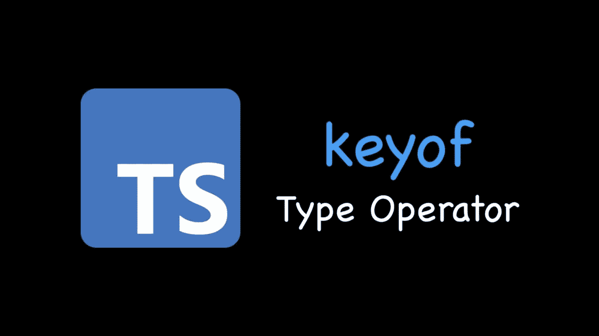

# 像专家一样使用 Typescript keyof

> 原文：<https://levelup.gitconnected.com/use-typescript-keyof-like-a-pro-56f3a3d06b73>

本文旨在以简单的方式向您展示如何利用 Typescript 中的`keyof`关键字来升级您的代码。



# 第一

`keyof`操作符接受一个对象类型，并生成其键的字符串或数字联合。它是一个强大的工具，为我们提供了构建时检查，防止我们使用底层对象中不存在的过时键。

# 内容概述/摘要

*   对类型、对象、接口和类使用`keyof`
*   使用类型脚本泛型的`keyof`
*   对映射类型使用`keyof`
*   对条件映射类型使用`keyof`

## 与类型一起使用`keyof`

```
type Staff = {
  name: string;
  age: number;
};

type StaffKeys = keyof Staff; // 'name' || 'age'

const staff: Staff = {
  name: "Tom",
  age: 18,
};

function getStaffInfoByKey(key: StaffKeys) {
  console.log(staff[key]);
}
getStaffInfoByKey("name"); // Tom
getStaffInfoByKey("salary"); // error TS2345: Argument of type '"salary"' is not assignable to parameter of type 'keyof Staff'.
```

## 对对象使用 keyof

```
const staff = {
  name: "Tom",
  age: 18,
};

type StaffKeys = keyof typeof staff; //  "name" | "age"

function getStaffInfoByKey(key: StaffKeys) {
  console.log(staff[key]);
}
getStaffInfoByKey("name"); // Tom
getStaffInfoByKey("salary"); // error TS2345: Argument of type '"salary"' is not assignable to parameter of type 'keyof Staff'.
```

## 对接口使用 keyof

```
interface Staff {
  name: string;
  age: number;
}

type StaffKeys = keyof Staff; //  "name" | "age"

const staff = {
  name: "Tom",
  age: 18,
};

function getStaffInfoByKey(key: StaffKeys) {
  console.log(staff[key]);
}
getStaffInfoByKey("name"); // Tom
getStaffInfoByKey("salary"); // error TS2345: Argument of type '"salary"' is not assignable to parameter of type 'keyof Staff'.
```

## 对类使用 keyof

```
class Staff {
  constructor(public name: string, public age: number) {}
}

// keyof
type StaffKeys = keyof Staff; // "name" | "age"

function getStaffInfoByKey (staff: Staff, key: StaffKeys) {
  return staff[key];
}

const staff = new Staff("Jack", 32);
console.log(getStaffInfoByKey(staff, "name")); // Jack
console.log(getStaffInfoByKey(staff, "salary")); // error TS2345: Argument of type '"salary"' is not assignable to parameter of type 'keyof Staff'.
```

## 对泛型使用 keyof

```
function getProperty<T, K extends keyof T>(obj: T, key: K): T[K] {
  return obj[key];
}

const randomData = {
  name: "John",
  age: 30,
};

console.log(getProperty(randomData, "name")); // John
console.log(getProperty(randomData, "age")); // 30
console.log(getProperty(randomData, "location")); // error TS2345: Argument of type '"location"' is not assignable to parameter of type '"name" | "age"'.
```

## 对映射类型使用 keyof

轻松创建新类型，并为类属性添加修饰符，如`readonly`、`private`和`protected`。

```
type Visibility<T> = {
  [Key in keyof T]: boolean;
};

type Staff = {
  name: string;
  age: number;
};

type StaffDetailVisibility = Visibility<Staff>;
// result
/*
type StaffDetailVisibility = {
  name: boolean; 
  age: boolean; 
} 
*/
```

## 对条件映射类型使用 keyof

```
type Visibility<T> = {
  [Key in keyof T]: T[Key] extends Function? Function: boolean;
};

type Staff = {
  name: string;
  age: number;
  report: () => void;
};

type StaffDetailVisibility = Visibility<Staff>;
// result
/*
type StaffDetailVisibility = {
  name: boolean; 
  age: boolean; 
  report: Function;
} 
*/
```

## 延伸阅读:

*   [TypeScript 必备基础知识—类型别名和接口](/typescript-must-know-fundamentals-for-your-next-tech-interview-or-project-255ae70df0a3)
*   [打字稿类——从零到英雄](/typescript-classes-from-zero-to-hero-a429a3c96189)
*   [使用类和装饰器的下一级 Typescript 运行时类型验证](/next-level-your-typescript-runtime-type-validation-using-class-and-decorators-ddd2ce3c86f3)
*   [掌握类型脚本泛型:终极指南](/mastering-typescript-generics-the-ultimate-guide-3a62afeff44)
*   [打字技巧和提示:立即成为专业人士](https://bootcamp.uxdesign.cc/typescript-tricks-and-tips-become-a-pro-in-no-time-5390aba151be)
*   [打字稿中的泛型——愚蠢地简化了的必备基础知识](/generics-in-typescript-must-know-fundamentals-stupidly-simplified-e7b4d7ffc0e3)
*   [Typescript 遗漏了这一点，但你不应该—运行时类型验证](/typescript-missed-this-but-you-shouldnt-runtime-type-validation-aa8a81ce4289)
*   [Typescript 枚举陷阱和解决方案必须知道](/typescript-enum-pitfalls-and-solutions-must-know-bb971cb0f7d2)
*   [掌握类型脚本泛型—终极指南—基本接口技术](https://bootcamp.uxdesign.cc/mastering-typescript-generics-the-ultimate-guide-essential-interface-techniques-86e793cf1fc)
*   【Javascript 开发者经常忽略的 Typescript 特性
*   [掌握打字稿中的交集和并集类型:终极指南和基本技巧](/mastering-intersection-and-union-types-in-typescript-the-ultimate-guide-essential-techniques-49aa9f6a188a)

如果你觉得这个指南有帮助，请鼓掌并跟我来。通过[链接](https://medium.com/@caopengau/membership)加入 medium，获取我和所有其他优秀作家在 medium 上发表的所有优质文章。

# 分级编码

感谢您成为我们社区的一员！在你离开之前:

*   👏为故事鼓掌，跟着作者走👉
*   📰查看[升级编码出版物](https://levelup.gitconnected.com/?utm_source=pub&utm_medium=post)中的更多内容
*   🔔关注我们:[Twitter](https://twitter.com/gitconnected)|[LinkedIn](https://www.linkedin.com/company/gitconnected)|[时事通讯](https://newsletter.levelup.dev)

🚀👉 [**加入升级人才集体，找到一份神奇的工作**](https://jobs.levelup.dev/talent/welcome?referral=true)