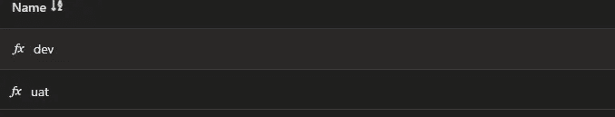

# 在 Azure DevOps 管道中使用变量

> 原文：<https://levelup.gitconnected.com/use-variables-inside-azure-devops-pipelines-a9f7f1c4e137>

如何在 YAML 管道中正确使用变量


照片由[阿尔方斯·莫拉莱斯](https://unsplash.com/@alfonsmc10?utm_source=unsplash&utm_medium=referral&utm_content=creditCopyText)在 [Unsplash](https://unsplash.com/s/photos/read?utm_source=unsplash&utm_medium=referral&utm_content=creditCopyText) 拍摄

当您创建 Azure DevOps 管道时，您将有一个要传递的配置来生成您的应用程序包。该配置可以包含环境变量、文件夹路径、登录、密码等变量

下面是一些你可以达到同样目的的方法

*   定义 YAML 内部的变量
*   在 DevOps 库中定义变量
*   在 Azure Key Vault 中定义变量

# YAML 内部的变量

默认情况下，所有这些配置都可以在您的`**azure-pipeline.yml**`文件中直接定义。后者将保存在您的代码源存储库中。这是一件很容易的事情，让您的所有构建配置都包含在您的项目中

```
variables:
- name: 'agentPoolName'
  value: 'my-cicd-pool'
```

或者

```
variables:
- agentPoolName:'my-cicd-pool'
```

# DevOps 库中的变量

上面是一个简单的方法，但是你可以想象，出于安全原因，密码一定不能清楚地保存在你的代码库中。这就是库变量发挥作用的地方。

```
variables:
    - group: my-variable-group
```

要设置，进入*管道* > *库* > *变量组*并创建一个新的*变量组*。

库变量的优点是你可以在那里定义你的秘密，而不是硬编码它们。另一个主要优势是，当您有多个环境时，这些组可以在您的 YAML 代码中迭代，而在一个阶段或作业中。



您的 DevOps 图书馆组

```
parameters:  
- name: environments
  type: object
  default: 
  - env_code: dev
    env_name: Development
  - deploy_env_code: uat
    env_name: UAT
# Environment-wise variable groups usage
- ${{ each env in parameters.environments }}:
  - stage:
    displayName:  Build ${{ env.env_name }}
    variables:
    - group: ${{ env.env_code }}

 jobs:
    - job: Task-Build
      displayName: 'Task Build'
      pool: $(agentPoolName)
      variables:
        api-key: $(api-key)
```

一旦你指定了`-group`，Azure 将通过你设置的服务连接找到组，并读取组内的变量。

# Azure Key Vault 中的变量

获取秘密最安全的方式是通过你的 YAML 管道，通过 Azure Key-Vault 服务，你可以在任务 `— task: AzureKeyVault@2`的帮助下轻松实现

```
# Azure Key Vault
# Download Azure Key Vault secrets
- task: AzureKeyVault@2
  inputs:
    connectedServiceName: ${{ service_name }}
    keyVaultName: ${{ vault_name }}
    secretsFilter: '*'
    runAsPreJob: true # Runs before the job starts
# Environment-wise variable groups usage
- ${{ each env in parameters.environments }}:
  - stage:
    displayName:  Build ${{ env.env_name }}

 jobs:
    - job: Task-Build
      displayName: 'Task Build'
      pool: $(agentPoolName)
      variables:
        api-key: $(api-key)
```

你可以在这里阅读更多信息[Azure Key vault secrets automation&集成到 DevOps 管道中](https://rollendxavier.medium.com/automate-secrets-to-azure-key-vault-and-access-it-in-devops-pipelines-69a24ecb9602)

# 脑震荡

有几种方法可以将变量(安全的和不安全的)传递给 Azure DevOps 管道。我发现所有这些选项都**简单易用，并且对于您的需求来说足够安全**。我希望这篇笔记能帮助你理解在库和 Azure 管道中关联和访问变量的基本概念。