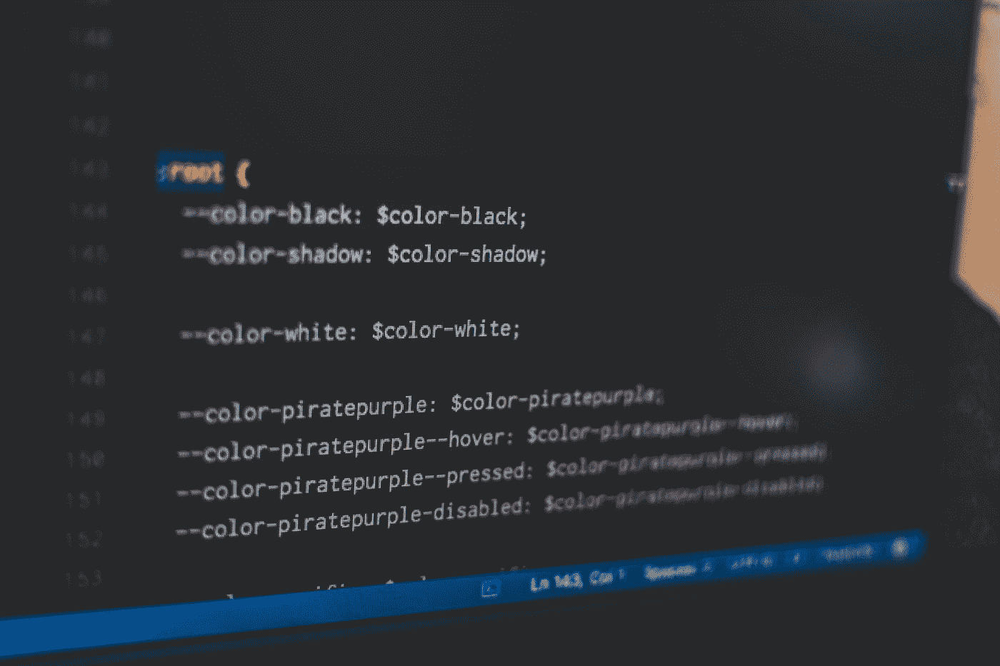

# 像高级开发人员一样使用 VSCode

> 原文：<https://levelup.gitconnected.com/use-vscode-like-a-senior-developer-9b54054c452a>

## 如果选择 VSCode 作为代码编辑器，您应该知道的 5 个技巧。



[Pankaj Patel](https://unsplash.com/@pankajpatel?utm_source=medium&utm_medium=referral) 在 [Unsplash](https://unsplash.com?utm_source=medium&utm_medium=referral) 上拍摄的照片

VSCode 是最流行的代码编辑器之一，熟练使用 VSCode 可以大大提高我们的编程效率。这里我将介绍一些使用 VSCode 的高级技巧，希望对你有所帮助。

下面是我要讲的功能:

*   多个光标
*   重命名符号
*   上下移动线条
*   用户片段

# 多个光标

我们可能想同时在不同的地方输入相同的内容。

例如，在下面的代码中，我们想给第一个、第三个和第五个`<li>`添加一个`class=“odd”`属性；向第二个、第四个和第六个`<li>`添加一个`class="even”`属性。

```
<ul>
  <li>Lorem, ipsum dolor.</li>
  <li>Lorem, ipsum dolor.</li>
  <li>Lorem, ipsum dolor.</li>
  <li>Lorem, ipsum dolor.</li>
  <li>Lorem, ipsum dolor.</li>
  <li>Lorem, ipsum dolor.</li>
</ul>
```

你将如何实现以下目标？


我曾经在一个标签上输入`class="old”`，然后复制粘贴到其他地方。直到后来我学会了多光标输入的技巧，大大提高了我的工作效率。

具体来说，当你按住键盘上的 Alt(在 macOS 中是 Option 键)时，点击其他区域会产生一个额外的光标。然后，无论你在键盘上键入什么，都会同时出现在每个光标区域。


注意:

*   窗口:Alt+单击
*   macOS: Option+Click

# 重命名符号

现在让我们变一个简单的戏法。

当我们编写代码或文档时，我们可能会发现拼写错误，或者我们可能希望更改命名约定，因此我们经常需要批量修改一个单词。

假设你有一段这样的代码，我们想把所有的`foo`都改成`bar`，你会怎么做？

```
function foo(){
  // ...
}foo();
foo();
foo();
```

如果我们手动一个一个地改变单词，有两个缺点:

*   太麻烦了
*   容易出现遗漏

此时，我们可以访问 VSCode 的`Rename Symbol`函数。


当我们选择一个文本并右键单击它时，此选项出现。或者您可以在选择文本后按下`F2`快捷键。

# 上下移动线条

有时我们想上下移动一些代码或文本。此时，我们可以选择文本，然后:

*   在 Windows 上，按`Alt` + `↑`向上移动文本；按下`Alt` + `↓`向下移动文本
*   在 macOS 上，按`Option` + `↑`将文字上移；按下`Option` + `↓`向下移动文本


这些提示可以帮助我们快速调整内容的顺序。

# 用户片段

当我们写代码时，我们总是重复使用几段代码。

例如，我们的 HTML5 文件总是具有以下基本结构:

```
<!DOCTYPE html>
<html lang="en">
<head>
  <title></title>
</head>
<body>
</body>
</html>
```

当我们用 JavaScript 写 for-i 循环时，我们总是写这些片段:

```
for(let i = 0; i < ; i++){

}
```

还有很多例子。如果我们每次需要使用这些代码片段时都必须手动输入，那将是非常低效的。

幸运的是，VSCode 为我们提供了一个自定义的自动完成特性。这里有一个演示:


让我们首先展示如何配置 VSCode 来实现上述效果。

## 生成配置文件

VSCode 是通过读取配置文件来达到上述效果的，所以我们首先需要生成一个配置文件。我们可以使用以下路径生成一个配置文件。

首先，我们打开用于生成配置文件的窗口。

> 首选项->用户片段


然后 VSCode 会弹出这个窗口:


在此窗口中，我们可以选择现有的配置文件并对其进行修改。或者我们也可以创建一个新的配置文件。

这里，我们将创建一个新的配置文件。

如果选择`New Global Snippets file`，将创建一个全局激活的配置文件。如果选择`New Snippets file for 'test'`，将创建一个本地活动配置文件。

这里，我们将只创建一个本地活动配置文件。

然后，它会要求您输入新创建的文件的名称。


好了，现在我们已经创建了一个配置文件。


为了方便读者，我录了一个 GIF 来完成以上过程，希望对你有帮助。


## 设置

配置文件是以 JSON 格式编写的，下面是一个简单的例子。


```
{
 "html5 autocomplete": {
  "prefix": "html5",
  "body": [
   "<!DOCTYPE html>",
      "<html lang=\"en\">",
      "<head>",
      "  <title></title>",
      "</head>",
      "<body>",
      "</body>",
      "</html>"
  ]
 }
}
```

首先我们来看字段`“html5 autocomplete”`。这个字段什么也不做，只是告诉程序员配置选项是做什么用的，你可以随意写这个字段。

然后我们再来看`“prefix”: “html5”`。这个字段是我们定义的快捷命令。当我们在文件中键入单词`html5`时，VSCode 会自动为我们完成代码。

然后再看`"body": [...]`。这个字段的内容是我们需要完成的代码。因为我们的代码可能有许多行，所以这个字段被表示为一个数组。数组中的每个元素代表一行代码。把上面的数组翻译成正常代码，就这样了。

```
<!DOCTYPE html>
<html lang="en">
<head>
  <title></title>
</head>
<body>
</body>
</html>
```

好了，现在我们有了基本的配置，让我们来测试一下。


## 范围

我们的配置确实有效。但还是能找到不完美的地方。也就是 html5 autocomplete 通常只在 html 文件中使用，当我们编写 JavaScript 文件时，不需要这个快捷命令。

幸运的是，我们可以在配置文件中指定这个配置的范围。

我们需要做的就是将字段`"scope": "html"`添加到配置文件中。


让我们再测试一次。


很好。现在在一个 JavaScript 文件中，这个快捷方式将自动失效。

## 光标

现在让我们重新测试我们的自动完成。有没有发现什么不完美的地方？


我们可以看到，当我们完成自动完成时，光标会自动停在代码的末尾。但是，我们自动完成的代码并不是一个完整的代码，我们还需要在标题中输入具体的内容。

如果自动完成后光标能留在`<title></title>`就更好了。

为此，我们只需在配置中添加一个特殊的变量`$0`。


完成后，光标会自动停留在`$0`。


## 例子

好，现在让我们看一个新的例子来复习我们所学的内容。

我们希望当我们在 JavaScript 或 TypeScript 文件中输入字符串`fori`时，VSCode 会自动完成下面的代码:

```
for(let i = 0; i < ; i++){
}
```

另外，光标应该停留在`i <` 之后。

你可以暂停一下，自己思考一下。

好吧，我给你答案。

我们可以编写这样的配置文件:

```
{
 "for-i loop": {
    "prefix": "fori",
    "scope": "javascript, typescript",
    "body": [
      "for(let i = 0; i < $0; i++){",
      "}"
    ]
 }
}
```

下面是一张 gif:


好了，这就是用户片段的用法。我花了很多时间谈论这个特性，因为它是我最喜欢的特性之一，我认为它对你也会有用。以前要打重复代码，就从另一个文件复制粘贴，很麻烦。现在有了它，我们就可以快速编写代码了。

# 快速打开文件

当我们在接触一个不熟悉的大型项目时，如何在大量的文件中快速找到自己想要的文件？

例如，当我阅读一个不熟悉的开源项目时，我喜欢优先考虑项目文件名中包含单词`util`的所有文件。

这种情况下，我们可以使用 VSCode 的文件搜索工具。

*   按下`⌘`和`P`打开工具
*   输入文件名


这样我们就可以在这个项目中找到所有的 util 文件。

同样，许多配置文件包含单词`config`或`configuration`。我们也可以通过这种方式找到项目中的配置文件。


# 蚂蚁

使用 Emmet 可以大大提高我们编码的速度。如果你对这个话题感兴趣，可以参考我的另一篇文章。

[](https://medium.com/frontend-handbooks/speed-up-your-coding-with-emmet-in-vscode-433162d95880) [## 使用 VSCode 中的 Emmet 加快编码速度

### 用 20 张 gif 解释。

medium.com](https://medium.com/frontend-handbooks/speed-up-your-coding-with-emmet-in-vscode-433162d95880)